# 智知库（SmartKnowledge）功能规格文档（FSD）

> **文档版本**：v1.1  
> **基于PRD版本**：v2.0  
> **生成日期**：2026-07-05  
> **文档状态**：评审后修订  
> **密级**：内部公开  
> **目标读者**：后端开发、前端开发、测试工程师、架构师、DevOps

---

## 目录

1. [文档概述](#一文档概述)
2. [系统上下文与边界](#二系统上下文与边界)
3. [功能模块规格](#三功能模块规格)
   - 3.1 文档管理模块
   - 3.2 智能问答模块（RAG核心）
   - 3.3 AI Agent模块
   - 3.4 对话管理模块
   - 3.5 用户系统模块
   - 3.6 系统管理模块
   - 3.7 工程化与性能模块
   - 3.8 数据飞轮与成本优化模块
4. [业务流程图](#四业务流程图)
5. [数据流图（DFD）](#五数据流图dfd)
6. [数据模型与ER图](#六数据模型与er图)
7. [状态机设计](#七状态机设计)
8. [接口规格（API Definition）](#八接口规格api-definition)
9. [业务规则矩阵](#九业务规则矩阵)
10. [异常处理与降级策略](#十异常处理与降级策略)
11. [附录](#十一附录)

---

## 一、文档概述

### 1.1 目的
本文档将PRD v2.0中的用户故事（User Stories）转化为可落地的功能规格，明确每个功能的：
- **输入（Input）**：用户操作、系统事件、外部数据
- **处理（Process）**：业务逻辑、算法步骤、状态流转
- **输出（Output）**：响应数据、UI状态、副作用
- **业务规则（Business Rules）**：校验逻辑、权限判定、数据约束
- **异常场景（Exception）**：错误码、降级行为、补偿机制

### 1.2 文档约定
- `【P0】`：必须实现（MVP）
- `【P1】`：重要功能（M2-M4）
- `【P2】`：期望功能（M5）
- `→`：数据流向
- `⊕`：并行处理
- `⊗`：互斥分支

---

## 二、系统上下文与边界

### 2.1 系统上下文图（Context Diagram）

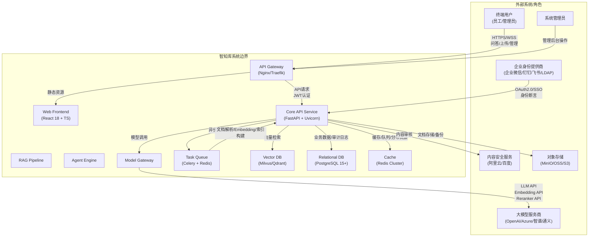
```mermaid
flowchart TB
    subgraph External["外部系统/角色"]
        User["终端用户<br/>(员工/管理员)"]
        Admin["系统管理员"]
        IdP["企业身份提供商<br/>(企业微信/钉钉/飞书/LDAP)"]
        LLMProvider["大模型服务商<br/>(OpenAI/Azure/智谱/通义)"]
        ContentSafe["内容安全服务<br/>(阿里云/百度)"]
        ObjectStorage["对象存储<br/>(MinIO/OSS/S3)"]
    end

    subgraph SmartKnowledge["智知库系统边界"]
        APIGateway["API Gateway<br/>(Nginx/Traefik)"]
        WebApp["Web Frontend<br/>(React 18 + TS)"]
        CoreAPI["Core API Service<br/>(FastAPI + Uvicorn)"]
        RAGPipeline["RAG Pipeline"]
        AgentEngine["Agent Engine"]
        ModelGateway["Model Gateway"]
        TaskQueue["Task Queue<br/>(Celery + Redis)"]
        VectorDB["Vector DB<br/>(Milvus/Qdrant)"]
        RelDB["Relational DB<br/>(PostgreSQL 15+)"]
        Cache["Cache<br/>(Redis Cluster)"]
    end

    User -->|"HTTPS/WSS<br/>问答/上传/管理"| APIGateway
    Admin -->|"管理后台操作"| APIGateway
    APIGateway -->|"静态资源"| WebApp
    APIGateway -->|"API请求<br/>JWT认证"| CoreAPI
    CoreAPI -->|"向量检索"| VectorDB
    CoreAPI -->|"业务数据/审计日志"| RelDB
    CoreAPI -->|"缓存/队列/分布式锁"| Cache
    CoreAPI -->|"异步任务投递"| TaskQueue
    CoreAPI -->|"模型调用"| ModelGateway
    ModelGateway -->|"LLM API<br/>Embedding API<br/>Reranker API"| LLMProvider
    CoreAPI -->|"内容审核"| ContentSafe
    CoreAPI -->|"文档存储/备份"| ObjectStorage
    IdP -->|"OAuth2.0/SSO<br/>身份断言"| CoreAPI
    TaskQueue -->|"文档解析/Embedding/索引构建"| CoreAPI
```

### 2.2 子系统划分

| 子系统 | 职责 | 核心组件 |
|--------|------|----------|
| **文档服务** | 文档生命周期管理、解析、分块、索引 | Document Service, Parser Service, Indexer Service |
| **检索服务** | Query理解、多路检索、重排序、上下文压缩 | Retrieval Service, Query Rewrite Service, Reranker Service |
| **生成服务** | Prompt组装、流式生成、引用注入、安全过滤 | Generation Service, Prompt Service, Safety Service |
| **Agent服务** | 任务规划、工具调用、记忆管理、自我反思 | Agent Controller, Planner, Executor, Reflector, Memory Manager |
| **对话服务** | 会话管理、上下文维护、历史持久化、分支 | Conversation Service, Context Manager |
| **用户服务** | 认证授权、RBAC、配额、SSO | Auth Service, User Service, Quota Service |
| **系统服务** | 权限管理、审计日志、统计报表、监控 | Admin Service, Audit Service, Analytics Service |
| **网关服务** | 多Provider路由、熔断、限流、缓存、计费 | Model Gateway, Rate Limiter, Circuit Breaker |
| **任务服务** | 异步队列、优先级调度、重试、死信处理 | Task Queue, Worker Pool, Scheduler |

---

## 三、功能模块规格

### 3.1 文档管理模块

#### 3.1.1 文档上传与解析（US-001）【P0】

**功能编号**：F-DM-001  
**功能名称**：文档上传与异步解析  
**相关US**：US-001

**输入**：
| 字段 | 类型 | 约束 | 说明 |
|------|------|------|------|
| files | File[] | 1-50个文件，总大小≤500MB | 支持PDF/DOCX/TXT/MD/XLSX/CSV/PPT |
| kb_id | UUID | 必填 | 目标知识库ID |
| tags | string[] | 可选，单标签≤20字符 | 文档标签 |
| category_id | UUID | 可选 | 分类目录ID |
| uploader_id | UUID | 从JWT提取 | 上传者用户ID |
| permission_level | enum | 默认"team" | 个人/团队/公开/自定义 |

**处理逻辑**：
```
1. 前置校验
   1.1 校验文件类型白名单（MIME类型 + 魔数签名）
   1.2 校验单文件大小 ≤ 50MB
   1.3 校验批量总大小 ≤ 500MB
   1.4 病毒扫描（ClamAV集成，异步）
   1.5 权限校验：用户是否有kb_id的写入权限

2. 文件持久化
   2.1 生成文件唯一标识：doc_id = UUIDv4
   2.2 存储至对象存储：/raw/{kb_id}/{doc_id}/{filename}
   2.3 写入文档元数据表（documents），processing_status=PENDING，lifecycle_status=ACTIVE

3. 异步任务投递
   3.1 构建解析任务Payload：{doc_id, file_path, file_type, kb_id, uploader_id}
   3.2 投递至Celery队列：queue="document.parse"
   3.3 优先级：manual_upload > batch_import > auto_sync
   3.4 返回任务ID（task_id）和预估处理时间

4. 异步解析流程（Celery Worker执行）
   4.1 更新状态：PARSING
   4.2 根据file_type选择解析引擎：
       - PDF: PyMuPDF → 提取文本/表格/结构；若纯图像 → 触发OCR（PaddleOCR）
       - DOCX: python-docx → 提取段落/表格/标题层级
       - MD/TXT: 直接读取，识别Markdown语法树
       - XLSX/CSV: pandas → 提取为结构化文本
       - PPT: python-pptx → 提取每页文本
   4.3 结构识别：提取标题层级（H1-H6）、目录、表格、代码块
   4.4 敏感信息扫描：正则匹配PII（身份证/手机号/银行卡/邮箱），标记脱敏位置
   4.5 智能分块（Chunking）：
       - 策略选择：按知识域配置（技术域=代码感知的递归分块；行政域=段落分块）
       - 默认：递归字符分块，chunk_size=512，overlap=50
       - 保留元数据：{doc_id, chunk_index, page_num, section_title, char_count, token_count}
   4.6 更新状态：CHUNKED

5. Embedding与索引构建
   5.1 批量调用Embedding模型（BGE-M3），batch_size=32
   5.2 检查Embedding缓存：相同文本的Embedding结果缓存24小时
   5.3 写入向量数据库：单Collection + 按kb_id Partition隔离（多租户物理隔离）
   5.4 写入稀疏索引：PostgreSQL全文检索表（document_chunks_fts）
   5.5 更新状态：INDEXED
   5.6 发送通知：WebSocket推送 / 邮件 / 站内信（按用户配置）

6. 失败处理
   6.1 解析失败：状态=FAILED，记录错误码和堆栈，自动重试最多3次（指数退避）
   6.2 重试耗尽：发送失败通知，管理员可手动重试
```

**输出**：
| 字段 | 类型 | 说明 |
|------|------|------|
| doc_id | UUID | 文档唯一标识 |
| task_id | UUID | 异步任务ID |
| processing_status | enum | PENDING / PARSING / CHUNKED / INDEXING / INDEXED / PARTIAL / FAILED |
| lifecycle_status | enum | ACTIVE / ARCHIVED / DELETING / DELETED |
| estimated_time | int | 预估处理秒数 |
| uploaded_at | ISO8601 | 上传时间 |

**业务规则**：
- BR-DM-001：同名文件上传视为新版本，自动触发版本更新流程（US-003）
- BR-DM-002：扫描件PDF（无文本层）必须触发OCR，OCR准确率<85%时标记"需人工校对"
- BR-DM-003：敏感信息在Embedding前必须脱敏，向量索引中存储脱敏后文本
- BR-DM-004：分块Token数超过模型限制（如8192）时，自动降级为更大粒度分块

**异常处理**：
| 异常场景 | 错误码 | 处理策略 |
|----------|--------|----------|
| 文件类型不支持 | E-DM-001 | 立即拒绝，返回明确提示 |
| PDF受密码保护 | E-DM-002 | 标记FAILED，提示用户解除密码后重新上传 |
| 扫描件OCR失败 | E-DM-003 | 标记FAILED，建议用户上传可搜索PDF |
| 病毒扫描阳性 | E-DM-004 | 立即隔离文件，告警管理员，通知上传者 |
| 向量数据库写入超时 | E-DM-005 | 重试3次，仍失败则标记processing_status=PARTIAL，人工介入 |
| Embedding服务熔断 | E-DM-006 | 降级至备用Embedding模型，记录降级事件 |

---

#### 3.1.2 文档列表与搜索（US-002）【P0】

**功能编号**：F-DM-002  
**输入**：
| 字段 | 类型 | 约束 |
|------|------|------|
| kb_id | UUID | 必填 |
| keyword | string | 可选，≤100字符 |
| filters | JSON | 可选：{file_type, uploader_id, date_range, tags, processing_status, lifecycle_status} |
| sort_by | enum | 默认upload_time_desc，可选name/size/upload_time |
| page | int | ≥1，默认1 |
| page_size | int | 10-100，默认20 |
| requester_id | UUID | 从JWT提取 |

**处理逻辑**：
```
1. 权限过滤：构建基础查询条件 WHERE kb_id=? AND (permission_level='public' OR uploader_id=? OR team_id IN ?)
2. 关键词搜索：
   - 若keyword存在：使用PostgreSQL全文检索（to_tsquery）匹配文档名和描述
   - 同时查询向量数据库的文档名Embedding（语义相似度>0.7）
   - 取并集后按相关度排序
3. 筛选与排序：应用filters和sort_by
4. 分页返回
```

**输出**：文档列表（含状态标签、解析进度、文件大小、页数/字数）

---

#### 3.1.3 文档删除与更新（US-003）【P1】

**功能编号**：F-DM-003  
**状态流转**：
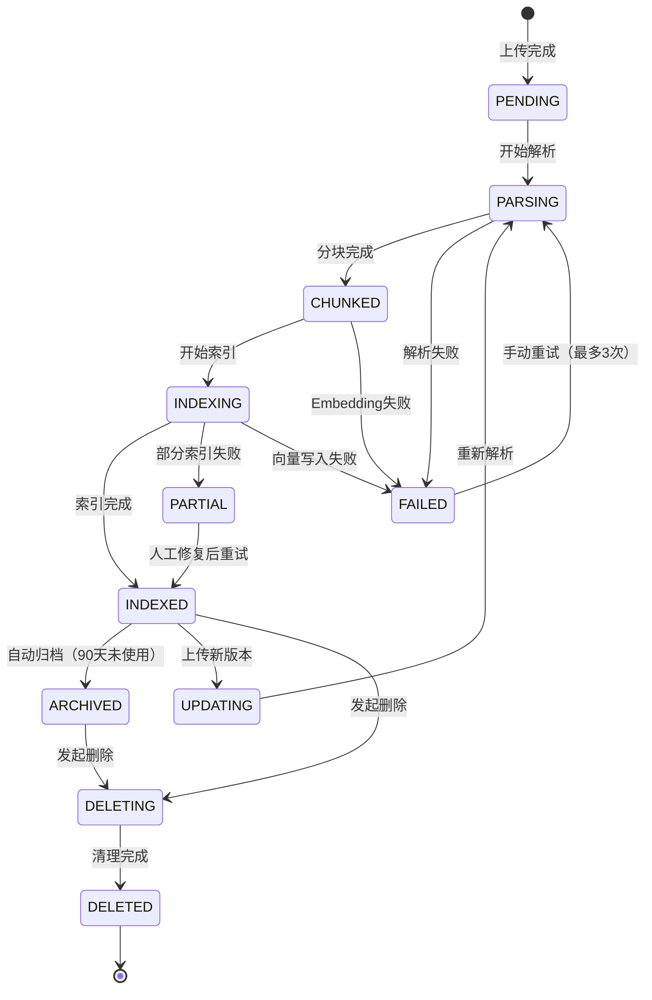
```mermaid
stateDiagram-v2
    [*] --> PENDING: 上传完成
    PENDING --> PARSING: 开始解析
    PARSING --> CHUNKED: 分块完成
    CHUNKED --> INDEXING: 开始索引
    INDEXING --> INDEXED: 索引完成
    INDEXING --> PARTIAL: 部分索引失败
    PARSING --> FAILED: 解析失败
    CHUNKED --> FAILED: Embedding失败
    INDEXING --> FAILED: 向量写入失败
    PARTIAL --> INDEXED: 人工修复后重试
    FAILED --> PARSING: 手动重试（最多3次）
    INDEXED --> ARCHIVED: 自动归档（90天未使用）
    INDEXED --> UPDATING: 上传新版本
    UPDATING --> PARSING: 重新解析
    INDEXED --> DELETING: 发起删除
    ARCHIVED --> DELETING: 发起删除
    DELETING --> DELETED: 清理完成
    DELETED --> [*]
```

> 注：为便于展示，本状态机将 `processing_status`（处理状态）与 `lifecycle_status`（生命周期状态）合并绘制；实际数据模型中二者为独立字段。

**删除副作用**：
```
1. 软删除：documents表标记lifecycle_status=DELETING，保留元数据30天
2. 向量清理：异步任务删除VectorDB中该doc_id的所有chunk
3. 缓存清理：清除Redis中该文档的Embedding缓存和Query缓存
4. 关联清除：清除对话中引用该文档的缓存上下文（标记"知识库已更新"）
5. 审计记录：写入audit_logs表（操作人、时间、IP、文档名、TraceID）
```

---

#### 3.1.4 文档分块可视化（US-004）【P1】

**功能编号**：F-DM-004  
**输入**：doc_id, requester_id  
**处理**：
```
1. 权限校验：用户是否有该doc_id的读取权限
2. 查询document_chunks表，按chunk_index排序
3. 对每个chunk：
   - 显示文本内容预览（前200字符）
   - 显示元数据：{chunk_index, char_count, token_count, page_num, section_title}
   - 查询向量数据库获取该chunk的Embedding向量（维度信息）
   - 执行ANN搜索获取最近邻chunk（Top-3）
4. 支持操作：
   - 合并：选中相邻chunks，合并文本，重新Embedding，更新索引
   - 拆分：在指定位置拆分，生成两个新chunk，重新Embedding
   - 编辑：修改文本内容，重新Embedding
   - 所有操作记录版本历史（chunk_versions表）
```

**输出**：Chunk列表 + 最近邻关系图

---

#### 3.1.5 文档标签与分类管理（US-005）【P1】

**功能编号**：F-DM-005  
**数据模型**：
- 标签表（tags）：{id, name, color, kb_id, created_by}
- 分类表（categories）：{id, name, parent_id, kb_id, level}（最多3级嵌套）
- 文档-标签关联表（document_tags）：{doc_id, tag_id}
- 知识域配置表（knowledge_domains）：{id, name, chunk_strategy, embedding_model}

**业务规则**：
- BR-DM-005：标签变更实时生效，无需重新索引（通过查询时JOIN实现）
- BR-DM-006：分类树变更时，级联更新所有子分类的path字段（物化路径）

---

### 3.2 智能问答模块（RAG核心）

#### 3.2.1 基础问答（US-101）【P0】

**功能编号**：F-RAG-001  
**功能名称**：语义检索增强生成（RAG）  
**相关US**：US-101, US-102, US-103, US-104

**输入**：
| 字段 | 类型 | 约束 | 说明 |
|------|------|------|------|
| query | string | 1-2000字符 | 用户自然语言问题 |
| conversation_id | UUID | 可选 | 现有会话ID，为空则创建新会话 |
| search_mode | enum | 默认"hybrid" | 语义优先/关键词优先/混合平衡 |
| strict_mode | boolean | 默认false | true=仅基于引用生成，无引用则拒绝回答 |
| kb_ids | UUID[] | 可选，默认用户可访问的所有知识库 | 限定检索范围 |
| requester_id | UUID | 从JWT提取 | 用户ID |
| requester_roles | string[] | 从JWT提取 | 角色列表 |

**处理逻辑（RAG Pipeline详细步骤）**：

```
Stage 1: Query理解层（Query Understanding）
├─ 1.1 意图识别（Intent Classification）
│   输入：query + 历史上下文（最近2轮）
│   模型：轻量分类模型（BERT-based，本地部署）
│   输出：intent ∈ {factual_qa, summary, comparison, calculation, multi_step}
│   业务规则：
│   - BR-RAG-001：若intent=calculation，自动触发Calculator工具
│   - BR-RAG-002：若intent=multi_step，转交Agent处理（US-201）
│
├─ 1.2 Query扩展（Query Expansion）
│   输入：query
│   处理：
│   - 同义词扩展：查询同义词词典（synonyms表，支持自定义术语）
│   - 缩写还原：查询abbreviations表（如"KPI"→"关键绩效指标"）
│   - 共现词扩展：基于历史高频Query共现矩阵
│   输出：expanded_queries = [original_query, synonym_variant_1, synonym_variant_2, ...]
│
├─ 1.3 Query分解（Query Decomposition）【P1】
│   条件：query长度>50字符 或 包含对比词（"对比"/"差异"/"优劣"）
│   处理：调用轻量LLM（GPT-3.5级别）生成子Query列表
│   输出：sub_queries = [{id, query, dependency, expected_source}]
│   示例："对比2024和2025产品策略差异" → 
│         ["2024年产品策略是什么？", "2025年产品策略是什么？", "两者的差异是什么？"]
│
└─ 1.4 敏感信息检测
    输入：query
    处理：正则匹配PII模式，若命中则记录审计日志（标记为PII_QUERY）
    输出：sanitized_query（脱敏后的查询文本）

Stage 2: 多路检索层（Multi-Channel Retrieval）
├─ 2.1 稠密检索（Dense Retrieval）
│   输入：expanded_queries（每个query生成Embedding）
│   模型：BGE-M3（统一缓存24小时）
│   向量库：Milvus/Qdrant，HNSW索引，ef=128
│   过滤条件：kb_id IN ? AND doc_id IN (用户有权限的文档列表)
│   检索参数：Top-K=15，相似度阈值≥0.65
│   输出：dense_results = [{chunk_id, score, content, metadata}]
│
├─ 2.2 稀疏检索（Sparse Retrieval）
│   输入：expanded_queries（BM25分词）
│   引擎：PostgreSQL全文检索（to_tsvector + to_tsquery）
│   参数：Top-K=15，按ts_rank排序
│   输出：sparse_results = [{chunk_id, score, content, metadata}]
│
├─ 2.3 全文检索（Full-Text Search）【P1】
│   输入：expanded_queries
│   引擎：PostgreSQL GIN索引
│   参数：Top-K=10
│   输出：fts_results = [{chunk_id, score, content, metadata}]
│
└─ 2.4 融合排序（Reciprocal Rank Fusion - RRF）
    公式：score_rrf = Σ(1 / (k + rank_i))，k=60
    输入：dense_results + sparse_results + fts_results
    处理：去重（相同chunk_id取最高score），按RRF分数降序
    输出：fused_results = Top-K=15

Stage 3: 精排层（Reranking）【P1】
├─ 3.1 重排序模型
│   输入：fused_results（15个候选）+ original_query
│   模型：BGE-Reranker（Cross-Encoder）
│   处理： pairwise relevance scoring
│   输出：reranked_results = [{chunk_id, relevance_score, content, metadata}]
│
├─ 3.2 权限过滤（二次校验）
│   处理：剔除用户无权限的chunk（防御向量数据库权限绕过）
│   输出：authorized_results
│
├─ 3.3 去重与合并
│   处理：
│   - 相似度>0.95的chunk合并（取内容更完整的）
│   - 同一文档的chunk按页码排序，保留上下文连贯性
│   输出：final_contexts = Top-K=5
│
└─ 3.3 时间过滤（若Query含时间限定词）
    处理：解析"最近一年"/"2024年"等时间表达式，过滤文档上传时间
    输出：time_filtered_contexts

Stage 4: 上下文压缩层（Context Compression）【P1】
├─ 4.1 上下文去重
│   处理：检测chunk间重复句子（Jaccard相似度>0.8），删除冗余
│
├─ 4.2 关键句提取
│   模型：轻量NLI模型（判断句子与query的相关性）
│   处理：保留相关性>0.7的句子，低相关性句子压缩为摘要
│
├─ 4.3 Token预算管理
│   规则：BR-RAG-003：总上下文Token数 ≤ 模型最大输入 × 70%
│   处理：若超限，按相关性分数截断，优先保留高相关chunk
│
└─ 4.4 结构化注入
    处理：按文档来源分组，标注[来源1: 文档名, 页码]、[来源2: ...]
    输出：structured_context（带引用标记的文本块）

Stage 5: 生成控制层（Generation Control）
├─ 5.1 Prompt组装
│   系统Prompt模板：
│   ```
│   你是企业知识库助手，基于以下提供的上下文回答问题。
│   规则：
│   1. 必须基于提供的上下文回答，禁止编造（strict_mode=true时强制执行）
│   2. 使用Markdown格式，代码块标注语言类型
│   3. 在关键事实后标注引用[^1][^2]
│   4. 若上下文不足，明确说明"未找到相关信息"
│   5. 对不确定信息标注"置信度：低"
│   ```
│   用户Prompt：{structured_context} + {query} + {conversation_history}
│
├─ 5.2 模型路由（Model Gateway）
│   策略：
│   - 简单事实问答（<100 tokens输入）→ 轻量模型（GPT-3.5/GLM-4-Flash）
│   - 复杂分析/多文档对比 → 强模型（GPT-4o/GLM-4）
│   - 高峰期预算紧张 → 自动降级至轻量模型
│   输出：selected_model, estimated_cost
│
├─ 5.3 流式生成（SSE）
│   处理：
│   - 首字返回时间目标<1.5秒（TTFB）
│   - 流式速率≥15 tokens/秒
│   - 实时解析输出，识别引用标记[^n]，映射到对应chunk_id
│   - 若模型未生成引用标记，系统在答案末尾强制追加"信息来源"列表
│
├─ 5.4 输出安全过滤
│   处理：
│   - 内容安全扫描（涉政/涉黄/暴恐/歧视），置信度>0.7时拦截
│   - PII二次扫描：输出中若含敏感信息，自动***替换
│   - 幻觉检测：LLM-as-Judge评估答案与上下文的一致性（Faithfulness）
│
└─ 5.5 置信度评分
    处理：模型自评（高/中/低）+ 算法校验（引用覆盖率、上下文相关度）
    输出：confidence_score ∈ [0,1]，分级：高(≥0.8) / 中(0.6-0.8) / 低(<0.6)
    规则：BR-RAG-004：confidence_score<0.6时，答案末尾追加免责声明
```

**输出**：
| 字段 | 类型 | 说明 |
|------|------|------|
| answer | string | Markdown格式答案文本 |
| citations | Citation[] | 引用列表 [{id, doc_name, page_num, chunk_text, confidence}] |
| confidence | enum | 高/中/低 |
| model_used | string | 实际调用的模型名称 |
| tokens_used | int | {input_tokens, output_tokens} |
| cost_estimate | float | 预估费用（元） |
| follow_up_questions | string[] | 3个生成的追问建议 |
| retrieval_debug | object | Debug模式可见：各阶段检索结果和分数 |

**状态码与异常**：
| 场景 | HTTP状态 | 错误码 | 前端行为 |
|------|----------|--------|----------|
| 知识库无相关内容 | 200 | - | 返回"未找到相关信息，建议..." |
| 模型服务熔断 | 503 | E-RAG-001 | 自动切换备用模型，用户无感知 |
| 生成超时（>10s） | 200 | E-RAG-002 | 返回已生成内容 + "生成超时，内容可能不完整" |
| 内容安全拦截 | 200 | E-RAG-003 | 返回安全提示，不展示原答案 |
| 配额耗尽 | 429 | E-RAG-004 | 提示联系管理员，提供紧急申请入口 |
| 上下文窗口溢出 | 200 | E-RAG-005 | 自动摘要早期对话，提示用户新建会话 |

---

#### 3.2.2 混合检索与重排序（US-105）【P1】

**功能编号**：F-RAG-002  
**检索模式切换逻辑**：
```
IF search_mode == "semantic":
    权重：dense=1.0, sparse=0.0, fts=0.0
ELIF search_mode == "keyword":
    权重：dense=0.0, sparse=1.0, fts=1.0
ELSE (hybrid):
    权重：dense=0.5, sparse=0.3, fts=0.2
    RRF融合：k=60
```

**Reranker调用策略**：
- 候选数≤15时，全量调用Cross-Encoder
- 候选数>15时，先取RRF Top-15再精排
- Reranker服务熔断时，降级为向量相似度排序

---

#### 3.2.3 Query重写与扩展（US-106）【P1】

**功能编号**：F-RAG-003  
**Query重写Pipeline**：
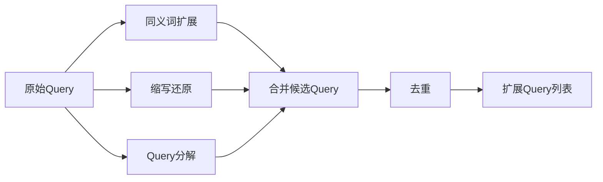
```mermaid
flowchart LR
    Q[原始Query] --> Synonym[同义词扩展]
    Q --> Abbreviation[缩写还原]
    Q --> Decomposition[Query分解]
    Synonym --> Merge[合并候选Query]
    Abbreviation --> Merge
    Decomposition --> Merge
    Merge --> Deduplicate[去重]
    Deduplicate --> Output[扩展Query列表]
```

**同义词词典结构**：
```json
{
  "term": "请假",
  "synonyms": ["休假", "调休", "事假", "病假", "年假"],
  "domain": "hr",
  "weight": 1.0
}
```

---

#### 3.2.4 用户反馈与答案修正（US-107）【P1】

**功能编号**：F-RAG-004  
**反馈数据模型**：
| 字段 | 类型 | 说明 |
|------|------|------|
| feedback_id | UUID | 主键 |
| message_id | UUID | 关联的对话消息 |
| feedback_type | enum | thumbs_up / thumbs_down / correction |
| reason | enum | factual_error / no_answer / citation_wrong / hallucination / other |
| comment | string | 用户文字说明，≤500字符 |
| corrected_answer | string | 修正后的答案（feedback_type=correction时） |
| context_snapshot | JSON | 快照：检索结果、模型参数、Prompt模板版本 |
| status | enum | pending / reviewed / resolved / rejected |

**业务规则**：
- BR-RAG-005：点踩数据自动进入Bad Case库，每周自动生成Bad Case报告
- BR-RAG-006：修正答案经管理员审核后，可作为"标准答案"用于相似Query的RAG Few-shot示例

---

### 3.3 AI Agent模块

#### 3.3.1 Agent自动拆解复杂问题（US-201）【P1】

**功能编号**：F-AGT-001  
**功能名称**：Plan-and-Execute Agent  
**相关US**：US-201, US-202, US-204, US-205

**输入**：
| 字段 | 类型 | 说明 |
|------|------|------|
| query | string | 复杂问题 |
| conversation_id | UUID | 会话ID |
| available_tools | string[] | 用户启用的工具列表（默认全部） |
| max_steps | int | 最大执行步骤，默认10 |
| timeout | int | 超时秒数，默认60 |
| memory_context | JSON | Agent记忆（用户偏好、历史实体） |

**Agent状态机**：
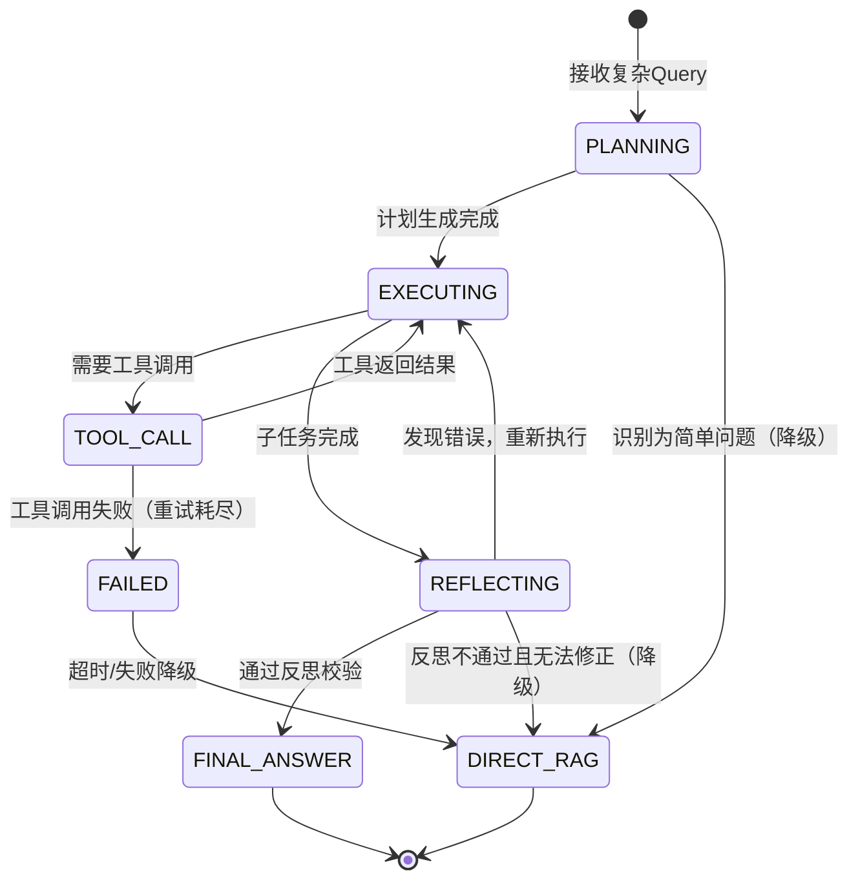
```mermaid
stateDiagram-v2
    [*] --> PLANNING: 接收复杂Query
    PLANNING --> EXECUTING: 计划生成完成
    PLANNING --> DIRECT_RAG: 识别为简单问题（降级）
    EXECUTING --> TOOL_CALL: 需要工具调用
    EXECUTING --> REFLECTING: 子任务完成
    TOOL_CALL --> EXECUTING: 工具返回结果
    TOOL_CALL --> FAILED: 工具调用失败（重试耗尽）
    REFLECTING --> EXECUTING: 发现错误，重新执行
    REFLECTING --> FINAL_ANSWER: 通过反思校验
    REFLECTING --> DIRECT_RAG: 反思不通过且无法修正（降级）
    FINAL_ANSWER --> [*]
    FAILED --> DIRECT_RAG: 超时/失败降级
    DIRECT_RAG --> [*]
```

**处理逻辑**：
```
1. 任务类型识别（Agent Controller）
   输入：query + 历史上下文
   模型：轻量分类模型（本地部署）
   输出：task_type ∈ {comparison, analysis, calculation, synthesis, troubleshooting}
   规则：BR-AGT-001：task_type为factual_qa时，直接降级为RAG（避免过度复杂化）

2. 计划制定（Planner）
   输入：query + task_type + available_tools
   模型：强LLM（GPT-4o/GLM-4）
   Prompt模板：
   ```
   你是一个任务规划专家。请将用户问题拆解为可执行的子任务计划。
   要求：
   - 每个步骤明确指定工具（document_search/web_search/calculator/database_query）
   - 标注步骤间的依赖关系（独立/依赖步骤X）
   - 预估每个步骤的Token消耗
   输出格式：JSON数组 [{step_id, description, tool, dependencies, expected_output}]
   ```
   输出：execution_plan（JSON格式）
   示例：
   [
     {"step_id": 1, "description": "检索2024年产品策略", "tool": "document_search", "dependencies": [], "expected_output": "2024策略要点"},
     {"step_id": 2, "description": "检索2025年产品策略", "tool": "document_search", "dependencies": [], "expected_output": "2025策略要点"},
     {"step_id": 3, "description": "对比差异", "tool": "calculator", "dependencies": [1,2], "expected_output": "差异表格"}
   ]

3. 执行（Executor）
   循环执行execution_plan中的步骤：
   FOR each step IN sorted_by_dependencies(execution_plan):
     3.1 检查依赖是否完成
     3.2 调用指定工具：
         - document_search: 调用RAG Pipeline（F-RAG-001），限定检索范围
         - web_search: 调用外部搜索API（需管理员开启）
         - calculator: 受限Python eval沙箱，仅允许数学表达式；禁止import、__import__、os、subprocess、open、eval、exec、compile等危险调用
         - database_query: 查询结构化数据（只读权限，SQL注入防护）
         - code_interpreter: 执行Python代码（P2），使用Docker隔离容器，禁止网络与系统调用；与calculator不是同一沙箱
     3.3 记录工具调用日志：{step_id, tool, input, output_summary, latency, cost}
     3.4 将结果存入短期记忆（Short-term Buffer）

4. 自我反思（Self-Reflection / Reflector）【P1】
   触发条件：所有步骤执行完成后 或 发现异常时
   检查项：
   - 引用准确性：答案中的引用是否真实存在于检索结果中
   - 逻辑自洽：结论是否与数据一致，有无矛盾
   - 问题覆盖：是否完整回答了原始query的所有子问题
   - 数据缺失：关键数据缺失时，自动触发补充检索（最多2轮）
   模型：强LLM（与Planner同模型）
   输出：reflection_report = {passed: bool, issues: [], confidence: float}

   若reflection_report.passed == false AND retry_count < 2:
     → 修正执行计划，重新执行有问题的步骤
   若retry_count >= 2:
     → 标记为低置信度，追加免责声明

> 注：Self-Reflection为可选增强能力，非Agent执行的强制阻塞节点；初期实现可关闭该步骤以简化流程、降低延迟。

5. 答案组装（Answer Assembler）
   输入：所有步骤结果 + reflection_report
   处理：
   - 按逻辑顺序组织答案结构
   - 注入引用标记（[^step_id.chunk_id]）
   - 生成置信度评分（综合reflection.confidence和引用覆盖率）
   - 生成3个追问建议
   输出：final_answer

6. 超时与降级管理
   监控：每5秒检查总耗时
   若耗时 > timeout（默认60秒）：
   - 中断当前执行
   - 使用已完成的步骤结果生成"部分答案"
   - 标记"由于复杂度，部分分析未完成"
   - 自动降级为简单RAG模式（F-RAG-001）
```

**输出**：
| 字段 | 类型 | 说明 |
|------|------|------|
| answer | string | 结构化答案（含表格/列表/分析） |
| execution_trace | TraceStep[] | 执行轨迹 [{step_id, description, tool, status, latency, cost}] |
| reflection_report | object | 反思报告 {passed, issues, confidence} |
| citations | Citation[] | 引用来源 |
| confidence | enum | 高/中/低 |
| total_cost | float | 总Token费用 |
| total_latency | float | 总耗时（秒） |
| is_degraded | boolean | 是否发生降级 |

---

#### 3.3.2 工具调用（Tool Use）（US-202）【P1】

**功能编号**：F-AGT-002  
**工具注册表（Tool Registry）**：

| 工具名 | 类型 | 输入模式 | 安全约束 | 降级策略 |
|--------|------|----------|----------|----------|
| document_search | 内部 | {query, kb_ids, filters} | 权限隔离 | 返回"知识库无答案" |
| web_search | 外部 | {query, max_results} | 需管理员开启 | 跳过并告知用户 |
| calculator | 沙箱 | {expression} | 受限Python eval沙箱：仅数学表达式；禁止import、__import__、os、subprocess、open、eval、exec、compile | 返回计算错误提示 |
| database_query | 内部 | {sql, params} | 只读连接池，SQL白名单 | 返回查询失败提示 |
| code_interpreter | 隔离 | {code, timeout} | Docker隔离容器（P2），无网络，CPU限制；与calculator沙箱相互独立 | 跳过工具 |

**注**：calculator仅用于数学/数值计算；code_interpreter（P2）使用Docker隔离，二者安全边界不同，不得互相替代。

**工具调用流程**：
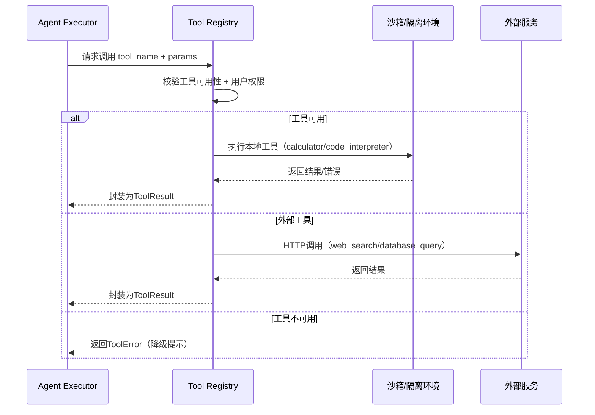
```mermaid
sequenceDiagram
    participant Agent as Agent Executor
    participant Registry as Tool Registry
    participant Sandbox as 沙箱/隔离环境
    participant External as 外部服务

    Agent->>Registry: 请求调用 tool_name + params
    Registry->>Registry: 校验工具可用性 + 用户权限
    alt 工具可用
        Registry->>Sandbox: 执行本地工具（calculator/code_interpreter）
        Sandbox-->>Registry: 返回结果/错误
        Registry-->>Agent: 封装为ToolResult
    else 外部工具
        Registry->>External: HTTP调用（web_search/database_query）
        External-->>Registry: 返回结果
        Registry-->>Agent: 封装为ToolResult
    else 工具不可用
        Registry-->>Agent: 返回ToolError（降级提示）
    end
```

---

#### 3.3.3 Agent记忆管理（US-204）【P1】

**功能编号**：F-AGT-003  
**记忆分层架构**：

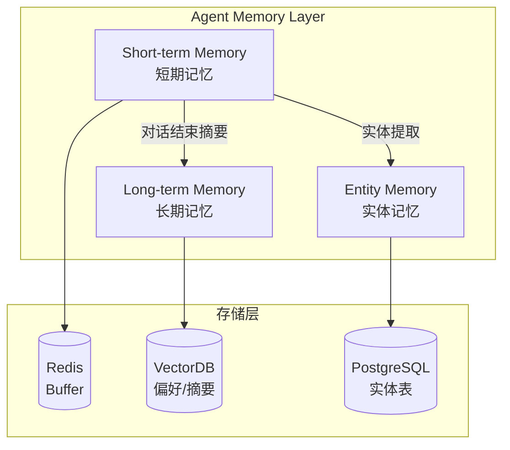
```mermaid
flowchart TB
    subgraph Memory["Agent Memory Layer"]
        STM["Short-term Memory<br/>短期记忆"]
        LTM["Long-term Memory<br/>长期记忆"]
        EM["Entity Memory<br/>实体记忆"]

        STM -->|"对话结束摘要"| LTM
        STM -->|"实体提取"| EM
    end

    subgraph Storage["存储层"]
        Redis[(Redis<br/>Buffer)]
        VectorDB[(VectorDB<br/>偏好/摘要)]
        RelDB[(PostgreSQL<br/>实体表)]
    end

    STM --> Redis
    LTM --> VectorDB
    EM --> RelDB
```

**记忆类型规格**：

| 记忆类型 | 存储 | 生命周期 | 内容 | 更新触发 |
|----------|------|----------|------|----------|
| Short-term Buffer | Redis List | 当前会话 | 最近10轮对话完整文本 | 每轮对话追加 |
| Long-term Preference | VectorDB + PostgreSQL | 永久 | 用户偏好（"偏好简洁回答"/"技术人员"） | 对话结束摘要提取 |
| Entity Memory | PostgreSQL | 永久 | 关键实体（项目/人/术语） | NER模型自动提取 |
| Conversation Summary | PostgreSQL | 30天 | 长对话摘要（关键决策点、待办） | 上下文溢出时或会话结束 |

**实体记忆表结构**：
```sql
CREATE TABLE user_entities (
    id UUID PRIMARY KEY,
    user_id UUID NOT NULL,
    entity_type VARCHAR(50), -- person/project/technology/department
    entity_name VARCHAR(200),
    entity_value TEXT, -- 实体详情JSON
    confidence FLOAT,
    source_conversation_id UUID,
    created_at TIMESTAMP,
    updated_at TIMESTAMP,
    UNIQUE(user_id, entity_type, entity_name)
);
```

**业务规则**：
- BR-AGT-002：用户可在个人设置中查看、编辑、删除Agent记忆，删除后24小时内生效（缓存失效）
- BR-AGT-003：记忆数据AES-256加密存储，用户注销时物理删除
- BR-AGT-004：实体提取置信度<0.7时不入库，避免噪声记忆

---

#### 3.3.4 Agent自我反思（US-205）【P1】

**功能编号**：F-AGT-004  
**反思检查清单（Checklist）**：
```
FOR each claim IN answer:
  1. 引用验证：claim是否能在retrieved_contexts中找到原文支撑？
     - 方法：Claim → Embedding → 向量检索上下文 → NLI模型判断 entailment/contradiction/neutral
     - 阈值：entailment置信度≥0.8为通过

  2. 数值一致性：claim中的数字是否与工具返回一致？
     - 方法：正则提取数字 → 对比原始数据

  3. 逻辑一致性：结论是否与前提矛盾？
     - 方法：LLM-as-Judge（"以下结论是否与数据矛盾？"）

FOR overall_answer:
  4. 问题覆盖度：是否回答了query的所有部分？
     - 方法：将query分解为子问题 → 检查每个子问题是否被覆盖

  5. 信息完整性：关键信息是否缺失？
     - 方法：检查required_entities是否全部出现在答案中
```

**置信度评分算法**：
```python
confidence = (
    citation_coverage * 0.3 +      # 引用覆盖率（答案中有引用的claim比例）
    nli_entailment_score * 0.3 +   # NLI蕴含分数
    logical_consistency * 0.2 +    # 逻辑一致性（LLM打分）
    query_coverage * 0.2            # 问题覆盖度
)
# 高: >=0.8, 中: 0.6-0.8, 低: <0.6
```

---

### 3.4 对话管理模块

#### 3.4.1 多会话管理（US-301）【P0】

**功能编号**：F-CONV-001  
**数据模型**：
```sql
CREATE TABLE conversations (
    id UUID PRIMARY KEY,
    user_id UUID NOT NULL,
    title VARCHAR(200), -- 自动摘要生成或用户自定义
    folder_id UUID, -- 文件夹归类
    tags VARCHAR(50)[], -- 标签
    message_count INT DEFAULT 0,
    total_tokens INT DEFAULT 0,
    status VARCHAR(20) DEFAULT 'active', -- active / archived / pinned
    context_window_size INT DEFAULT 10, -- 上下文轮数限制
    created_at TIMESTAMP,
    updated_at TIMESTAMP,
    archived_at TIMESTAMP
);

CREATE TABLE conversation_messages (
    id UUID PRIMARY KEY,
    conversation_id UUID NOT NULL,
    role VARCHAR(20) NOT NULL, -- user / assistant / system / tool
    content TEXT NOT NULL,
    message_type VARCHAR(50), -- text / image / file / tool_result
    citations JSONB, -- 引用快照
    feedback_id UUID, -- 关联反馈
    tokens_used JSONB, -- {input, output}
    model_used VARCHAR(50),
    latency_ms INT,
    created_at TIMESTAMP,
    parent_message_id UUID, -- 用于对话分支（US-304）
    branch_from_id UUID -- 分支来源消息ID
);
```

**会话标题自动生成**：
- 首条用户消息前20字符 + "..."（若用户未自定义）
- 每5轮对话自动重新摘要标题（轻量LLM调用）

---

#### 3.4.2 对话历史持久化（US-303）【P0】

**功能编号**：F-CONV-002  
**加密策略**：
- 消息内容（content字段）AES-256加密存储
- 密钥管理：KMS托管，按用户维度派生密钥
- 管理员可查看元数据（时间、Token数、模型），不可查看内容明文

**分页策略**：
- 会话列表：按updated_at倒序，每页20条，滚动加载
- 消息历史：进入会话时加载最近20条，向上滚动加载更早（cursor-based分页）

**自动归档**：
- 条件：30天未更新 且 非pinned状态
- 处理：status → archived，从Redis活跃会话列表移除，保留PostgreSQL数据
- 恢复：用户可手动恢复，重新加入Redis活跃列表

---

#### 3.4.3 对话分支（US-304）【P2】

**功能编号**：F-CONV-003  
**分支逻辑**：
```
1. 用户选择消息M（conversation_messages.id）
2. 创建新会话N：
   - 复制原会话的messages[:M]（包含M）作为初始上下文
   - 复制Agent记忆（Long-term + Entity）
   - 设置branch_from_id = M.id
3. 新会话N独立演进，原会话不受影响
4. 分支关系可视化：树形结构展示（对话图谱）
```

---

### 3.5 用户系统模块

#### 3.5.1 注册登录（US-401）【P0】

**功能编号**：F-USER-001  
**认证流程**：
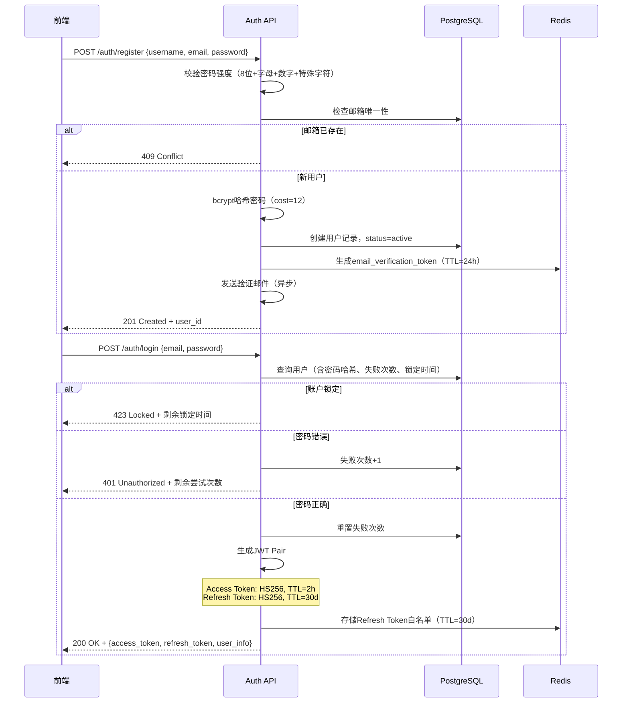
```mermaid
sequenceDiagram
    participant Client as 前端
    participant API as Auth API
    participant DB as PostgreSQL
    participant Redis as Redis

    Client->>API: POST /auth/register {username, email, password}
    API->>API: 校验密码强度（8位+字母+数字+特殊字符）
    API->>DB: 检查邮箱唯一性
    alt 邮箱已存在
        API-->>Client: 409 Conflict
    else 新用户
        API->>API: bcrypt哈希密码（cost=12）
        API->>DB: 创建用户记录，status=active
        API->>Redis: 生成email_verification_token（TTL=24h）
        API->>API: 发送验证邮件（异步）
        API-->>Client: 201 Created + user_id
    end

    Client->>API: POST /auth/login {email, password}
    API->>DB: 查询用户（含密码哈希、失败次数、锁定时间）
    alt 账户锁定
        API-->>Client: 423 Locked + 剩余锁定时间
    else 密码错误
        API->>DB: 失败次数+1
        API-->>Client: 401 Unauthorized + 剩余尝试次数
    else 密码正确
        API->>DB: 重置失败次数
        API->>API: 生成JWT Pair
        Note over API: Access Token: HS256, TTL=2h<br/>Refresh Token: HS256, TTL=30d
        API->>Redis: 存储Refresh Token白名单（TTL=30d）
        API-->>Client: 200 OK + {access_token, refresh_token, user_info}
    end
```

**Token刷新机制**：
```
1. 前端检测到Access Token过期（401 + code=TOKEN_EXPIRED）
2. 自动携带Refresh Token调用 POST /auth/refresh
3. 后端校验Refresh Token：
   - JWT签名有效
   - 存在于Redis白名单（未被注销）
   - 未过期
4. 生成新的Access Token + Refresh Token（轮换机制）
5. 旧Refresh Token从白名单移除，新Token加入
6. 返回新Token对
```

---

#### 3.5.2 JWT认证与权限控制（US-402）【P0】

**功能编号**：F-USER-002  
**RBAC模型**：

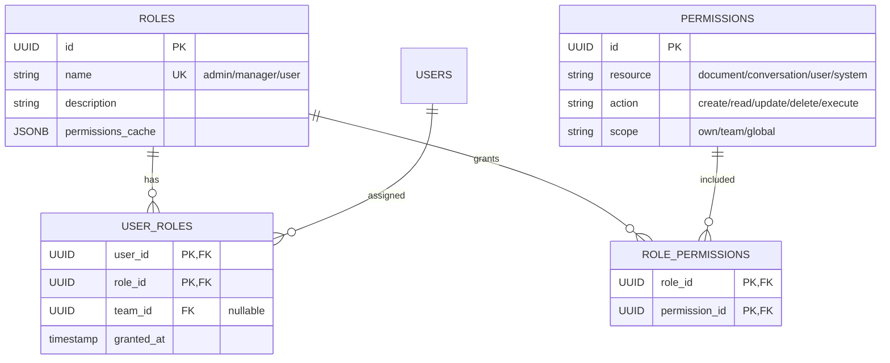
```mermaid
erDiagram
    ROLES ||--o{ USER_ROLES : "has"
    USERS ||--o{ USER_ROLES : "assigned"
    ROLES ||--o{ ROLE_PERMISSIONS : "grants"
    PERMISSIONS ||--o{ ROLE_PERMISSIONS : "included"

    ROLES {
        UUID id PK
        string name UK "admin/manager/user"
        string description
        JSONB permissions_cache
    }

    PERMISSIONS {
        UUID id PK
        string resource "document/conversation/user/system"
        string action "create/read/update/delete/execute"
        string scope "own/team/global"
    }

    USER_ROLES {
        UUID user_id PK,FK
        UUID role_id PK,FK
        UUID team_id FK "nullable"
        timestamp granted_at
    }

    ROLE_PERMISSIONS {
        UUID role_id PK,FK
        UUID permission_id PK,FK
    }
```

**权限校验层级**：
```
1. 接口级鉴权（@require_permission("document:read")）
   - 检查JWT中的roles是否包含所需权限
   - 不匹配则返回403

2. 数据级鉴权（Data-level ACL）
   - 文档查询：自动附加 WHERE (doc.permission_level='public' OR doc.uploader_id=? OR ? = ANY(doc.team_ids))
   - 向量检索：在检索阶段过滤无权限的chunk（单Collection内按kb_id Partition过滤，再结合doc_id列表做metadata二次校验）
   - 对话隔离：WHERE conversation.user_id=?

3. 字段级鉴权（Field-level）
   - 普通用户API响应中排除敏感字段（如cost_estimate、model_config）
   - 管理员后台可查看全部字段
```

---

#### 3.5.3 用户配额管理（US-403）【P1】

**功能编号**：F-USER-003  
**配额维度**：

| 维度 | 单位 | 默认配额 | 计费点 |
|------|------|----------|--------|
| 每日提问次数 | 次/日 | 100 | 每次/chat请求 |
| 每月Token消耗 | tokens/月 | 1,000,000 | 每次LLM调用累加 |
| 文档上传数量 | 个/月 | 200 | 每次上传成功 |
| 文档上传大小 | MB/月 | 5,000 | 每次上传累加 |
| Agent调用次数 | 次/日 | 50 | 每次Agent请求 |
| 存储空间占用 | MB总计 | 10,000 | 按实际存储计算 |

**配额检查流程**：
```
1. 请求到达时，Redis计数器检查（INCR + EXPIRE）
2. 若达到80%阈值：记录警告事件，发送通知（站内信+邮件）
3. 若达到100%阈值：
   - 拒绝请求，返回429 + 配额类型
   - 提供"紧急申请"入口（提交表单给管理员）
4. 配额消耗记录：异步写入PostgreSQL（quota_usage_log表），用于报表
```

---

#### 3.5.4 OAuth2/SSO登录（US-404）【P1】

**功能编号**：F-USER-004  
**SSO流程**：
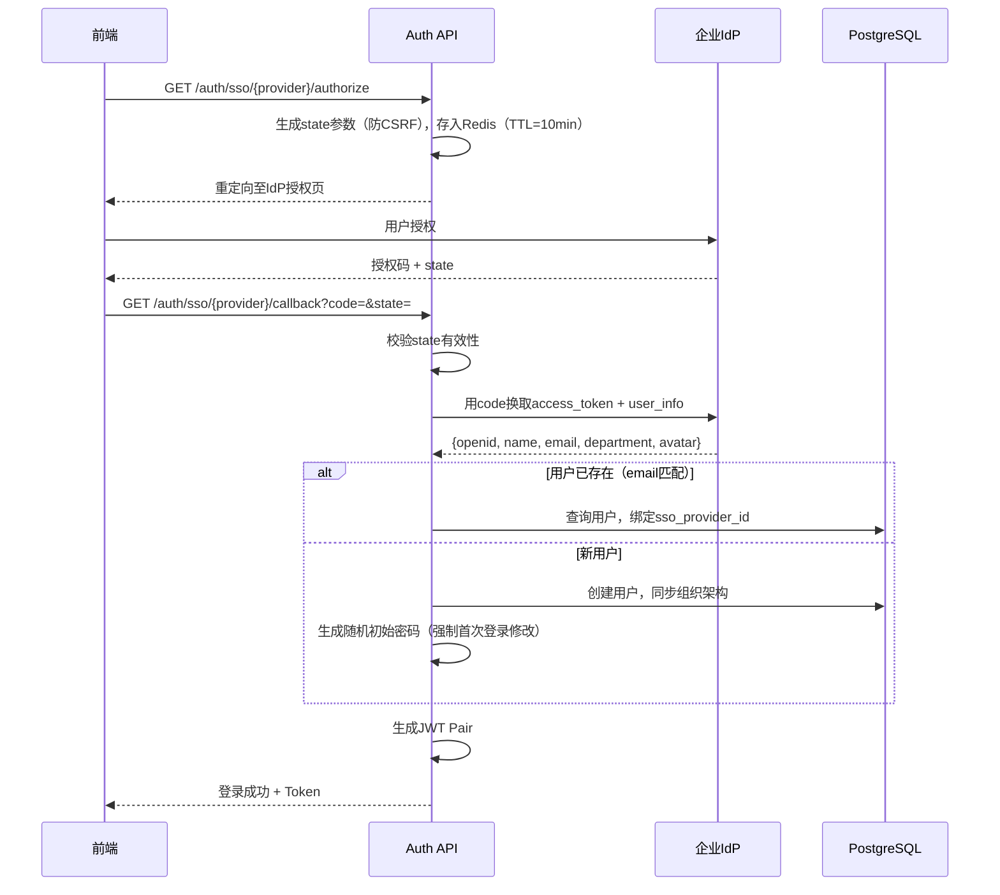
```mermaid
sequenceDiagram
    participant Client as 前端
    participant API as Auth API
    participant IdP as 企业IdP
    participant DB as PostgreSQL

    Client->>API: GET /auth/sso/{provider}/authorize
    API->>API: 生成state参数（防CSRF），存入Redis（TTL=10min）
    API-->>Client: 重定向至IdP授权页

    Client->>IdP: 用户授权
    IdP-->>Client: 授权码 + state
    Client->>API: GET /auth/sso/{provider}/callback?code=&state=
    API->>API: 校验state有效性
    API->>IdP: 用code换取access_token + user_info
    IdP-->>API: {openid, name, email, department, avatar}

    alt 用户已存在（email匹配）
        API->>DB: 查询用户，绑定sso_provider_id
    else 新用户
        API->>DB: 创建用户，同步组织架构
        API->>API: 生成随机初始密码（强制首次登录修改）
    end

    API->>API: 生成JWT Pair
    API-->>Client: 登录成功 + Token
```

---

### 3.6 系统管理模块

#### 3.6.1 知识库权限管理（US-501）【P1】

**功能编号**：F-ADM-001  
**权限矩阵**：

| 操作 | 个人 | 团队 | 公开 | 自定义 | 管理员 |
|------|------|------|------|--------|--------|
| 查看文档 | 上传者 | 团队成员 | 所有用户 | 指定用户组 | 管理员 |
| 检索内容 | 上传者 | 团队成员 | 所有用户 | 指定用户组 | 管理员 |
| 下载原始文件 | 上传者 | 团队成员 | 所有用户 | 指定用户组 | 管理员 |
| 编辑/删除 | 上传者 | 团队管理员 | 系统管理员 | 系统管理员 | 管理员 |
| 修改权限 | 上传者 | 团队管理员 | 系统管理员 | 系统管理员 | 管理员 |

**向量隔离策略**：
- 最终方案：单Collection + 按kb_id Partition隔离（Milvus）/ 等价隔离方案（Qdrant），查询时指定kb_id对应的Partition，并结合doc_id列表做metadata权限过滤。
- 不再采用每知识库独立Collection或混合方案，以降低运维复杂度并保证查询性能。

---

#### 3.6.2 使用统计与洞察（US-502）【P1】

**功能编号**：F-ADM-002  
**统计指标计算逻辑**：

| 指标 | 计算方式 | 数据源 |
|------|----------|--------|
| 热门问答Top20 | COUNT(DISTINCT query) GROUP BY query_text ORDER BY count DESC | conversation_messages WHERE role='user' |
| 高频检索文档Top10 | COUNT(DISTINCT citation.doc_id) GROUP BY doc_id | citations表 JOIN documents |
| 冷文档 | documents LEFT JOIN citations ON id=doc_id WHERE citation.id IS NULL AND uploaded_at < NOW()-90days | documents + citations |
| 用户活跃度 | DAU/WAU/MAU = COUNT(DISTINCT user_id) BY day/week/month | conversations表 |
| RAG检索命中率 | 有引用答案数 / 总答案数 | conversation_messages WHERE citations IS NOT NULL |
| 知识缺口 | 高频Query（>3次）且检索结果为空 | query_logs WHERE retrieval_count=0 |

---

#### 3.6.3 审计日志（US-503）【P1】

**功能编号**：F-ADM-003  
**审计事件类型**：

```python
AUDIT_EVENTS = {
    "auth": ["login", "logout", "password_change", "sso_bind"],
    "document": ["upload", "delete", "update", "download", "preview", "permission_change"],
    "conversation": ["create", "delete", "export", "share"],
    "admin": ["user_create", "role_change", "quota_change", "config_update"],
    "system": ["model_switch", "provider_failover", "backup_complete", "alert_triggered"]
}
```

**日志结构**：
```json
{
  "trace_id": "uuid",
  "timestamp": "ISO8601",
  "event_type": "document:delete",
  "user_id": "uuid",
  "username": "zhangsan",
  "client_ip": "10.0.1.23",
  "user_agent": "Mozilla/5.0...",
  "object_type": "document",
  "object_id": "uuid",
  "object_name": "2025产品白皮书.pdf",
  "action_result": "success",
  "duration_ms": 245,
  "request_params": {"doc_id": "uuid"},
  "response_summary": "deleted",
  "risk_level": "low"
}
```

**防篡改机制**：
- 关键审计日志写入WAL（PostgreSQL预写日志）
- 每日归档至对象存储，计算SHA256哈希链
- P3阶段：区块链存证（Hyperledger Fabric联盟链）

---

#### 3.6.4 敏感数据自动脱敏（US-504）【P1】

**功能编号**：F-ADM-004  
**PII识别规则**：

| 类型 | 正则/模型 | 脱敏方式 | 示例 |
|------|-----------|----------|------|
| 身份证号 | 正则：\d{17}[\dXx] | 替换：***********1234 | 110101********1234 |
| 手机号 | 正则：1[3-9]\d{9} | 替换：138****8888 | 138****8888 |
| 银行卡 | 正则：\d{16,19} | 替换：**** **** **** 1234 | **** **** **** 1234 |
| 邮箱 | 正则：.+@.+\..+ | 替换：a***@example.com | a***@example.com |
| 薪资数据 | NER模型 + 关键词（"月薪"/"年薪"/"工资"） | 替换：****元 | 月薪****元 |
| 客户名单 | 自定义词库 + NER（ORG标签） | 替换：[客户名称] | [客户名称] |

**脱敏Pipeline**：
```
文档解析阶段：
  1. 文本提取 → 2. 正则匹配PII → 3. 标记脱敏位置（start, end, type）
  → 4. 存储脱敏后文本至向量索引
  → 5. 原始文本加密存储（仅供白名单用户审批后查看）

问答输出阶段：
  1. 模型生成答案 → 2. 输出侧PII扫描 → 3. 实时脱敏
  → 4. 若检测到敏感词，追加提示"部分信息已脱敏"
```

---

### 3.7 工程化与性能模块

#### 3.7.1 异步文档处理（US-601）【P0】

**功能编号**：F-ENG-001  
**任务队列设计**：

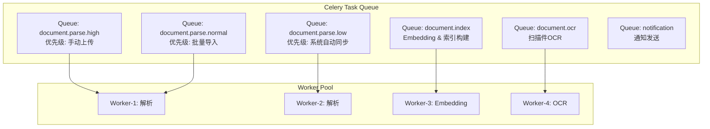
```mermaid
flowchart TB
    subgraph Queue["Celery Task Queue"]
        direction TB
        Q1["Queue: document.parse.high<br/>优先级: 手动上传"]
        Q2["Queue: document.parse.normal<br/>优先级: 批量导入"]
        Q3["Queue: document.parse.low<br/>优先级: 系统自动同步"]
        Q4["Queue: document.index<br/>Embedding & 索引构建"]
        Q5["Queue: document.ocr<br/>扫描件OCR"]
        Q6["Queue: notification<br/>通知发送"]
    end

    subgraph Workers["Worker Pool"]
        W1["Worker-1: 解析"]
        W2["Worker-2: 解析"]
        W3["Worker-3: Embedding"]
        W4["Worker-4: OCR"]
    end

    Q1 --> W1
    Q2 --> W1
    Q3 --> W2
    Q4 --> W3
    Q5 --> W4
```

**任务状态流转**：
```
PENDING → RECEIVED → STARTED → SUCCESS / FAILURE / RETRY
                    ↳ RETRY → STARTED（最多3次，指数退避：1s, 5s, 25s）
                    ↳ FAILURE → DEAD_LETTER（人工介入）
```

**任务队列与数据库表的关系**：
- Celery是唯一的任务执行与调度引擎，Redis作为Broker和Result Backend。
- 数据库中的`task_queue`表仅作为运营只读视图，通过Celery事件流同步，不直接参与任务调度，也不允许业务代码直接写入或修改。

---

#### 3.7.2 系统监控与告警（US-602）【P1】

**功能编号**：F-ENG-002  
**监控指标采集**：

| 指标类别 | 指标名 | 类型 | 采集方式 | 告警阈值 |
|----------|--------|------|----------|----------|
| API性能 | http_request_duration_seconds | Histogram | Prometheus中间件 | P99>5s |
| API错误 | http_request_error_rate | Gauge | 计数器 | >5%持续5min |
| 向量检索 | vector_search_latency_ms | Histogram | 自定义埋点 | P99>500ms |
| 队列 | celery_queue_length | Gauge | Celery Exporter | >100持续10min |
| 队列 | celery_task_failure_rate | Gauge | Celery Exporter | >5% |
| Token | token_consumption_per_minute | Counter | 自定义埋点 | 超预算阈值 |
| 缓存 | cache_hit_rate | Gauge | Redis INFO | <30% |
| 模型 | model_provider_success_rate | Gauge | Model Gateway | <99.5% |
| RAG | retrieval_hit_rate | Gauge | 评估Pipeline | <90% |
| RAG | hallucination_rate | Gauge | 评估Pipeline | >5% |

**告警升级策略**：
```
Level 1（P3）：邮件通知值班工程师
Level 2（P2）：邮件 + 企业微信/钉钉Webhook，5分钟未Ack则升级
Level 3（P1）：电话/SMS通知SRE负责人，自动创建Incident工单
Level 4（P0）：自动触发降级（关闭非核心功能、切换备用模型）
```

---

#### 3.7.3 模型网关与多Provider管理（US-603）【P1】

**功能编号**：F-ENG-003  
**模型网关架构**：

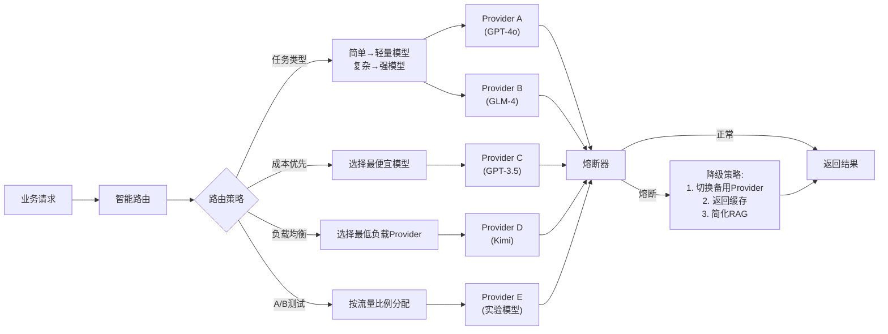
```mermaid
flowchart LR
    Request["业务请求"] --> Router["智能路由"]
    Router --> Strategy{"路由策略"}

    Strategy -->|"任务类型"| TaskRouter["简单→轻量模型<br/>复杂→强模型"]
    Strategy -->|"成本优先"| CostRouter["选择最便宜模型"]
    Strategy -->|"负载均衡"| LoadRouter["选择最低负载Provider"]
    Strategy -->|"A/B测试"| ABRouter["按流量比例分配"]

    TaskRouter --> ProviderA["Provider A<br/>(GPT-4o)"]
    TaskRouter --> ProviderB["Provider B<br/>(GLM-4)"]
    CostRouter --> ProviderC["Provider C<br/>(GPT-3.5)"]
    LoadRouter --> ProviderD["Provider D<br/>(Kimi)"]
    ABRouter --> ProviderE["Provider E<br/>(实验模型)"]

    ProviderA --> CB["熔断器"]
    ProviderB --> CB
    ProviderC --> CB
    ProviderD --> CB
    ProviderE --> CB

    CB -->|"正常"| Response["返回结果"]
    CB -->|"熔断"| Fallback["降级策略:<br/>1. 切换备用Provider<br/>2. 返回缓存<br/>3. 简化RAG"]
    Fallback --> Response
```

**熔断器配置（Circuit Breaker）**：
```python
CIRCUIT_BREAKER_CONFIG = {
    "failure_threshold": 5,        # 5次失败触发熔断
    "recovery_timeout": 60,        # 60秒后尝试半开
    "half_open_max_calls": 3,    # 半开状态最多3次试探
    "expected_exception": [TimeoutError, ConnectionError, RateLimitError]
}
```

**缓存策略**：
- Query结果缓存：Redis，Key=hash(user_id + query + kb_ids + search_mode + user_permission_scope)，命名空间 `sk:query:{user_id}:{hash}`，TTL=5min。必须按用户维度隔离，防止跨用户缓存泄露。
- Embedding缓存：Redis，Key=hash(text+model_version)，TTL=24h
- 模型响应缓存：仅缓存简单事实问答（confidence>0.9），TTL=1h

---

#### 3.7.4 RAG效果评估与观测（US-604）【P1】

**功能编号**：F-ENG-004  
**评估Pipeline**：

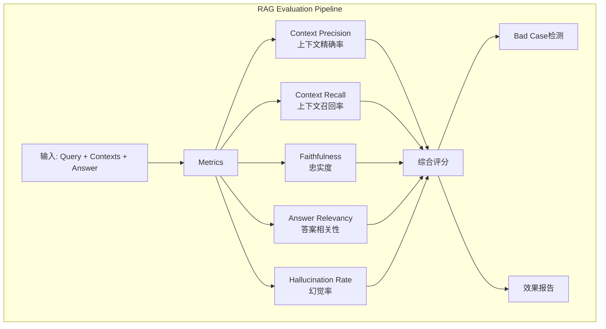
```mermaid
flowchart TB
    subgraph Evaluation["RAG Evaluation Pipeline"]
        Input["输入: Query + Contexts + Answer"] --> Metrics

        Metrics --> M1["Context Precision<br/>上下文精确率"]
        Metrics --> M2["Context Recall<br/>上下文召回率"]
        Metrics --> M3["Faithfulness<br/>忠实度"]
        Metrics --> M4["Answer Relevancy<br/>答案相关性"]
        Metrics --> M5["Hallucination Rate<br/>幻觉率"]

        M1 --> Score["综合评分"]
        M2 --> Score
        M3 --> Score
        M4 --> Score
        M5 --> Score

        Score --> BadCase["Bad Case检测"]
        Score --> Report["效果报告"]
    end
```

**评估指标算法**：

| 指标 | 计算方法 | 阈值 | 低分处理 |
|------|----------|------|----------|
| Context Precision | 相关chunk数 / Top-K检索数 | >0.8 | 优化重排序模型 |
| Context Recall | 相关chunk数 / 理想相关chunk数 | >0.9 | 优化Query扩展/分块策略 |
| Faithfulness | LLM判断：答案claim是否被上下文支撑 | >0.85 | 加强引用强制 |
| Answer Relevancy | Embedding相似度(answer, query) | >0.8 | 优化生成Prompt |
| Hallucination Rate | 无引用支撑的claim数 / 总claim数 | <5% | 严格模式+反思 |

**Bad Case自动检测规则**：
```
IF user_feedback == thumbs_down OR confidence_score < 0.6 OR faithfulness < 0.7:
    → 标记为Bad Case
    → 保存完整上下文快照（query, contexts, answer, model_params, prompt_version）
    → 分类根因：
        - retrieval_failure: 检索未召回相关文档
        - ranking_error: 相关文档排名靠后
        - generation_hallucination: 生成内容脱离上下文
        - citation_error: 引用标记错误/缺失
        - format_error: 格式不符合预期
    → 进入Bad Case库（bad_cases表）
    → 每周生成《RAG优化建议报告》
```

---

### 3.8 数据飞轮与成本优化模块

#### 3.8.1 用户反馈收集（US-701）【P1】

**功能编号**：F-DW-001  
**反馈闭环流程**：
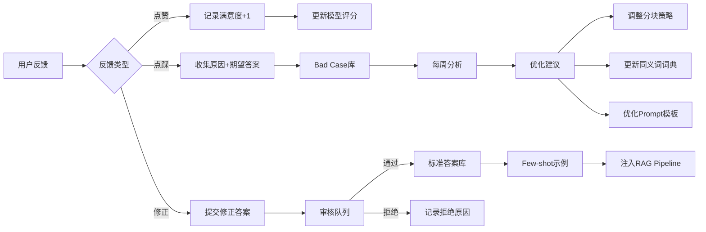
```mermaid
flowchart LR
    A[用户反馈] --> B{反馈类型}
    B -->|点赞| C[记录满意度+1]
    B -->|点踩| D[收集原因+期望答案]
    B -->|修正| E[提交修正答案]

    C --> F[更新模型评分]
    D --> G[Bad Case库]
    E --> H[审核队列]

    G --> I[每周分析]
    H -->|通过| J[标准答案库]
    H -->|拒绝| K[记录拒绝原因]

    I --> L[优化建议]
    J --> M[Few-shot示例]

    L --> N[调整分块策略]
    L --> O[更新同义词词典]
    L --> P[优化Prompt模板]

    M --> Q[注入RAG Pipeline]
```

---

#### 3.8.2 知识库自动优化建议（US-702）【P2】

**功能编号**：F-DW-002  
**优化建议生成逻辑**：

| 建议类型 | 触发条件 | 生成逻辑 | 动作 |
|----------|----------|----------|------|
| 知识缺口 | 高频Query（>3次/周）且retrieval_count=0 | 聚类未回答问题 → 提取主题 → 匹配现有文档 | 推送"建议补充文档"任务卡片 |
| 冷文档 | 90天零检索 且 uploaded_at>90天 | 扫描citations表 → 统计doc_id出现次数 | 推送"建议归档"任务卡片 |
| 过时文档 | 被检索>10次/月 且 uploaded_at>1年 | 标记为"需时效性检查" | 推送"建议更新"任务卡片 |
| 分块优化 | Bad Case中retrieval_failure占比>30% 且 集中在某文档 | 分析该文档的chunk分布 → 检测chunk_size异常 | 推送"建议调整分块"任务卡片 |

---

#### 3.8.3 Token与成本精细化监控（US-801）【P1】

**功能编号**：F-COST-001  
**成本追踪模型**：

```sql
CREATE TABLE token_usage_logs (
    id UUID PRIMARY KEY,
    request_id UUID NOT NULL,
    user_id UUID NOT NULL,
    conversation_id UUID,
    model_name VARCHAR(50) NOT NULL,
    provider VARCHAR(50) NOT NULL,
    input_tokens INT NOT NULL,
    output_tokens INT NOT NULL,
    total_tokens INT GENERATED ALWAYS AS (input_tokens + output_tokens) STORED,
    cost_cny DECIMAL(10,6), -- 按模型单价计算
    task_type VARCHAR(50), -- rag/agent/embedding/rerank
    latency_ms INT,
    created_at TIMESTAMP
);
```

**成本分摊报表**：
- 按部门：JOIN users.department_id → SUM(cost_cny)
- 按项目：JOIN conversations.project_id → SUM(cost_cny)
- 按模型：GROUP BY model_name → SUM(cost_cny), AVG(latency_ms)

---

#### 3.8.4 智能缓存与降级策略（US-802）【P1】

**功能编号**：F-COST-002  
**缓存层级**：

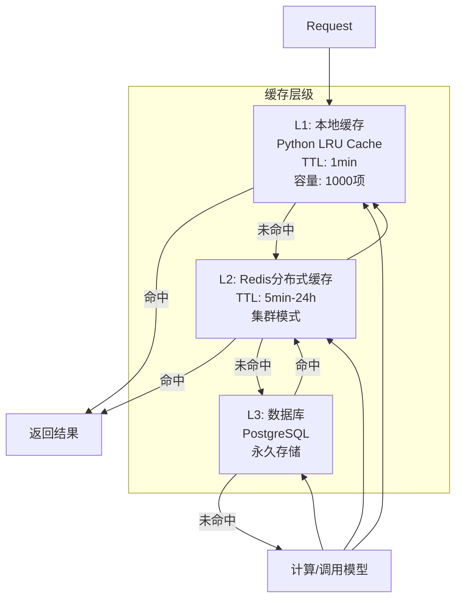
```mermaid
flowchart TB
    subgraph CacheLayer["缓存层级"]
        L1["L1: 本地缓存<br/>Python LRU Cache<br/>TTL: 1min<br/>容量: 1000项"]
        L2["L2: Redis分布式缓存<br/>TTL: 5min-24h<br/>集群模式"]
        L3["L3: 数据库<br/>PostgreSQL<br/>永久存储"]
    end

    Request --> L1
    L1 -->|命中| Return
    L1 -->|未命中| L2
    L2 -->|命中| Return
    L2 -->|未命中| L3
    L3 -->|命中| L2
    L2 --> L1
    L3 -->|未命中| Compute
    Compute --> L1
    Compute --> L2
    Compute --> L3

    Return["返回结果"]
    Compute["计算/调用模型"]
```

**降级策略矩阵**：

| 触发条件 | 降级动作 | 用户体验影响 |
|----------|----------|------------|
| 高峰期QPS>阈值 | 简单问答走轻量模型 | 复杂问题准确率略降 |
| 模型Provider故障 | 切换备用Provider | 无感知（延迟可能增加） |
| 预算使用率>90% | 关闭Agent功能，仅保留基础RAG | 复杂问题无法处理 |
| 预算使用率>100% | 关闭流式输出，返回非流式 | 等待时间增加 |
| 向量DB延迟>P99 | 跳过重排序，仅用向量相似度 | 检索精度略降 |
| Embedding服务熔断 | 使用缓存Embedding或简化分块 | 新文档无法索引 |

---

## 四、业务流程图

### 4.1 核心业务流程：端到端问答

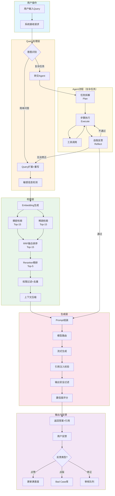
```mermaid
flowchart TB
    subgraph UserAction["用户操作"]
        A1["用户输入Query"] --> A2["系统接收请求"]
    end

    subgraph QueryProcess["Query处理层"]
        A2 --> B1{"意图识别"}
        B1 -->|简单问答| B2["Query扩展+重写"]
        B1 -->|复杂任务| B3["转交Agent"]
        B2 --> B4["敏感信息检测"]
    end

    subgraph Retrieval["检索层"]
        B4 --> C1["Embedding生成"]
        C1 --> C2["稠密检索<br/>Top-15"]
        C1 --> C3["稀疏检索<br/>Top-15"]
        C2 --> C4["RRF融合排序<br/>Top-15"]
        C3 --> C4
        C4 --> C5["Reranker精排<br/>Top-5"]
        C5 --> C6["权限过滤+去重"]
        C6 --> C7["上下文压缩"]
    end

    subgraph Generation["生成层"]
        C7 --> D1["Prompt组装"]
        D1 --> D2["模型路由"]
        D2 --> D3["流式生成"]
        D3 --> D4["引用注入校验"]
        D4 --> D5["输出安全过滤"]
        D5 --> D6["置信度评分"]
    end

    subgraph Output["输出与反馈"]
        D6 --> E1["返回答案+引用"]
        E1 --> E2["用户反馈"]
        E2 --> E3{"反馈类型?"}
        E3 -->|点赞| E4["更新满意度"]
        E3 -->|点踩| E5["Bad Case库"]
        E3 -->|修正| E6["审核队列"]
    end

    subgraph AgentFlow["Agent流程（复杂任务）"]
        B3 --> F1["任务拆解<br/>Plan"]
        F1 --> F2["步骤执行<br/>Execute"]
        F2 --> F3["工具调用"]
        F3 --> F2
        F2 --> F4["自我反思<br/>Reflect"]
        F4 -->|通过| D1
        F4 -->|不通过| F2
        F4 -->|无法修正| B2
    end

    style UserAction fill:#e1f5fe
    style QueryProcess fill:#fff3e0
    style Retrieval fill:#e8f5e9
    style Generation fill:#fce4ec
    style Output fill:#f3e5f5
    style AgentFlow fill:#fff8e1
```

### 4.2 文档生命周期管理流程

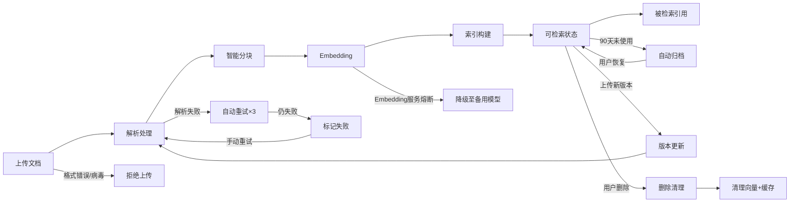
```mermaid
flowchart LR
    Upload["上传文档"] --> Parse["解析处理"] --> Chunk["智能分块"] --> Embed["Embedding"] --> Index["索引构建"] --> Ready["可检索状态"]

    Upload -->|格式错误/病毒| Reject["拒绝上传"]
    Parse -->|解析失败| Retry["自动重试×3"]
    Retry -->|仍失败| Failed["标记失败"]
    Embed -->|Embedding服务熔断| Degrade["降级至备用模型"]

    Ready --> Query["被检索引用"]
    Ready -->|90天未使用| Archive["自动归档"]
    Ready -->|上传新版本| Update["版本更新"] --> Parse
    Ready -->|用户删除| Delete["删除清理"] --> Clean["清理向量+缓存"]

    Archive -->|用户恢复| Ready
    Failed -->|手动重试| Parse
```

### 4.3 用户认证与权限流程

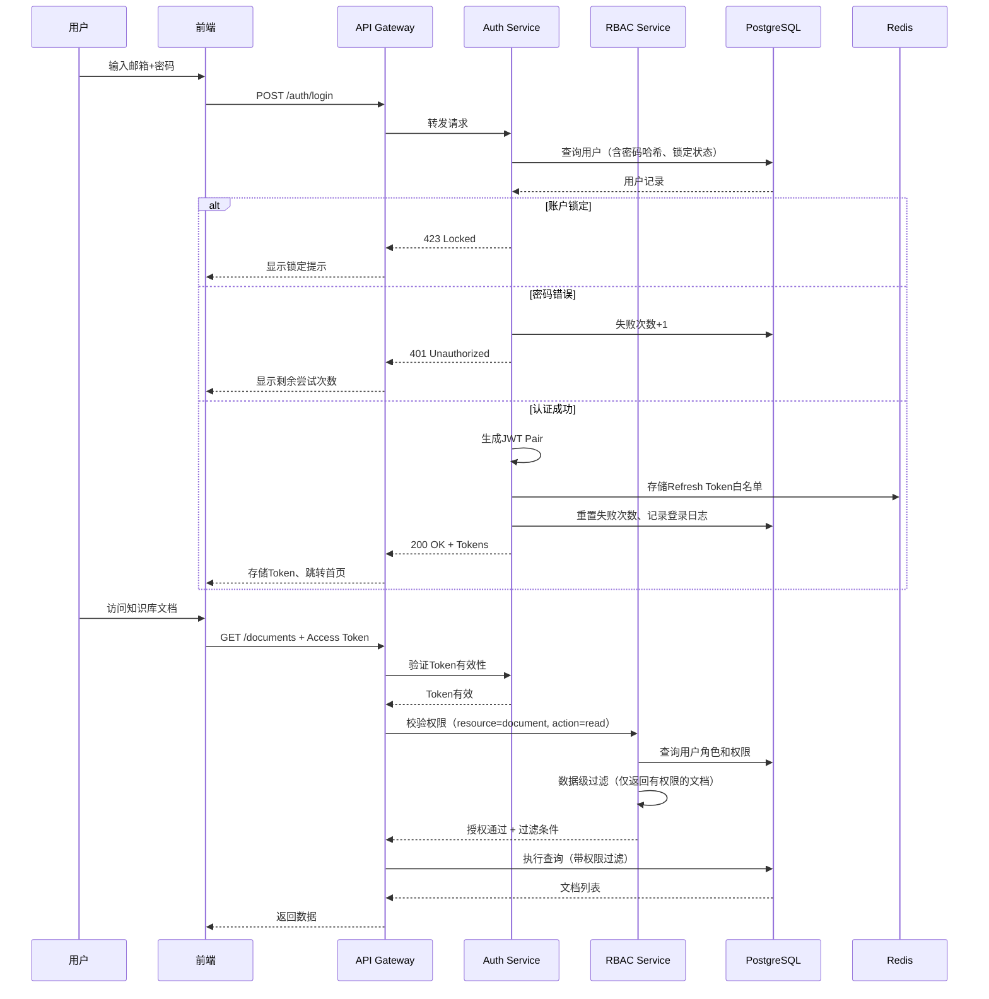
```mermaid
sequenceDiagram
    participant U as 用户
    participant F as 前端
    participant G as API Gateway
    participant A as Auth Service
    participant R as RBAC Service
    participant DB as PostgreSQL
    participant Redis as Redis

    U->>F: 输入邮箱+密码
    F->>G: POST /auth/login
    G->>A: 转发请求
    A->>DB: 查询用户（含密码哈希、锁定状态）
    DB-->>A: 用户记录

    alt 账户锁定
        A-->>G: 423 Locked
        G-->>F: 显示锁定提示
    else 密码错误
        A->>DB: 失败次数+1
        A-->>G: 401 Unauthorized
        G-->>F: 显示剩余尝试次数
    else 认证成功
        A->>A: 生成JWT Pair
        A->>Redis: 存储Refresh Token白名单
        A->>DB: 重置失败次数、记录登录日志
        A-->>G: 200 OK + Tokens
        G-->>F: 存储Token、跳转首页
    end

    U->>F: 访问知识库文档
    F->>G: GET /documents + Access Token
    G->>A: 验证Token有效性
    A-->>G: Token有效
    G->>R: 校验权限（resource=document, action=read）
    R->>DB: 查询用户角色和权限
    R->>R: 数据级过滤（仅返回有权限的文档）
    R-->>G: 授权通过 + 过滤条件
    G->>DB: 执行查询（带权限过滤）
    DB-->>G: 文档列表
    G-->>F: 返回数据
```

---

## 五、数据流图（DFD）

### 5.1 上下文数据流图（Level 0）

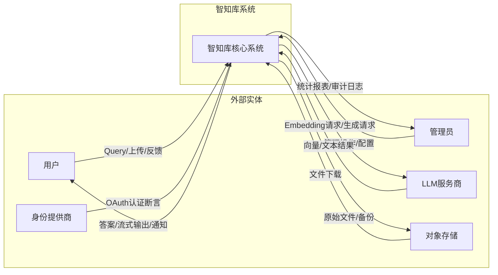
```mermaid
flowchart LR
    subgraph ExternalEntities["外部实体"]
        User["用户"]
        Admin["管理员"]
        IdP["身份提供商"]
        LLMProvider["LLM服务商"]
        Storage["对象存储"]
    end

    subgraph SmartKnowledgeSystem["智知库系统"]
        SK["智知库核心系统"]
    end

    User -->|"Query/上传/反馈"| SK
    SK -->|"答案/流式输出/通知"| User
    Admin -->|"管理操作/配置"| SK
    SK -->|"统计报表/审计日志"| Admin
    IdP -->|"OAuth认证断言"| SK
    SK -->|"Embedding请求/生成请求"| LLMProvider
    LLMProvider -->|"向量/文本结果"| SK
    SK -->|"原始文件/备份"| Storage
    Storage -->|"文件下载"| SK
```

### 5.2 Level 1 DFD：主要加工与数据存储

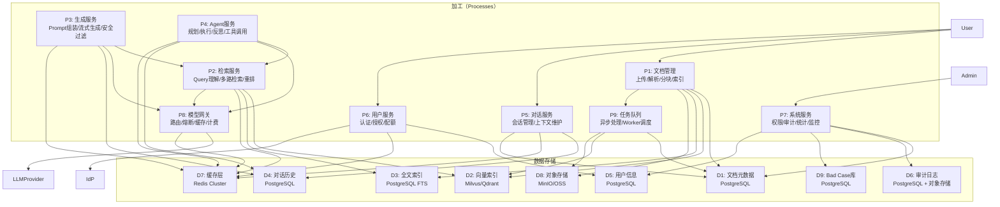
```mermaid
flowchart TB
    subgraph Processes["加工（Processes）"]
        P1["P1: 文档管理<br/>上传/解析/分块/索引"]
        P2["P2: 检索服务<br/>Query理解/多路检索/重排"]
        P3["P3: 生成服务<br/>Prompt组装/流式生成/安全过滤"]
        P4["P4: Agent服务<br/>规划/执行/反思/工具调用"]
        P5["P5: 对话服务<br/>会话管理/上下文维护"]
        P6["P6: 用户服务<br/>认证/授权/配额"]
        P7["P7: 系统服务<br/>权限/审计/统计/监控"]
        P8["P8: 模型网关<br/>路由/熔断/缓存/计费"]
        P9["P9: 任务队列<br/>异步处理/Worker调度"]
    end

    subgraph DataStores["数据存储"]
        D1["D1: 文档元数据<br/>PostgreSQL"]
        D2["D2: 向量索引<br/>Milvus/Qdrant"]
        D3["D3: 全文索引<br/>PostgreSQL FTS"]
        D4["D4: 对话历史<br/>PostgreSQL"]
        D5["D5: 用户信息<br/>PostgreSQL"]
        D6["D6: 审计日志<br/>PostgreSQL + 对象存储"]
        D7["D7: 缓存层<br/>Redis Cluster"]
        D8["D8: 对象存储<br/>MinIO/OSS"]
        D9["D9: Bad Case库<br/>PostgreSQL"]
    end

    User --> P1
    User --> P5
    User --> P6
    Admin --> P7

    P1 --> D1
    P1 --> D2
    P1 --> D3
    P1 --> D8
    P1 --> P9

    P2 --> D2
    P2 --> D3
    P2 --> D7
    P2 --> P8

    P3 --> P2
    P3 --> P8
    P3 --> D4
    P3 --> D7

    P4 --> P2
    P4 --> P8
    P4 --> D4
    P4 --> D7

    P5 --> D4
    P5 --> D7
    P5 --> D1

    P6 --> D5
    P6 --> D7
    P6 --> IdP

    P7 --> D1
    P7 --> D6
    P7 --> D9
    P7 --> D5

    P8 --> LLMProvider
    P8 --> D7

    P9 --> D1
    P9 --> D2
    P9 --> D8
```

### 5.3 Level 2 DFD：RAG Pipeline详细数据流

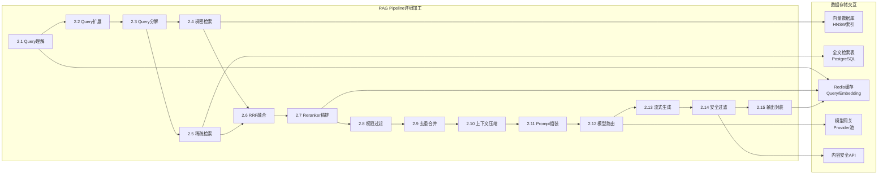
```mermaid
flowchart LR
    subgraph RAGProcess["RAG Pipeline详细加工"]
        direction TB
        Q1["2.1 Query理解"] --> Q2["2.2 Query扩展"]
        Q2 --> Q3["2.3 Query分解"]
        Q3 --> R1["2.4 稠密检索"]
        Q3 --> R2["2.5 稀疏检索"]
        R1 --> F1["2.6 RRF融合"]
        R2 --> F1
        F1 --> R3["2.7 Reranker精排"]
        R3 --> P1["2.8 权限过滤"]
        P1 --> D1["2.9 去重合并"]
        D1 --> C1["2.10 上下文压缩"]
        C1 --> G1["2.11 Prompt组装"]
        G1 --> G2["2.12 模型路由"]
        G2 --> G3["2.13 流式生成"]
        G3 --> S1["2.14 安全过滤"]
        S1 --> O1["2.15 输出封装"]
    end

    subgraph DataStores2["数据存储交互"]
        VDB["向量数据库<br/>HNSW索引"]
        FTS["全文检索表<br/>PostgreSQL"]
        Cache["Redis缓存<br/>Query/Embedding"]
        ModelGW["模型网关<br/>Provider池"]
        Safety["内容安全API"]
    end

    Q1 --> Cache
    R1 --> VDB
    R2 --> FTS
    R3 --> Cache
    G2 --> ModelGW
    S1 --> Safety
    O1 --> Cache
```

---

## 六、数据模型与ER图

### 6.1 核心实体关系图

```mermaid
erDiagram
    USERS ||--o{ CONVERSATIONS : "creates"
    USERS ||--o{ DOCUMENTS : "uploads"
    USERS ||--o{ USER_ROLES : "has"
    USERS ||--o{ USER_ENTITIES : "remembered_by"
    USERS ||--o{ FEEDBACKS : "submits"
    USERS ||--o{ AUDIT_LOGS : "generates"
    USERS ||--o{ QUOTA_USAGE : "consumes"

    ROLES ||--o{ USER_ROLES : "assigned_to"
    ROLES ||--o{ ROLE_PERMISSIONS : "grants"
    PERMISSIONS ||--o{ ROLE_PERMISSIONS : "included_in"

    KNOWLEDGE_BASES ||--o{ DOCUMENTS : "contains"
    KNOWLEDGE_BASES ||--o{ CATEGORIES : "has"
    CATEGORIES ||--o{ CATEGORIES : "parent_of"

    DOCUMENTS ||--o{ DOCUMENT_CHUNKS : "split_into"
    DOCUMENTS ||--o{ DOCUMENT_TAGS : "tagged_with"
    DOCUMENTS ||--o{ DOCUMENT_VERSIONS : "has_history"
    DOCUMENTS ||--o{ CITATIONS : "referenced_in"
    TAGS ||--o{ DOCUMENT_TAGS : "labels"

    CONVERSATIONS ||--o{ CONVERSATION_MESSAGES : "contains"
    CONVERSATIONS ||--o{ CONVERSATION_FOLDERS : "organized_in"
    CONVERSATION_MESSAGES ||--o{ FEEDBACKS : "receives"
    CONVERSATION_MESSAGES ||--o{ CITATIONS : "includes"

    DOCUMENT_CHUNKS ||--o{ CITATIONS : "cited_as"

    BAD_CASES ||--o{ BAD_CASE_ANALYSIS : "analyzed_by"
    FEEDBACKS ||--o{ BAD_CASES : "triggers"

    TOKEN_USAGE_LOGS }o--|| USERS : "records"
    TOKEN_USAGE_LOGS }o--|| CONVERSATIONS : "belongs_to"

    USERS {
        UUID id PK
        string username UK
        string email UK
        string password_hash
        string display_name
        string department_id
        string avatar_url
        enum status "active/locked/inactive"
        timestamp last_login_at
        timestamp created_at
    }

    KNOWLEDGE_BASES {
        UUID id PK
        string name
        string description
        UUID owner_id FK
        enum default_permission "personal/team/public"
        JSONB config "chunk_strategy,embedding_model"
        timestamp created_at
    }

    DOCUMENTS {
        UUID id PK
        UUID kb_id FK
        string filename
        string file_type
        int file_size
        int page_count
        string storage_path
        UUID uploader_id FK
        enum processing_status "pending/parsing/chunked/indexing/indexed/partial/failed"
        enum lifecycle_status "active/archived/deleting/deleted"
        enum permission_level "personal/team/public/custom"
        JSONB metadata "title,author,created_date"
        timestamp uploaded_at
        timestamp indexed_at
    }

    DOCUMENT_CHUNKS {
        UUID id PK
        UUID doc_id FK
        int chunk_index
        text content
        text content_masked "脱敏后内容"
        int char_count
        int token_count
        int page_num
        string section_title
        JSONB vector_metadata "embedding_model,version"
        timestamp created_at
    }

    CONVERSATIONS {
        UUID id PK
        UUID user_id FK
        string title
        UUID folder_id FK
        string[] tags
        int message_count
        int total_tokens
        enum status "active/archived/pinned"
        int context_window_size
        timestamp created_at
        timestamp updated_at
    }

    CONVERSATION_MESSAGES {
        UUID id PK
        UUID conversation_id FK
        enum role "user/assistant/system/tool"
        text content
        string message_type
        JSONB citations
        UUID feedback_id FK
        JSONB tokens_used
        string model_used
        int latency_ms
        UUID parent_message_id
        UUID branch_from_id
        timestamp created_at
    }

    FEEDBACKS {
        UUID id PK
        UUID message_id FK
        UUID user_id FK
        enum feedback_type "thumbs_up/thumbs_down/correction"
        enum reason "factual_error/no_answer/citation_wrong/hallucination/other"
        text comment
        text corrected_answer
        JSONB context_snapshot
        enum status "pending/reviewed/resolved/rejected"
        timestamp created_at
    }

    BAD_CASES {
        UUID id PK
        UUID feedback_id FK
        string query_text
        JSONB retrieved_contexts
        text generated_answer
        string root_cause "retrieval_failure/ranking_error/generation_hallucination/citation_error/format_error"
        float confidence_score
        enum priority "high/medium/low"
        enum status "open/analyzing/fixed/verified/closed"
        timestamp created_at
        timestamp resolved_at
    }

    AUDIT_LOGS {
        UUID id PK
        string trace_id UK
        timestamp event_at
        string event_type
        UUID user_id FK
        string username
        string client_ip
        string user_agent
        string object_type
        UUID object_id
        string object_name
        string action_result
        int duration_ms
        JSONB request_params
        string response_summary
        enum risk_level "low/medium/high/critical"
    }

    TOKEN_USAGE_LOGS {
        UUID id PK
        UUID request_id
        UUID user_id FK
        UUID conversation_id FK
        string model_name
        string provider
        int input_tokens
        int output_tokens
        int total_tokens
        decimal cost_cny
        string task_type
        int latency_ms
        timestamp created_at
    }
```

### 6.2 向量数据库Collection设计（Milvus）

```yaml
Collection: document_chunks
  Fields:
    - id: INT64, PK, auto_id=True
    - doc_id: VARCHAR(36)  # 用于权限过滤和删除
    - kb_id: VARCHAR(36)   # 知识库Partition隔离键
    - chunk_index: INT32
    - content: VARCHAR(4096)  # 脱敏后文本
    - embedding: FLOAT_VECTOR(1024)  # BGE-M3维度
    - sparse_vector: SPARSE_FLOAT_VECTOR  # 用于混合检索
    - metadata: JSON  # {page_num, section_title, token_count, created_at}

  Index:
    - embedding: HNSW, metric_type=COSINE
      params: {M: 16, efConstruction: 256}
    - sparse_vector: SPARSE_INVERTED_INDEX, metric_type=IP

  Partitions:
    - _default
    - kb_{kb_id}  # 按知识库动态创建Partition（物理隔离）
```

---

## 七、状态机设计

### 7.1 文档状态机

> 实际数据模型中，文档状态拆分为 `processing_status`（PENDING / PARSING / CHUNKED / INDEXING / INDEXED / PARTIAL / FAILED）与 `lifecycle_status`（ACTIVE / ARCHIVED / DELETING / DELETED）。下图将两类状态合并展示，便于理解完整生命周期。

```mermaid
stateDiagram-v2
    [*] --> PENDING: 文件上传完成
    PENDING --> PARSING: 任务队列消费
    PARSING --> CHUNKED: 解析成功
    PARSING --> FAILED: 解析异常
    CHUNKED --> INDEXING: 开始Embedding
    CHUNKED --> FAILED: 分块异常
    INDEXING --> INDEXED: 索引构建成功
    INDEXING --> PARTIAL: 部分Chunk失败
    INDEXING --> FAILED: 索引服务异常
    PARTIAL --> INDEXED: 人工修复重试
    FAILED --> PARSING: 手动重试（max 3）
    INDEXED --> UPDATING: 上传新版本
    UPDATING --> PARSING: 重新解析
    INDEXED --> ARCHIVED: 90天未使用
    ARCHIVED --> INDEXED: 手动恢复
    INDEXED --> DELETING: 用户删除
    ARCHIVED --> DELETING: 用户删除
    DELETING --> DELETED: 清理完成
    DELETED --> [*]

    note right of FAILED
        自动重试策略：
        1次：1秒后
        2次：5秒后
        3次：25秒后
        3次均失败 → DEAD_LETTER
    end note
```

### 7.2 异步任务状态机（Celery）

```mermaid
stateDiagram-v2
    [*] --> PENDING: 任务投递
    PENDING --> RECEIVED: Worker接收
    RECEIVED --> STARTED: 开始执行
    STARTED --> SUCCESS: 执行成功
    STARTED --> FAILURE: 执行失败
    STARTED --> RETRY: 触发重试
    RETRY --> STARTED: 重新执行
    RETRY --> FAILURE: 重试耗尽
    FAILURE --> DEAD_LETTER: 进入死信队列
    SUCCESS --> [*]
    DEAD_LETTER --> [*]

    PENDING --> REVOKED: 用户取消
    RECEIVED --> REVOKED: 用户取消
    REVOKED --> [*]
```

### 7.3 Agent执行状态机

```mermaid
stateDiagram-v2
    [*] --> PLANNING: 接收复杂Query
    PLANNING --> EXECUTING: 计划生成完成
    PLANNING --> DIRECT_RAG: 识别为简单问题（降级）

    EXECUTING --> TOOL_CALL: 需要外部工具
    EXECUTING --> REFLECTING: 步骤执行完成

    TOOL_CALL --> EXECUTING: 工具返回结果
    TOOL_CALL --> FAILED: 工具调用失败（重试耗尽）

    REFLECTING --> EXECUTING: 反思发现错误，重新执行
    REFLECTING --> FINAL_ANSWER: 反思通过
    REFLECTING --> DIRECT_RAG: 反思不通过且无法修正

    FAILED --> DIRECT_RAG: 超时/失败降级
    DIRECT_RAG --> [*]
    FINAL_ANSWER --> [*]

    note right of PLANNING
        超时检测：每5秒检查
        总耗时 > 60秒 → 强制降级
    end note
```

### 7.4 用户会话状态机

```mermaid
stateDiagram-v2
    [*] --> ACTIVE: 创建新会话
    ACTIVE --> ACTIVE: 持续对话
    ACTIVE --> PINNED: 用户置顶
    PINNED --> ACTIVE: 取消置顶
    ACTIVE --> ARCHIVED: 30天未活跃
    PINNED --> ARCHIVED: 30天未活跃
    ARCHIVED --> ACTIVE: 用户恢复
    ACTIVE --> BRANCHED: 创建分支
    BRANCHED --> ACTIVE: 分支独立演进
    ACTIVE --> DELETED: 用户删除
    ARCHIVED --> DELETED: 用户删除
    DELETED --> [*]
```

---

## 八、接口规格（API Definition）

### 8.1 接口设计规范

- **Base URL**: `https://api.smartknowledge.example.com/v1`
- **认证方式**: `Authorization: Bearer {access_token}`
- **内容类型**: `Content-Type: application/json`
- **TraceID**: 每个请求需携带 `X-Request-ID: {uuid}`，用于全链路追踪
- **分页**: 默认Cursor-based分页（`cursor` + `limit`），兼容Offset-based（`page` + `page_size`）
- **流式响应**: `Accept: text/event-stream`（SSE）
- **错误格式**: 
```json
{
  "error_code": "E-XXXX-XXX",
  "message": "人类可读错误信息",
  "detail": "技术详情（Debug模式）",
  "trace_id": "uuid",
  "timestamp": "ISO8601"
}
```

### 8.2 文档管理接口

#### 8.2.1 上传文档
```
POST /documents/upload
Content-Type: multipart/form-data

Request:
  files: File[] (1-50个)
  kb_id: UUID (required)
  tags: string[] (optional)
  category_id: UUID (optional)
  permission_level: enum["personal", "team", "public", "custom"] (default: "team")

Response: 202 Accepted
{
  "batch_id": "uuid",
  "tasks": [
    {
      "doc_id": "uuid",
      "task_id": "uuid",
      "filename": "example.pdf",
      "processing_status": "PENDING",
      "lifecycle_status": "ACTIVE",
      "estimated_time_seconds": 120
    }
  ],
  "total_files": 5,
  "accepted_files": 5,
  "rejected_files": 0
}

Errors:
  400: E-DM-001 (文件类型不支持)
  400: E-DM-002 (单文件超过50MB)
  400: E-DM-003 (批量总大小超过500MB)
  403: E-AUTH-001 (无知识库写入权限)
  413: E-DM-004 (文件过大)
```

#### 8.2.2 查询文档列表
```
GET /documents?kb_id={uuid}&keyword={string}&file_type={string}&processing_status={enum}&lifecycle_status={enum}&sort_by={enum}&page={int}&page_size={int}

Response: 200 OK
{
  "items": [
    {
      "doc_id": "uuid",
      "filename": "2025产品白皮书.pdf",
      "file_type": "pdf",
      "file_size": 2048000,
      "page_count": 45,
      "uploader": {"id": "uuid", "name": "张三"},
      "processing_status": "INDEXED",
      "lifecycle_status": "ACTIVE",
      "tags": ["产品", "战略"],
      "permission_level": "team",
      "uploaded_at": "2026-07-01T10:00:00Z",
      "indexed_at": "2026-07-01T10:05:00Z"
    }
  ],
  "total": 156,
  "page": 1,
  "page_size": 20
}
```

#### 8.2.3 删除文档
```
DELETE /documents/{doc_id}

Response: 202 Accepted
{
  "doc_id": "uuid",
  "deletion_task_id": "uuid",
  "lifecycle_status": "DELETING",
  "estimated_cleanup_time": "30s"
}
```

**副作用**：接口返回后，系统将异步删除VectorDB中该doc_id的全部chunk，并级联清除Redis中该文档的Embedding缓存及按用户维度的Query缓存。

#### 8.2.4 获取文档分块
```
GET /documents/{doc_id}/chunks?page={int}&page_size={int}

Response: 200 OK
{
  "doc_id": "uuid",
  "chunks": [
    {
      "chunk_id": "uuid",
      "chunk_index": 0,
      "content_preview": "本文档旨在明确产品战略方向...",
      "char_count": 512,
      "token_count": 256,
      "page_num": 1,
      "section_title": "第一章 概述",
      "nearest_neighbors": [
        {"chunk_id": "uuid", "similarity": 0.92}
      ]
    }
  ]
}
```

#### 8.2.5 更新分块（合并/拆分/编辑）
```
PATCH /documents/{doc_id}/chunks/{chunk_id}
Content-Type: application/json

Request:
{
  "action": "edit",  // merge | split | edit
  "content": "新的文本内容...",  // action=edit时必填
  "merge_target_id": "uuid",  // action=merge时必填
  "split_at": 256  // action=split时必填，字符位置
}

Response: 202 Accepted
{
  "reindex_task_id": "uuid",
  "affected_chunks": ["uuid1", "uuid2"]
}
```

### 8.3 智能问答接口

#### 8.3.1 发送问答请求（SSE流式）
```
POST /chat/completions
Content-Type: application/json
Accept: text/event-stream

Request:
{
  "conversation_id": "uuid",  // 可选，为空创建新会话
  "query": "今年的产品策略有哪些？",
  "search_mode": "hybrid",  // semantic | keyword | hybrid
  "strict_mode": false,
  "kb_ids": ["uuid1", "uuid2"],  // 可选，默认全部可访问
  "stream": true  // 是否流式输出
}

Response: 200 OK (SSE Stream)

event: status
data: {"step": "query_understanding", "message": "正在理解您的问题..."}

event: status
data: {"step": "retrieving", "message": "正在检索相关知识..."}

event: status
data: {"step": "generating", "message": "正在生成答案..."}

event: delta
data: {"content": "根据", "citation_ids": []}

event: delta
data: {"content": "《2025年产品白皮书》", "citation_ids": [1]}

event: delta
data: {"content": "，今年的核心策略包括：\n\n1. **AI原生架构升级**", "citation_ids": [1]}

...

event: done
data: {
  "message_id": "uuid",
  "conversation_id": "uuid",
  "usage": {
    "input_tokens": 1200,
    "output_tokens": 350,
    "total_tokens": 1550
  },
  "cost_estimate": 0.023,
  "model_used": "gpt-4o",
  "confidence": "high",
  "citations": [
    {
      "id": 1,
      "doc_name": "2025年产品白皮书.pdf",
      "page_num": 12,
      "chunk_text": "2025年我们将重点推进AI原生架构升级...",
      "relevance_score": 0.95
    }
  ],
  "follow_up_questions": [
    "AI原生架构具体包含哪些技术？",
    "这与去年的策略有何不同？",
    "实施时间表是怎样的？"
  ]
}

Errors:
  401: E-AUTH-002 (Token过期)
  429: E-RAG-004 (配额耗尽)
  503: E-RAG-001 (模型服务熔断，已自动降级)
```

#### 8.3.2 提交反馈
```
POST /feedback

Request:
{
  "message_id": "uuid",
  "feedback_type": "thumbs_down",  // thumbs_up | thumbs_down | correction
  "reason": "factual_error",  // factual_error | no_answer | citation_wrong | hallucination | other
  "comment": "第三点的数据与原文不符",
  "corrected_answer": "正确的答案应该是..."  // feedback_type=correction时
}

Response: 201 Created
{
  "feedback_id": "uuid",
  "status": "pending",
  "message": "感谢您的反馈，我们将持续改进"
}
```

### 8.4 Agent接口

#### 8.4.1 执行复杂任务
```
POST /agent/execute
Content-Type: application/json
Accept: text/event-stream

Request:
{
  "conversation_id": "uuid",
  "query": "对比2024年和2025年产品策略的差异",
  "max_steps": 10,
  "timeout": 60,
  "enable_tools": ["document_search", "calculator"],  // 可选，默认全部
  "stream_trace": true  // 是否流式输出执行轨迹
}

Response: 200 OK (SSE Stream)

event: plan
data: {
  "plan_id": "uuid",
  "steps": [
    {"step_id": 1, "description": "检索2024年产品策略", "tool": "document_search", "status": "pending"},
    {"step_id": 2, "description": "检索2025年产品策略", "tool": "document_search", "status": "pending"},
    {"step_id": 3, "description": "对比差异", "tool": "calculator", "status": "pending", "dependencies": [1, 2]}
  ]
}

event: step_start
data: {"step_id": 1, "status": "running", "started_at": "ISO8601"}

event: step_end
data: {
  "step_id": 1,
  "status": "completed",
  "result_summary": "找到3份相关文档，提取了5个关键要点",
  "latency_ms": 2500,
  "cost_cny": 0.008
}

event: reflection
data: {
  "passed": true,
  "confidence": 0.92,
  "issues": []
}

event: final_answer
data: {
  "answer": "## 2024 vs 2025 产品策略对比\n\n| 维度 | 2024 | 2025 |...",
  "execution_trace": [...],
  "total_cost": 0.045,
  "total_latency": 8.5,
  "confidence": "high",
  "is_degraded": false
}
```

### 8.5 用户系统接口

#### 8.5.1 用户注册
```
POST /auth/register

Request:
{
  "username": "zhangsan",
  "email": "zhangsan@company.com",
  "password": "SecurePass123!"
}

Response: 201 Created
{
  "user_id": "uuid",
  "email": "zhangsan@company.com",
  "status": "pending_verification",
  "verification_token_expiry": "2026-07-06T10:00:00Z"
}
```

#### 8.5.2 用户登录
```
POST /auth/login

Request:
{
  "email": "zhangsan@company.com",
  "password": "SecurePass123!",
  "remember_me": true
}

Response: 200 OK
{
  "access_token": "eyJhbGciOiJIUzI1NiIs...",
  "refresh_token": "eyJhbGciOiJIUzI1NiIs...",
  "token_type": "Bearer",
  "expires_in": 7200,
  "user": {
    "id": "uuid",
    "username": "zhangsan",
    "email": "zhangsan@company.com",
    "roles": ["user"],
    "permissions": ["document:read", "conversation:create", ...]
  }
}
```

#### 8.5.3 SSO登录
```
GET /auth/sso/{provider}/authorize?redirect_uri={url}
# provider: wechat_work | dingtalk | feishu | ldap

Response: 302 Redirect to IdP

GET /auth/sso/{provider}/callback?code={code}&state={state}

Response: 200 OK
{
  "access_token": "...",
  "refresh_token": "...",
  "is_new_user": false,
  "user": {...}
}
```

#### 8.5.4 查询配额
```
GET /users/quota

Response: 200 OK
{
  "user_id": "uuid",
  "quotas": [
    {
      "dimension": "daily_questions",
      "limit": 100,
      "used": 45,
      "remaining": 55,
      "reset_at": "2026-07-06T00:00:00Z"
    },
    {
      "dimension": "monthly_tokens",
      "limit": 1000000,
      "used": 234567,
      "remaining": 765433,
      "reset_at": "2026-08-01T00:00:00Z"
    }
  ],
  "warning_threshold": 0.8,
  "is_exceeded": false
}
```

### 8.6 系统管理接口

#### 8.6.1 查询审计日志
```
GET /admin/audit-logs?user_id={uuid}&event_type={string}&start_date={ISO}&end_date={ISO}&page={int}&page_size={int}
Authorization: Bearer {admin_token}

Response: 200 OK
{
  "items": [
    {
      "trace_id": "uuid",
      "event_at": "2026-07-05T09:30:00Z",
      "event_type": "document:delete",
      "user_id": "uuid",
      "username": "zhangsan",
      "client_ip": "10.0.1.23",
      "object_type": "document",
      "object_name": "旧规范.pdf",
      "action_result": "success",
      "risk_level": "medium"
    }
  ],
  "total": 1523
}
```

#### 8.6.2 查询使用统计
```
GET /admin/analytics/dashboard?time_range=7d&kb_id={uuid}
Authorization: Bearer {admin_token}

Response: 200 OK
{
  "time_range": "2026-06-28 to 2026-07-05",
  "overview": {
    "total_questions": 1256,
    "active_users": 89,
    "total_tokens": 4567890,
    "total_cost": 128.5
  },
  "top_questions": [
    {"query": "如何申请假期？", "count": 45, "satisfaction": 0.95}
  ],
  "top_documents": [
    {"doc_id": "uuid", "name": "员工手册.pdf", "citation_count": 234}
  ],
  "cold_documents": [
    {"doc_id": "uuid", "name": "2023旧规范.pdf", "last_cited_at": "2026-03-01"}
  ],
  "rag_metrics": {
    "retrieval_hit_rate": 0.92,
    "answer_relevance": 0.88,
    "hallucination_rate": 0.03,
    "bad_case_rate": 0.08
  }
}
```

#### 8.6.3 模型网关配置
```
PUT /admin/model-gateway/config
Authorization: Bearer {admin_token}

Request:
{
  "providers": [
    {
      "name": "openai",
      "api_key": "sk-...",
      "base_url": "https://api.openai.com/v1",
      "priority": 1,
      "models": ["gpt-4o", "gpt-3.5-turbo"],
      "is_active": true,
      "rate_limit": 1000
    },
    {
      "name": "zhipu",
      "api_key": "...",
      "base_url": "https://open.bigmodel.cn/api/paas/v4",
      "priority": 2,
      "models": ["glm-4", "glm-4-flash"],
      "is_active": true,
      "rate_limit": 500
    }
  ],
  "routing_strategy": "task_based",  // task_based | cost_based | load_based | ab_test
  "fallback_enabled": true,
  "cache_enabled": true,
  "cache_ttl_seconds": 300
}

Response: 200 OK
{
  "config_id": "uuid",
  "updated_at": "2026-07-05T10:00:00Z",
  "active_providers": 2
}
```

---

## 九、业务规则矩阵

### 9.1 全局业务规则

| 规则ID | 规则描述 | 适用模块 | 优先级 | 验证时机 |
|--------|----------|----------|--------|----------|
| BR-GLB-001 | 所有API（除公开接口）必须携带有效JWT | 全局 | P0 | 网关层 |
| BR-GLB-002 | 敏感操作（删除/导出/权限变更）必须记录审计日志 | 全局 | P0 | 业务层 |
| BR-GLB-003 | 用户数据按用户ID物理隔离，管理员不可查看内容明文 | 全局 | P0 | 数据层 |
| BR-GLB-004 | 系统响应必须包含TraceID，用于全链路追踪 | 全局 | P0 | 网关层 |
| BR-GLB-005 | 所有外部调用必须有超时设置（默认30s）和重试机制 | 全局 | P1 | 基础设施层 |
| BR-GLB-006 | 生产环境错误响应不得暴露堆栈信息 | 全局 | P0 | 异常处理层 |

### 9.2 文档管理规则

| 规则ID | 规则描述 | 触发条件 | 动作 |
|--------|----------|----------|------|
| BR-DM-001 | 同名文件上传视为新版本 | 文件名+kb_id已存在 | 自动触发版本更新流程 |
| BR-DM-002 | 扫描件PDF必须OCR | 解析后无文本层 | 触发PaddleOCR，准确率<85%标记"需校对" |
| BR-DM-003 | 敏感信息Embedding前脱敏 | 解析阶段检测到PII | 存储脱敏后文本至向量索引 |
| BR-DM-004 | 分块Token超限自动降级 | chunk_token_count > model_limit | 增大chunk_size，减少overlap |
| BR-DM-005 | 标签变更实时生效 | 文档标签CRUD | 无需重建索引，查询时JOIN |
| BR-DM-006 | 分类树变更级联更新 | 父分类移动 | 更新所有子分类的path字段 |
| BR-DM-007 | 删除文档同步清理关联数据 | 文档删除确认 | 清除向量/缓存/对话引用标记 |
| BR-DM-008 | 文档更新触发知识库更新提示 | 文档重新索引完成 | 推送"知识库已更新"至关联对话 |

### 9.3 RAG问答规则

| 规则ID | 规则描述 | 触发条件 | 动作 |
|--------|----------|----------|------|
| BR-RAG-001 | 计算意图自动触发Calculator | intent=calculation | 调用Python沙箱执行表达式 |
| BR-RAG-002 | 多步意图转交Agent | intent=multi_step | 转交Plan-and-Execute Agent |
| BR-RAG-003 | 上下文Token预算限制 | 总上下文Token > model_limit × 70% | 按相关性截断，保留Top相关chunk |
| BR-RAG-004 | 低置信度追加免责声明 | confidence_score < 0.6 | 答案末尾追加"以上信息仅供参考，请核实" |
| BR-RAG-005 | 点踩自动进入Bad Case | feedback_type=thumbs_down | 保存完整上下文快照，标记Bad Case |
| BR-RAG-006 | 修正答案审核后入库 | feedback_type=correction | 进入审核队列，通过后作为Few-shot示例 |
| BR-RAG-007 | 强制引用模式 | strict_mode=true | 无引用时拒绝生成事实性内容 |
| BR-RAG-008 | 内容安全拦截 | 安全扫描置信度 > 0.7 | 返回安全提示，不展示原答案 |
| BR-RAG-009 | 引用缺失强制追加来源 | 模型未生成[^n]引用 | 系统在答案末尾追加"信息来源"列表 |
| BR-RAG-010 | 相似Query缓存复用 | 余弦相似度 > 0.95 | 直接返回缓存结果，TTL=5min |

### 9.4 Agent规则

| 规则ID | 规则描述 | 触发条件 | 动作 |
|--------|----------|----------|------|
| BR-AGT-001 | 简单问题降级RAG | task_type=factual_qa | 不走Agent，直接调用RAG Pipeline |
| BR-AGT-002 | 用户可管理Agent记忆 | 用户访问个人设置 | 提供查看/编辑/删除记忆入口 |
| BR-AGT-003 | 记忆数据加密且可销毁 | 用户注销或删除记忆 | AES-256加密，注销时物理删除 |
| BR-AGT-004 | 低置信度实体不入库 | NER置信度 < 0.7 | 丢弃该实体，避免噪声记忆 |
| BR-AGT-005 | Agent超时强制降级 | 总耗时 > 60秒 | 中断执行，返回部分答案，降级RAG |
| BR-AGT-006 | 工具调用失败自动重试 | 工具返回异常 | 重试1次，仍失败则跳过并告知用户 |
| BR-AGT-007 | 反思不通过重新执行 | reflection.passed=false | 修正计划重新执行，最多2轮 |
| BR-AGT-008 | 工具权限隔离 | 用户禁用某工具 | Agent执行时跳过该工具 |

### 9.5 安全与合规规则

| 规则ID | 规则描述 | 触发条件 | 动作 |
|--------|----------|----------|------|
| BR-SEC-001 | Prompt Injection检测拦截 | 输入匹配恶意模式 | 置信度>0.8时拦截，记录安全事件 |
| BR-SEC-002 | 权限穿透防护 | 用户尝试诱导模型泄露无权限文档 | 返回"未找到相关信息"，记录审计日志 |
| BR-SEC-003 | PII输出二次脱敏 | 答案含敏感信息 | 自动***替换，追加脱敏提示 |
| BR-SEC-004 | 水印防泄密 | 文档预览 | 叠加动态水印（用户名+时间+IP） |
| BR-SEC-005 | 下载审批流程 | 敏感文档下载 | 提交审批，通过后方可下载（P2） |
| BR-SEC-006 | 密码错误锁定 | 连续5次密码错误 | 锁定账户15分钟，邮件通知用户 |
| BR-SEC-007 | 审计日志防篡改 | 关键操作记录 | 写入WAL，每日哈希链归档 |
| BR-SEC-008 | 模型越狱检测 | 输入含DAN模式/角色扮演诱导 | 拦截并返回安全提示 |

---

## 十、异常处理与降级策略

### 10.1 异常分类与处理矩阵

| 异常层级 | 异常类型 | 典型场景 | 检测方式 | 处理策略 | 用户感知 |
|----------|----------|----------|----------|----------|----------|
| **基础设施** | 数据库连接池耗尽 | PostgreSQL/Milvus连接超时 | 连接池监控 | 返回503，触发HPA扩容 | "服务繁忙，请稍后再试" |
| | Redis集群故障 | 缓存节点宕机 | Redis Sentinel | 降级为直接查DB，限流保护 | 无感知（延迟增加） |
| | 对象存储不可用 | MinIO/OSS网络中断 | 健康检查 | 暂停上传，允许下载缓存 | 上传按钮禁用，提示维护中 |
| **模型服务** | LLM Provider故障 | OpenAI返回5xx | 熔断器 | 切换备用Provider | 无感知 |
| | Embedding服务熔断 | BGE-M3服务超时 | 熔断器 | 使用缓存Embedding或备用模型 | 新文档索引延迟 |
| | Reranker服务不可用 | Cross-Encoder超时 | 健康检查 | 降级为向量相似度排序 | 检索精度略降 |
| | 模型Rate Limit | 触发Provider限流 | 429响应 | 指数退避重试，限流排队 | 响应延迟增加 |
| **业务逻辑** | 知识库无答案 | 检索结果为空 | 检索后判断 | 返回建议话术，推荐联系管理员 | "未找到相关信息，建议..." |
| | 上下文窗口溢出 | 历史消息Token超限 | 生成前校验 | 自动摘要早期对话 | 提示"已自动摘要历史对话" |
| | 配额耗尽 | Redis计数器达到阈值 | 请求前校验 | 返回429，提供紧急申请入口 | "配额已用完，请联系管理员" |
| | 内容安全拦截 | 输出涉政/涉黄 | 安全API返回 | 替换为安全提示 | "内容涉及敏感信息，已过滤" |
| **Agent执行** | Agent超时 | 执行超过60秒 | 定时器 | 中断执行，返回部分答案，降级RAG | "任务复杂，已返回部分分析" |
| | 工具调用失败 | 网络/权限问题 | 工具返回异常 | 重试1次，跳过并告知 | "部分信息获取失败，答案可能不完整" |
| | 反思不通过 | 引用缺失/逻辑矛盾 | Self-Reflection | 重新检索/重新分析，最多2轮 | 无感知（延迟增加） |
| **安全** | Prompt Injection | 输入恶意指令 | 检测模型 | 拦截请求，记录安全事件 | "输入包含不安全内容" |
| | 权限穿透尝试 | 诱导泄露无权限数据 | 输出审计 | 返回通用提示，记录审计 | "未找到相关信息" |
| | 暴力破解 | 登录失败次数过多 | 计数器 | 锁定账户，邮件通知 | "账户已锁定，15分钟后重试" |

### 10.2 降级策略详细规格

#### 10.2.1 模型服务降级
```
IF Provider_A.error_rate > 20% IN last_1_minute:
    → 熔断器 OPEN
    → 新请求路由至 Provider_B（备用）
    → 告警通知
    → 60秒后进入 HALF_OPEN（试探3次）
    → 若成功 → CLOSED（恢复Provider_A）
    → 若失败 → 继续OPEN

IF ALL_PROVIDER_UNAVAILABLE:
    → 返回本地模型结果（Ollama/vLLM，质量降级但可用）
    → 标记答案为"离线模式生成，准确性可能降低"
    → 紧急告警（P0）
```

#### 10.2.2 RAG检索降级
```
IF VectorDB.latency > 500ms:
    → 跳过重排序（Reranker），使用向量相似度Top-5直接生成
    → 记录降级事件

IF VectorDB.connection_error:
    → 降级为纯PostgreSQL全文检索（BM25）
    → 告警通知
    → 5分钟后自动恢复探测

IF Embedding.cache_miss_rate > 70%:
    → 告警提示缓存失效，排查Redis
```

#### 10.2.3 成本预算降级
```
IF monthly_cost > budget * 90%:
    → 发送预警通知（管理员+财务）

IF monthly_cost > budget * 100%:
    → 关闭Agent功能（仅保留基础RAG）
    → 关闭流式输出（减少Token消耗）
    → 强制使用轻量模型（GPT-3.5级别）
    → 发送紧急通知

IF monthly_cost > budget * 120%:
    → 仅保留查询功能（关闭生成）
    → 返回"系统维护中，仅支持文档检索"
    → 需要管理员手动解除限制
```

---

## 十一、附录

### 11.1 错误码全表

| 错误码 | 错误名称 | HTTP状态 | 说明 | 前端处理建议 |
|--------|----------|----------|------|--------------|
| E-GLB-001 | UNKNOWN_ERROR | 500 | 未知系统错误 | 显示"系统繁忙"，提供重试按钮 |
| E-GLB-002 | VALIDATION_ERROR | 400 | 请求参数校验失败 | 高亮错误字段，显示具体错误 |
| E-GLB-003 | RATE_LIMITED | 429 | 请求频率超限 | 显示倒计时，自动重试 |
| E-AUTH-001 | UNAUTHORIZED | 401 | 未携带Token或Token无效 | 跳转登录页 |
| E-AUTH-002 | TOKEN_EXPIRED | 401 | Access Token过期 | 自动刷新Token，失败则跳转登录 |
| E-AUTH-003 | PERMISSION_DENIED | 403 | 无权限执行此操作 | 显示"无权访问"，联系管理员 |
| E-AUTH-004 | ACCOUNT_LOCKED | 423 | 账户因安全原因锁定 | 显示锁定原因和解锁时间 |
| E-AUTH-005 | QUOTA_EXCEEDED | 429 | 配额已耗尽 | 显示配额详情，提供申请入口 |
| E-DM-001 | UNSUPPORTED_FILE_TYPE | 400 | 不支持的文件类型 | 显示支持的格式列表 |
| E-DM-002 | FILE_TOO_LARGE | 413 | 单文件超过50MB | 提示压缩或拆分文件 |
| E-DM-003 | BATCH_TOO_LARGE | 400 | 批量总大小超过500MB | 提示分批上传 |
| E-DM-004 | VIRUS_DETECTED | 400 | 文件包含恶意内容 | 拒绝上传，通知管理员 |
| E-DM-005 | PARSE_FAILED | 422 | 文档解析失败 | 提示具体原因（密码保护/扫描件） |
| E-DM-006 | INDEX_FAILED | 500 | 向量索引构建失败 | 标记processing_status=PARTIAL，人工介入 |
| E-RAG-001 | MODEL_SERVICE_UNAVAILABLE | 503 | 模型服务熔断 | 自动切换备用，用户无感知 |
| E-RAG-002 | GENERATION_TIMEOUT | 200 | 生成超时 | 返回已生成内容，提示不完整 |
| E-RAG-003 | CONTENT_SAFETY_BLOCKED | 200 | 内容安全拦截 | 显示安全提示，不展示原文 |
| E-RAG-004 | KNOWLEDGE_GAP | 200 | 知识库无相关内容 | 显示建议话术，引导补充文档 |
| E-RAG-005 | CONTEXT_OVERFLOW | 200 | 上下文窗口溢出 | 提示已自动摘要，建议新建会话 |
| E-AGT-001 | AGENT_TIMEOUT | 200 | Agent执行超时 | 返回部分答案，标记降级 |
| E-AGT-002 | TOOL_CALL_FAILED | 200 | 工具调用失败 | 提示部分信息缺失 |
| E-AGT-003 | PLAN_GENERATION_FAILED | 500 | 计划生成失败 | 降级为简单RAG |
| E-SEC-001 | PROMPT_INJECTION_DETECTED | 400 | 检测到恶意输入 | 拦截请求，记录安全事件 |
| E-SEC-002 | SENSITIVE_DATA_LEAK | 500 | 敏感数据泄露风险 | 自动脱敏，通知管理员 |
| E-SEC-003 | UNAUTHORIZED_DATA_ACCESS | 403 | 尝试越权访问数据 | 返回通用提示，记录审计 |

### 11.2 术语表

| 术语 | 定义 | 本文档中的使用场景 |
|------|------|------------------|
| Chunk | 文档分块后的语义单元 | 检索和生成的基本上下文单位 |
| Collection | Milvus中的集合，相当于关系数据库的表 | 向量数据的逻辑隔离单元 |
| Embedding | 文本的高维向量表示 | 用于语义相似度计算 |
| HNSW | 分层可导航小世界图算法 | 向量近似最近邻搜索索引 |
| RRF | 倒数排名融合 | 多路检索结果融合算法 |
| NLI | 自然语言推理 | 判断文本间的蕴含/矛盾/中性关系 |
| TTFB | 首字节时间 | 从请求发送到首字返回的延迟 |
| WAL | 预写日志 | 审计日志防篡改机制 |
| PII | 个人身份信息 | 敏感数据脱敏的目标数据 |
| Bad Case | 效果不佳的案例 | 用于RAG持续优化的负样本 |

### 11.3 文档变更记录

| 版本 | 日期 | 变更内容 | 作者 | 审批状态 |
|------|------|----------|------|----------|
| v1.0 | 2026-07-05 | 基于PRD v2.0初始创建FSD，包含功能规格、业务流程、数据流图、数据模型、状态机、API定义、业务规则、异常处理 | 技术团队 | 待评审 |
| v1.1 | 2026-07-05 | 根据开发手册评审结论修订：统一向量隔离为单Collection+按kb_id Partition；Agent超时改为60s并降为P1；明确calculator沙箱；task_queue表为只读运营视图；Query缓存按用户隔离；拆分文档processing_status/lifecycle_status；删除API补充级联清理说明 | 技术团队 | 已评审 |

### 11.4 待确认事项

1. **向量数据库选型确认**：Milvus vs Qdrant，需根据实际数据规模测试后确认
2. **Embedding模型维度**：BGE-M3为1024维，若更换模型需同步更新Collection Schema
3. **SSO Provider优先级**：企业微信/钉钉/飞书/LDAP的实施顺序
4. **本地模型部署**：Ollama/vLLM的硬件资源需求（GPU显存）
5. **多区域部署**：P3阶段是否需预留多区域架构
6. **GraphRAG集成**：P2阶段是否引入知识图谱，需评估构建成本

---

> **文档结束**  
> 本文档由技术团队基于PRD v2.0编写，用于指导开发实现。如有技术疑问请联系架构师，业务逻辑疑问请联系产品经理。
