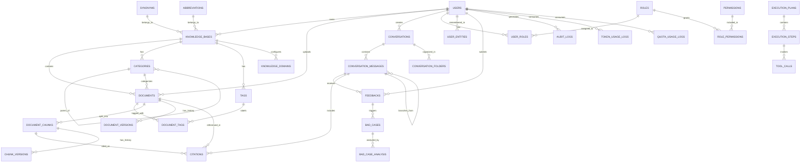
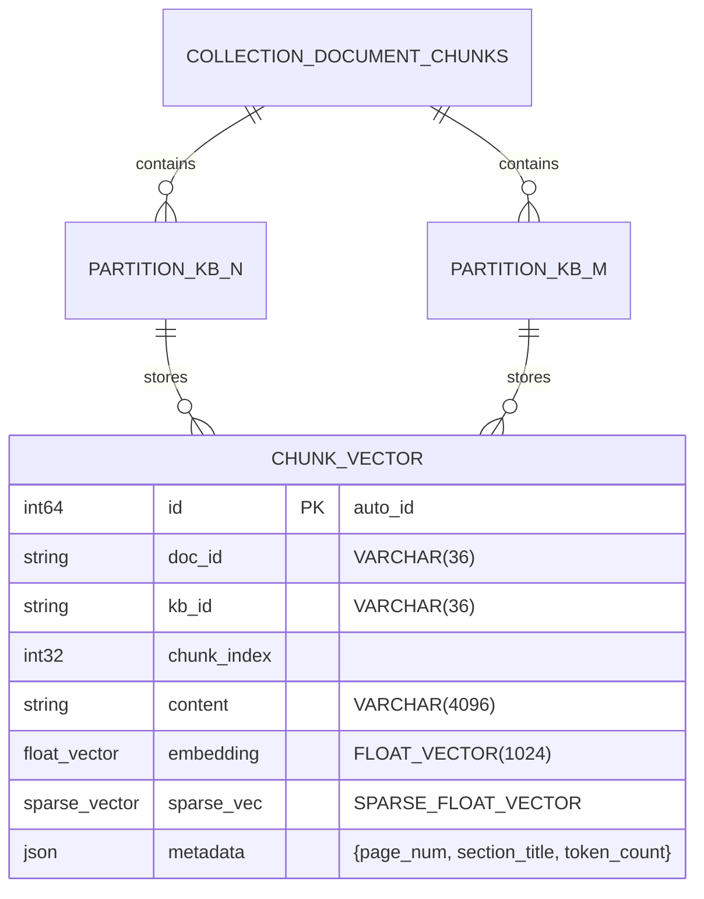

# 智知库（SmartKnowledge）数据库设计文档

> **文档版本**：v1.1  
> **基于FSD版本**：v1.0  
> **生成日期**：2026-07-05  
> **目标数据库**：PostgreSQL 15+ / Milvus 2.3+ / Redis 7+  
> **文档状态**：评审修订完成

---

## 修订记录

| 版本 | 日期 | 修订人 | 修订内容 |
|------|------|--------|----------|
| v1.0 | 2026-07-05 | 技术团队 | 初稿：完成核心数据字典、向量与Redis设计 |
| v1.1 | 2026-07-05 | 技术团队 | 根据开发手册评审修订：补充 prompt_templates/standard_answers/model_provider_configs 表；明确 Milvus 单 Collection + `kb_{kb_id}` Partition 隔离；拆分 documents 处理/生命周期状态；优化 document_chunks 字段说明与索引；调整 audit_logs 主键与 trace_id 索引；明确 task_queue 为 Celery 运营视图；更新 Redis Query 缓存用户维度与 Celery key 隔离 |

---

## 一、设计概述（资深领导视角）

### 1.1 战略定位与价值

智知库作为企业级RAG知识库平台，数据库层是整个系统的核心资产底座。本设计遵循**"数据即资产、安全即底线、性能即体验"**三大原则，确保系统在高并发、大数据量场景下稳定运行，同时满足企业合规审计要求。

### 1.2 关键设计决策（ROI导向）

| 决策项 | 方案 | 业务价值 | 资源投入 | 风险等级 |
|--------|------|----------|----------|----------|
| **关系型数据库** | PostgreSQL 15+（主）+ 读写分离 | 成熟稳定，JSONB支持半结构化数据，降低NoSQL维护成本 | 中 | 低 |
| **向量数据库** | Milvus（主）+ Qdrant（备选） | 支持十亿级向量检索，HNSW索引保障亚秒级响应 | 高 | 中 |
| **缓存层** | Redis Cluster 7.x | 会话、缓存、分布式锁、计数器统一存储，减少技术栈复杂度 | 低 | 低 |
| **多租户隔离** | 知识库级物理隔离（Collection/Partition） | 防止数据越权，满足金融/政企合规要求 | 中 | 低 |
| **数据加密** | AES-256列级加密 + KMS密钥托管 | 满足等保2.0/三级要求，防止内部数据泄露 | 中 | 低 |
| **审计防篡改** | WAL + 对象存储归档 + SHA256哈希链 | 满足监管审计要求，关键操作可追溯不可抵赖 | 低 | 低 |

### 1.3 容量规划与扩展路径

| 阶段 | 数据规模 | 存储策略 | 扩展动作 |
|------|----------|----------|----------|
| **MVP（0-6月）** | 文档<10万，用户<1万 | 单实例PostgreSQL + 单Milvus | 垂直扩容 |
| **M2-M4（6-18月）** | 文档<100万，用户<10万 | 读写分离 + Milvus集群 | 水平分库（按租户） |
| **M5+（18月+）** | 文档<1000万，用户<50万 | 分库分表 + 冷热分离 | 引入TiDB/CockroachDB |

### 1.4 风险与控制

- **数据丢失风险**：PostgreSQL流复制（同步+异步），RPO<30秒；Milvus定期快照备份
- **性能衰减风险**：核心表按时间分区，90天冷数据自动归档至对象存储
- **合规风险**：所有PII数据脱敏后入向量索引，原始文本加密隔离存储

---

## 二、产品视角设计（资深产品经理视角）

### 2.1 功能模块与数据实体映射

| 产品功能 | 核心数据实体 | 数据流转特征 | 用户体验影响 |
|----------|--------------|--------------|--------------|
| **文档上传** | documents, document_chunks, document_versions | 写密集型，异步处理，状态流转 | 上传后立即返回，后台解析进度实时推送 |
| **智能问答** | conversations, conversation_messages, citations | 读多写少，高并发，实时性要求高 | 首字延迟<1.5s，历史会话秒级加载 |
| **Agent任务** | execution_plans, execution_steps, tool_calls | 复杂事务，多步骤状态机 | 执行轨迹可视化，失败步骤可重试 |
| **用户反馈** | feedbacks, bad_cases | 低频写入，后续分析读取 | 反馈提交后进入审核流，影响模型优化 |
| **系统管理** | audit_logs, quota_usage_logs, token_usage_logs | 只增不改，海量数据，报表查询 | 审计日志秒级检索，统计报表T+1生成 |
| **权限管理** | users, roles, permissions, user_roles | 读多写少，缓存敏感 | 权限变更实时生效，SSO同步延迟<5min |

### 2.2 迭代演进策略

| 迭代阶段 | 数据库重点 | 产品功能支撑 |
|----------|------------|--------------|
| **MVP** | 核心表建立，基础索引 | 文档上传、基础RAG、多会话、注册登录 |
| **M2** | 向量检索优化，权限模型完善 | 混合检索、重排序、文档分块可视化、RBAC |
| **M3** | Agent状态机表，记忆存储 | Agent自动拆解、工具调用、记忆管理 |
| **M4** | 审计日志分区，配额系统 | SSO登录、配额管理、审计日志、统计报表 |
| **M5** | 数据飞轮表，冷数据归档 | 知识库自动优化、对话分支、GraphRAG预留 |

### 2.3 数据驱动的用户体验

- **实时性**：活跃会话数据Redis缓存，消息列表Cursor分页，避免Offset深分页性能陷阱
- **一致性**：文档删除后向量/缓存/对话引用标记同步清理，确保用户看不到"幽灵文档"
- **可靠性**：配额检查前置（Redis计数器），避免超额后用户白等；Bad Case自动收集，每周生成优化报告

---

## 三、技术视角设计（资深开发者视角）

### 3.1 架构选型与理由

```
┌─────────────────────────────────────────────────────────────┐
│                      数据存储架构总览                          │
├─────────────────────────────────────────────────────────────┤
│  PostgreSQL 15+ (主库)                                       │
│  ├── 业务数据：用户、文档、对话、权限、审计、配额、Token       │
│  ├── 全文检索：GIN索引 + to_tsvector（稀疏检索）               │
│  ├── JSONB：灵活元数据、配置、动态字段                        │
│  └── 分区表：audit_logs, token_usage_logs（按时间RANGE分区）   │
├─────────────────────────────────────────────────────────────┤
│  Milvus 2.3+ (向量数据库)                                    │
│  ├── Collection: document_chunks（全局单一Collection）       │
│  ├── Index: HNSW(COSINE) + SPARSE_INVERTED_INDEX             │
│  └── Partition: 按 kb_id 动态分区，分区名 `kb_{kb_id}`       │
├─────────────────────────────────────────────────────────────┤
│  Redis Cluster 7.x                                          │
│  ├── 缓存：Query结果、Embedding、会话上下文                    │
│  ├── 计数器：配额消耗、失败次数、限流                          │
│  ├── 队列：Celery任务队列、消息通知                            │
│  └── 分布式锁：文档解析锁、索引构建锁                          │
├─────────────────────────────────────────────────────────────┤
│  MinIO / OSS / S3 (对象存储)                                 │
│  ├── 原始文件：/raw/{kb_id}/{doc_id}/{filename}              │
│  ├── 解析产物：/parsed/{doc_id}/text.json                    │
│  └── 备份归档：/backup/{date}/                                 │
└─────────────────────────────────────────────────────────────┘
```

### 3.2 数据库设计核心原则

1. **第三范式为主，反范式设计为辅**：核心业务表遵循3NF，报表/日志类表适当冗余提升查询性能
2. **JSONB承载变化，DDL承载稳定**：文档元数据、模型配置等易变字段使用JSONB，避免频繁DDL
3. **软删除优先，物理删除滞后**：所有业务表保留`deleted_at`字段，关联数据清理异步执行
4. **租户隔离在连接层**：通过`kb_id` + `user_id`双重过滤实现数据隔离，向量层物理隔离
5. **时间字段必备**：所有表包含`created_at` + `updated_at`，分区表增加`event_at`/`created_at`作为分区键

### 3.3 索引策略总览

| 索引类型 | 适用场景 | 本系统使用位置 |
|----------|----------|----------------|
| **B-Tree** | 等值/范围查询，主键/外键 | 全表主键、外键、状态字段、时间字段 |
| **GIN** | JSONB、全文检索、数组包含 | document_chunks.metadata, documents.metadata, 全文检索字段 |
| **GiST** | 几何/范围数据 | 预留（未来知识图谱） |
| **BRIN** | 超大数据顺序写入 | audit_logs, token_usage_logs（时间顺序写入） |
| **Hash** | 等值查询（不排序） | 预留（Redis替代） |
| **HNSW** | 高维向量近似最近邻 | Milvus document_chunks.embedding |
| **SPARSE_INVERTED_INDEX** | 稀疏向量检索 | Milvus document_chunks.sparse_vector |

---

## 四、实体关系图（ER Diagram）

### 4.1 核心实体关系图（PostgreSQL业务库）



### 4.2 向量数据库实体关系（Milvus）



> **说明**：全局采用单一 Collection `document_chunks`，按知识库 ID 动态创建 Partition `kb_{kb_id}` 实现物理隔离，避免每知识库独立 Collection 带来的运维复杂度。

---

## 五、数据字典（Data Dictionary）

### 5.1 用户与权限模块

#### 5.1.1 users（用户表）

| 字段名 | 数据类型 | 长度/精度 | 可空 | 默认值 | 约束 | 索引 | 说明 |
|--------|----------|-----------|------|--------|------|------|------|
| id | UUID | - | NO | gen_random_uuid() | PK | 主键 | 用户唯一标识 |
| username | VARCHAR | 50 | NO | - | UK | 唯一索引 | 登录用户名 |
| email | VARCHAR | 255 | NO | - | UK | 唯一索引 | 邮箱，SSO同步 |
| password_hash | VARCHAR | 255 | YES | - | - | - | bcrypt哈希，cost=12；SSO用户可为空 |
| display_name | VARCHAR | 100 | YES | - | - | - | 展示名称 |
| department_id | UUID | - | YES | - | FK | 普通索引 | 所属部门 |
| avatar_url | VARCHAR | 500 | YES | - | - | - | 头像URL |
| phone | VARCHAR | 20 | YES | - | - | - | 手机号（脱敏存储） |
| status | VARCHAR | 20 | NO | 'active' | CHECK | 普通索引 | active/locked/inactive/pending_verification |
| sso_provider | VARCHAR | 50 | YES | - | - | 普通索引 | wechat_work/dingtalk/feishu/ldap |
| sso_openid | VARCHAR | 255 | YES | - | - | - | SSO唯一标识 |
| last_login_at | TIMESTAMP | - | YES | - | - | 普通索引 | 最后登录时间 |
| last_login_ip | INET | - | YES | - | - | - | 最后登录IP |
| failed_login_count | INT | - | NO | 0 | - | - | 连续失败次数 |
| locked_until | TIMESTAMP | - | YES | - | - | - | 锁定截止时间 |
| preferences | JSONB | - | YES | '{}' | - | GIN索引 | 用户偏好配置（JSON） |
| quota_config | JSONB | - | YES | '{}' | - | - | 自定义配额覆盖 |
| created_at | TIMESTAMP | - | NO | NOW() | - | BRIN索引 | 创建时间 |
| updated_at | TIMESTAMP | - | NO | NOW() | - | 普通索引 | 更新时间 |
| deleted_at | TIMESTAMP | - | YES | - | - | 普通索引 | 软删除标记 |

**表级约束**：
- `CHECK (status IN ('active', 'locked', 'inactive', 'pending_verification'))`
- `CHECK (failed_login_count >= 0 AND failed_login_count <= 5)`
- `CHECK (email ~* '^[A-Za-z0-9._%+-]+@[A-Za-z0-9.-]+\.[A-Za-z]{2,}$')`

**索引详情**：
```sql
CREATE UNIQUE INDEX idx_users_username ON users(username) WHERE deleted_at IS NULL;
CREATE UNIQUE INDEX idx_users_email ON users(email) WHERE deleted_at IS NULL;
CREATE INDEX idx_users_status ON users(status);
CREATE INDEX idx_users_department ON users(department_id);
CREATE INDEX idx_users_sso ON users(sso_provider, sso_openid) WHERE deleted_at IS NULL;
CREATE INDEX idx_users_created_at ON users USING BRIN(created_at);
```

---

#### 5.1.2 roles（角色表）

| 字段名 | 数据类型 | 长度/精度 | 可空 | 默认值 | 约束 | 说明 |
|--------|----------|-----------|------|--------|------|------|
| id | UUID | - | NO | gen_random_uuid() | PK | 角色唯一标识 |
| name | VARCHAR | 50 | NO | - | UK | 角色名称：admin/manager/user/guest |
| description | VARCHAR | 255 | YES | - | - | 角色描述 |
| permissions_cache | JSONB | - | NO | '[]' | - | 权限缓存（加速校验） |
| is_system | BOOLEAN | - | NO | false | - | 系统内置角色不可删除 |
| created_at | TIMESTAMP | - | NO | NOW() | - | 创建时间 |
| updated_at | TIMESTAMP | - | NO | NOW() | - | 更新时间 |

---

#### 5.1.3 permissions（权限表）

| 字段名 | 数据类型 | 长度/精度 | 可空 | 默认值 | 约束 | 说明 |
|--------|----------|-----------|------|--------|------|------|
| id | UUID | - | NO | gen_random_uuid() | PK | 权限唯一标识 |
| resource | VARCHAR | 50 | NO | - | - | 资源类型：document/conversation/user/system/agent |
| action | VARCHAR | 50 | NO | - | - | 操作类型：create/read/update/delete/execute/manage |
| scope | VARCHAR | 20 | NO | 'own' | - | 作用域：own/team/department/global |
| description | VARCHAR | 255 | YES | - | - | 权限描述 |
| created_at | TIMESTAMP | - | NO | NOW() | - | 创建时间 |

**唯一约束**：`(resource, action, scope)`

---

#### 5.1.4 user_roles（用户角色关联表）

| 字段名 | 数据类型 | 长度/精度 | 可空 | 默认值 | 约束 | 索引 | 说明 |
|--------|----------|-----------|------|--------|------|------|------|
| user_id | UUID | - | NO | - | PK, FK | 主键 | 用户ID |
| role_id | UUID | - | NO | - | PK, FK | 主键 | 角色ID |
| team_id | UUID | - | YES | - | FK | 普通索引 | 团队ID（团队级角色时必填） |
| granted_by | UUID | - | YES | - | FK | - | 授权人 |
| granted_at | TIMESTAMP | - | NO | NOW() | - | - | 授权时间 |
| expires_at | TIMESTAMP | - | YES | - | - | - | 过期时间（临时权限） |

**索引**：
```sql
CREATE INDEX idx_user_roles_user ON user_roles(user_id);
CREATE INDEX idx_user_roles_role ON user_roles(role_id);
CREATE INDEX idx_user_roles_team ON user_roles(team_id) WHERE team_id IS NOT NULL;
```

---

#### 5.1.5 role_permissions（角色权限关联表）

| 字段名 | 数据类型 | 长度/精度 | 可空 | 默认值 | 约束 | 说明 |
|--------|----------|-----------|------|--------|------|------|
| role_id | UUID | - | NO | - | PK, FK | 角色ID |
| permission_id | UUID | - | NO | - | PK, FK | 权限ID |
| created_at | TIMESTAMP | - | NO | NOW() | - | 创建时间 |

---

### 5.2 知识库与文档模块

#### 5.2.1 knowledge_bases（知识库表）

| 字段名 | 数据类型 | 长度/精度 | 可空 | 默认值 | 约束 | 索引 | 说明 |
|--------|----------|-----------|------|--------|------|------|------|
| id | UUID | - | NO | gen_random_uuid() | PK | 主键 | 知识库唯一标识 |
| name | VARCHAR | 100 | NO | - | - | 普通索引 | 知识库名称 |
| description | TEXT | - | YES | - | - | - | 知识库描述 |
| owner_id | UUID | - | NO | - | FK | 普通索引 | 所有者 |
| default_permission | VARCHAR | 20 | NO | 'team' | CHECK | - | personal/team/public/custom |
| config | JSONB | - | NO | '{}' | - | GIN索引 | 分块策略、Embedding模型配置 |
| vector_partition_name | VARCHAR | 100 | YES | - | - | 唯一索引 | 关联的Milvus Partition名（固定为 `kb_{kb_id}`，保留字段便于运维查询） |
| status | VARCHAR | 20 | NO | 'active' | CHECK | 普通索引 | active/archived/deleted |
| total_docs | INT | - | NO | 0 | - | - | 文档总数（缓存） |
| total_chunks | INT | - | NO | 0 | - | - | 分块总数（缓存） |
| storage_size_bytes | BIGINT | - | NO | 0 | - | - | 存储占用（字节） |
| created_at | TIMESTAMP | - | NO | NOW() | - | - | 创建时间 |
| updated_at | TIMESTAMP | - | NO | NOW() | - | - | 更新时间 |
| deleted_at | TIMESTAMP | - | YES | - | - | - | 软删除 |

**约束**：
- `CHECK (default_permission IN ('personal', 'team', 'public', 'custom'))`
- `CHECK (status IN ('active', 'archived', 'deleted'))`

---

#### 5.2.2 documents（文档表）

| 字段名 | 数据类型 | 长度/精度 | 可空 | 默认值 | 约束 | 索引 | 说明 |
|--------|----------|-----------|------|--------|------|------|------|
| id | UUID | - | NO | gen_random_uuid() | PK | 主键 | 文档唯一标识 |
| kb_id | UUID | - | NO | - | FK | 普通索引 | 所属知识库 |
| filename | VARCHAR | 255 | NO | - | - | - | 原始文件名 |
| file_type | VARCHAR | 20 | NO | - | CHECK | 普通索引 | pdf/docx/txt/md/xlsx/csv/ppt |
| file_size | BIGINT | - | NO | 0 | - | - | 文件大小（字节） |
| page_count | INT | - | YES | - | - | - | 页数 |
| word_count | INT | - | YES | - | - | - | 字数 |
| storage_path | VARCHAR | 500 | NO | - | - | - | 对象存储路径 |
| storage_hash | VARCHAR | 64 | NO | - | - | - | 文件SHA256哈希 |
| uploader_id | UUID | - | NO | - | FK | 普通索引 | 上传者 |
| processing_status | VARCHAR | 30 | NO | 'UPLOADED' | CHECK | 普通索引 | 文档处理状态（瞬态/终态） |
| lifecycle_status | VARCHAR | 20 | NO | 'ACTIVE' | CHECK | 普通索引 | 文档生命周期状态 |
| permission_level | VARCHAR | 20 | NO | 'team' | CHECK | - | personal/team/public/custom |
| custom_permissions | JSONB | - | YES | '[]' | - | - | 自定义权限列表 |
| metadata | JSONB | - | YES | '{}' | - | GIN索引 | 标题/作者/创建日期等元数据 |
| tags | VARCHAR(50)[] | - | YES | '{}' | - | GIN索引 | 标签数组 |
| category_id | UUID | - | YES | - | FK | 普通索引 | 分类目录 |
| version | INT | - | NO | 1 | - | - | 当前版本号 |
| is_latest | BOOLEAN | - | NO | true | - | 普通索引 | 是否最新版本 |
| parent_doc_id | UUID | - | YES | - | FK | 普通索引 | 父文档（版本链） |
| ocr_status | VARCHAR | 20 | YES | - | - | - | none/pending/completed/failed |
| ocr_accuracy | FLOAT | - | YES | - | - | - | OCR准确率 |
| pii_scan_status | VARCHAR | 20 | YES | - | - | - | none/pending/completed |
| pii_count | INT | - | NO | 0 | - | - | 检测到PII数量 |
| parsing_error | TEXT | - | YES | - | - | - | 解析错误信息 |
| task_id | UUID | - | YES | - | - | - | 当前异步任务ID |
| indexed_at | TIMESTAMP | - | YES | - | - | 普通索引 | 索引完成时间 |
| archived_at | TIMESTAMP | - | YES | - | - | - | 归档时间 |
| created_at | TIMESTAMP | - | NO | NOW() | - | BRIN索引 | 上传时间 |
| updated_at | TIMESTAMP | - | NO | NOW() | - | - | 更新时间 |
| deleted_at | TIMESTAMP | - | YES | - | - | 普通索引 | 软删除 |

**状态约束**：
```sql
-- processing_status：文档解析、分块、索引等处理状态
CHECK (processing_status IN (
    'UPLOADED',       -- 已上传，等待解析
    'PARSING',        -- 解析中
    'CHUNKED',        -- 分块完成
    'INDEXING',       -- 索引构建中
    'INDEXED',        -- 索引完成（成功终态）
    'PARTIAL_INDEXED',-- 部分索引成功（运营可介入）
    'FAILED',         -- 处理失败（失败终态）
    'UPDATING'        -- 版本更新中
))

-- lifecycle_status：文档生命周期状态
CHECK (lifecycle_status IN (
    'ACTIVE',         -- 正常可用
    'ARCHIVED',       -- 已归档
    'DELETING',       -- 删除中（异步清理）
    'DELETED'         -- 已删除（软删除标记）
))
```

> **说明**：`processing_status` 与 `lifecycle_status` 正交，分别描述处理流与生命周期。`CHECK` 约束同时包含瞬态与终态，应用层负责状态机校验与终态守护。

**索引策略**：
```sql
CREATE INDEX idx_documents_kb_status ON documents(kb_id, processing_status, lifecycle_status) WHERE deleted_at IS NULL;
CREATE INDEX idx_documents_uploader ON documents(uploader_id) WHERE deleted_at IS NULL;
CREATE INDEX idx_documents_category ON documents(category_id) WHERE deleted_at IS NULL;
CREATE INDEX idx_documents_file_type ON documents(file_type) WHERE deleted_at IS NULL;
CREATE INDEX idx_documents_tags ON documents USING GIN(tags) WHERE deleted_at IS NULL;
CREATE INDEX idx_documents_metadata ON documents USING GIN(metadata) WHERE deleted_at IS NULL;
CREATE INDEX idx_documents_latest ON documents(parent_doc_id, is_latest) WHERE is_latest = true;
CREATE INDEX idx_documents_created_at ON documents USING BRIN(created_at);
```

---

#### 5.2.3 document_versions（文档版本历史表）

| 字段名 | 数据类型 | 长度/精度 | 可空 | 默认值 | 约束 | 说明 |
|--------|----------|-----------|------|--------|------|------|
| id | UUID | - | NO | gen_random_uuid() | PK | 版本记录ID |
| doc_id | UUID | - | NO | - | FK | 文档ID |
| version | INT | - | NO | - | - | 版本号 |
| storage_path | VARCHAR | 500 | NO | - | - | 该版本的存储路径 |
| file_size | BIGINT | - | NO | - | - | 文件大小 |
| change_summary | VARCHAR | 255 | YES | - | - | 变更摘要 |
| created_by | UUID | - | NO | - | FK | 创建人 |
| created_at | TIMESTAMP | - | NO | NOW() | - | 创建时间 |

**唯一约束**：`(doc_id, version)`

---

#### 5.2.4 document_chunks（文档分块表）

| 字段名 | 数据类型 | 长度/精度 | 可空 | 默认值 | 约束 | 索引 | 说明 |
|--------|----------|-----------|------|--------|------|------|------|
| id | UUID | - | NO | gen_random_uuid() | PK | 主键 | 分块唯一标识 |
| doc_id | UUID | - | NO | - | FK | 普通索引 | 所属文档 |
| chunk_index | INT | - | NO | - | - | - | 分块序号（文档内） |
| content | TEXT | - | NO | - | - | - | 原始文本内容（AES-256加密存储） |
| content_masked | TEXT | - | YES | - | - | - | 脱敏后文本，用于全文检索（FTS）与前端展示 |
| char_count | INT | - | NO | 0 | - | - | 字符数 |
| token_count | INT | - | NO | 0 | - | - | Token数 |
| page_num | INT | - | YES | - | - | - | 所在页码 |
| section_title | VARCHAR | 255 | YES | - | - | - | 所属章节标题 |
| section_level | INT | - | YES | - | - | - | 标题层级H1-H6 |
| chunk_type | VARCHAR | 20 | NO | 'text' | - | - | text/table/code/image_desc |
| metadata | JSONB | - | YES | '{}' | - | GIN索引 | 扩展元数据 |
| embedding_model | VARCHAR | 50 | YES | - | - | 普通索引 | Embedding模型名（如 BGE-M3） |
| embedding_version | VARCHAR | 20 | YES | - | - | 普通索引 | 模型版本号，支持多版本并存与渐进式重索引 |
| vector_id | VARCHAR | 50 | YES | - | UK | 唯一索引 | Milvus 向量 ID（`document_chunks.id` INT64 的字符串映射） |
| fts_vector | TSVECTOR | - | YES | - | - | GIN索引 | 全文检索向量，基于 `content_masked` 生成 |
| status | VARCHAR | 20 | NO | 'active' | CHECK | - | active/updated/deleted |
| created_at | TIMESTAMP | - | NO | NOW() | - | - | 创建时间 |
| updated_at | TIMESTAMP | - | NO | NOW() | - | - | 更新时间 |

**索引策略**：
```sql
CREATE UNIQUE INDEX idx_chunks_doc_index ON document_chunks(doc_id, chunk_index) WHERE status = 'active';
CREATE INDEX idx_chunks_doc ON document_chunks(doc_id) WHERE status = 'active';
CREATE UNIQUE INDEX idx_chunks_vector_id ON document_chunks(vector_id) WHERE vector_id IS NOT NULL;
CREATE INDEX idx_chunks_embedding_model ON document_chunks(embedding_model, embedding_version);
CREATE INDEX idx_chunks_fts ON document_chunks USING GIN(fts_vector);
CREATE INDEX idx_chunks_metadata ON document_chunks USING GIN(metadata);
```

---

#### 5.2.5 chunk_versions（分块版本历史表）

| 字段名 | 数据类型 | 长度/精度 | 可空 | 默认值 | 约束 | 说明 |
|--------|----------|-----------|------|--------|------|------|
| id | UUID | - | NO | gen_random_uuid() | PK | 版本ID |
| chunk_id | UUID | - | NO | - | FK | 分块ID |
| action | VARCHAR | 20 | NO | - | CHECK | merge/split/edit |
| previous_content | TEXT | - | NO | - | - | 变更前内容 |
| new_content | TEXT | - | NO | - | - | 变更后内容 |
| performed_by | UUID | - | NO | - | FK | 操作人 |
| performed_at | TIMESTAMP | - | NO | NOW() | - | 操作时间 |

---

#### 5.2.6 categories（分类表）

| 字段名 | 数据类型 | 长度/精度 | 可空 | 默认值 | 约束 | 索引 | 说明 |
|--------|----------|-----------|------|--------|------|------|------|
| id | UUID | - | NO | gen_random_uuid() | PK | 主键 | 分类ID |
| kb_id | UUID | - | NO | - | FK | 普通索引 | 所属知识库 |
| name | VARCHAR | 100 | NO | - | - | - | 分类名称 |
| parent_id | UUID | - | YES | - | FK | 普通索引 | 父分类ID |
| path | VARCHAR | 500 | NO | - | - | - | 物化路径（如/1/2/3） |
| level | INT | - | NO | 1 | CHECK | - | 层级（1-3） |
| sort_order | INT | - | NO | 0 | - | - | 排序序号 |
| doc_count | INT | - | NO | 0 | - | - | 文档数缓存 |
| created_at | TIMESTAMP | - | NO | NOW() | - | - | 创建时间 |
| updated_at | TIMESTAMP | - | NO | NOW() | - | - | 更新时间 |

---

#### 5.2.7 tags（标签表）

| 字段名 | 数据类型 | 长度/精度 | 可空 | 默认值 | 约束 | 说明 |
|--------|----------|-----------|------|--------|------|------|
| id | UUID | - | NO | gen_random_uuid() | PK | 标签ID |
| kb_id | UUID | - | NO | - | FK | 所属知识库 |
| name | VARCHAR | 50 | NO | - | - | 标签名 |
| color | VARCHAR | 7 | YES | '#1890ff' | - | 颜色HEX |
| created_by | UUID | - | NO | - | FK | 创建人 |
| created_at | TIMESTAMP | - | NO | NOW() | - | 创建时间 |

**唯一约束**：`(kb_id, name)`

---

#### 5.2.8 document_tags（文档标签关联表）

| 字段名 | 数据类型 | 长度/精度 | 可空 | 默认值 | 约束 | 说明 |
|--------|----------|-----------|------|--------|------|------|
| doc_id | UUID | - | NO | - | PK, FK | 文档ID |
| tag_id | UUID | - | NO | - | PK, FK | 标签ID |
| created_at | TIMESTAMP | - | NO | NOW() | - | 关联时间 |

---

#### 5.2.9 knowledge_domains（知识域配置表）

| 字段名 | 数据类型 | 长度/精度 | 可空 | 默认值 | 约束 | 说明 |
|--------|----------|-----------|------|--------|------|------|
| id | UUID | - | NO | gen_random_uuid() | PK | 域ID |
| name | VARCHAR | 100 | NO | - | - | 域名称 |
| chunk_strategy | JSONB | - | NO | '{}' | - | 分块策略配置 |
| embedding_model | VARCHAR | 50 | NO | 'BGE-M3' | - | 默认Embedding模型 |
| reranker_model | VARCHAR | 50 | YES | - | - | 重排序模型 |
| description | TEXT | - | YES | - | - | 描述 |
| created_at | TIMESTAMP | - | NO | NOW() | - | 创建时间 |

---

### 5.3 对话与消息模块

#### 5.3.1 conversations（会话表）

| 字段名 | 数据类型 | 长度/精度 | 可空 | 默认值 | 约束 | 索引 | 说明 |
|--------|----------|-----------|------|--------|------|------|------|
| id | UUID | - | NO | gen_random_uuid() | PK | 主键 | 会话ID |
| user_id | UUID | - | NO | - | FK | 普通索引 | 所属用户 |
| title | VARCHAR | 200 | YES | - | - | - | 会话标题（自动/手动生成） |
| folder_id | UUID | - | YES | - | FK | 普通索引 | 所属文件夹 |
| tags | VARCHAR(50)[] | - | YES | '{}' | - | GIN索引 | 标签数组 |
| kb_ids | UUID[] | - | YES | '{}' | - | GIN索引 | 关联知识库列表 |
| message_count | INT | - | NO | 0 | - | - | 消息数缓存 |
| total_tokens | INT | - | NO | 0 | - | - | 累计Token消耗 |
| total_cost | DECIMAL | 10,6 | NO | 0 | - | - | 累计费用 |
| status | VARCHAR | 20 | NO | 'active' | CHECK | 普通索引 | active/archived/pinned/deleted |
| context_window_size | INT | - | NO | 10 | - | - | 上下文轮数限制 |
| last_message_at | TIMESTAMP | - | YES | - | - | 普通索引 | 最后消息时间 |
| branch_from_id | UUID | - | YES | - | FK | 普通索引 | 分支来源会话 |
| metadata | JSONB | - | YES | '{}' | - | - | 扩展元数据 |
| created_at | TIMESTAMP | - | NO | NOW() | - | 普通索引 | 创建时间 |
| updated_at | TIMESTAMP | - | NO | NOW() | - | 普通索引 | 更新时间 |
| archived_at | TIMESTAMP | - | YES | - | - | - | 归档时间 |
| deleted_at | TIMESTAMP | - | YES | - | - | 普通索引 | 软删除 |

**索引策略**：
```sql
CREATE INDEX idx_conversations_user ON conversations(user_id, updated_at DESC) WHERE deleted_at IS NULL;
CREATE INDEX idx_conversations_status ON conversations(status) WHERE deleted_at IS NULL;
CREATE INDEX idx_conversations_folder ON conversations(folder_id) WHERE deleted_at IS NULL;
CREATE INDEX idx_conversations_kb ON conversations USING GIN(kb_ids) WHERE deleted_at IS NULL;
CREATE INDEX idx_conversations_last_msg ON conversations(last_message_at DESC) WHERE deleted_at IS NULL;
```

---

#### 5.3.2 conversation_messages（对话消息表）

| 字段名 | 数据类型 | 长度/精度 | 可空 | 默认值 | 约束 | 索引 | 说明 |
|--------|----------|-----------|------|--------|------|------|------|
| id | UUID | - | NO | gen_random_uuid() | PK | 主键 | 消息ID |
| conversation_id | UUID | - | NO | - | FK | 普通索引 | 所属会话 |
| role | VARCHAR | 20 | NO | - | CHECK | - | user/assistant/system/tool |
| content | TEXT | - | NO | - | - | - | 消息内容（AES加密存储） |
| content_plain_hash | VARCHAR | 64 | YES | - | - | - | 明文哈希，用于消息去重检测；注意：在敏感场景下会泄露“内容是否相同”的信息，可改用 HMAC/加密哈希替代 |
| message_type | VARCHAR | 50 | NO | 'text' | - | - | text/image/file/tool_result |
| citations | JSONB | - | YES | '[]' | - | GIN索引 | 引用快照 [{id, doc_id, chunk_id, relevance}] |
| feedback_id | UUID | - | YES | - | FK | 普通索引 | 关联反馈ID |
| tokens_used | JSONB | - | YES | '{}' | - | - | {input, output, total} |
| model_used | VARCHAR | 50 | YES | - | - | - | 使用的模型 |
| provider | VARCHAR | 50 | YES | - | - | - | 模型提供商 |
| latency_ms | INT | - | YES | - | - | - | 响应延迟（毫秒） |
| cost_cny | DECIMAL | 10,6 | YES | 0 | - | - | 该消息费用 |
| task_type | VARCHAR | 20 | YES | - | - | - | rag/agent/embedding |
| parent_message_id | UUID | - | YES | - | FK | 普通索引 | 父消息（用于分支） |
| branch_from_id | UUID | - | YES | - | FK | 普通索引 | 分支来源消息 |
| execution_plan_id | UUID | - | YES | - | FK | - | 关联Agent执行计划 |
| metadata | JSONB | - | YES | '{}' | - | - | 扩展元数据 |
| created_at | TIMESTAMP | - | NO | NOW() | - | 普通索引 | 创建时间 |
| deleted_at | TIMESTAMP | - | YES | - | - | - | 软删除 |

**索引策略**：
```sql
-- 覆盖会话消息列表高频查询（按会话 + 时间倒序）
CREATE INDEX idx_messages_conv ON conversation_messages(conversation_id, created_at DESC) WHERE deleted_at IS NULL;
CREATE INDEX idx_messages_feedback ON conversation_messages(feedback_id) WHERE feedback_id IS NOT NULL;
CREATE INDEX idx_messages_parent ON conversation_messages(parent_message_id) WHERE parent_message_id IS NOT NULL;
CREATE INDEX idx_messages_citations ON conversation_messages USING GIN(citations) WHERE citations IS NOT NULL;
CREATE INDEX idx_messages_model ON conversation_messages(model_used, created_at) WHERE deleted_at IS NULL;
```

**约束说明**：
- 主键 `(id)` 已保证消息唯一性；`parent_message_id` 建议由应用层在写入前进行祖先链路校验，防止消息树成环。
- 分支场景下，`branch_from_id` 指向历史消息快照，删除源消息时不对分支消息级联删除。

---

#### 5.3.3 conversation_folders（会话文件夹表）

| 字段名 | 数据类型 | 长度/精度 | 可空 | 默认值 | 约束 | 说明 |
|--------|----------|-----------|------|--------|------|------|
| id | UUID | - | NO | gen_random_uuid() | PK | 文件夹ID |
| user_id | UUID | - | NO | - | FK | 所属用户 |
| name | VARCHAR | 100 | NO | - | - | 文件夹名称 |
| parent_id | UUID | - | YES | - | FK | 父文件夹 |
| sort_order | INT | - | NO | 0 | - | 排序 |
| created_at | TIMESTAMP | - | NO | NOW() | - | 创建时间 |

---

### 5.4 RAG检索与引用模块

#### 5.4.1 citations（引用表）

| 字段名 | 数据类型 | 长度/精度 | 可空 | 默认值 | 约束 | 索引 | 说明 |
|--------|----------|-----------|------|--------|------|------|------|
| id | UUID | - | NO | gen_random_uuid() | PK | 主键 | 引用ID |
| message_id | UUID | - | NO | - | FK | 普通索引 | 所属消息 |
| doc_id | UUID | - | NO | - | FK | 普通索引 | 引用文档 |
| chunk_id | UUID | - | NO | - | FK | 普通索引 | 引用分块 |
| citation_index | INT | - | NO | - | - | - | 引用序号（[^n]） |
| chunk_text_preview | TEXT | - | YES | - | - | - | 引用文本快照 |
| page_num | INT | - | YES | - | - | - | 页码 |
| relevance_score | FLOAT | - | YES | - | - | - | 相关度分数 |
| retrieval_source | VARCHAR | 20 | YES | - | - | dense/sparse/fts/rerank |
| created_at | TIMESTAMP | - | NO | NOW() | - | - | 创建时间 |

**索引策略**：
```sql
CREATE INDEX idx_citations_message ON citations(message_id);
CREATE INDEX idx_citations_doc ON citations(doc_id);
CREATE INDEX idx_citations_chunk ON citations(chunk_id);
CREATE INDEX idx_citations_created ON citations(created_at);
```

---

#### 5.4.2 query_logs（查询日志表）

| 字段名 | 数据类型 | 长度/精度 | 可空 | 默认值 | 约束 | 索引 | 说明 |
|--------|----------|-----------|------|--------|------|------|------|
| id | UUID | - | NO | gen_random_uuid() | PK | 主键 | 日志ID |
| query_hash | VARCHAR | 64 | NO | - | - | 普通索引 | Query文本哈希 |
| query_text | TEXT | - | NO | - | - | - | 原始Query（脱敏） |
| user_id | UUID | - | NO | - | FK | 普通索引 | 用户ID |
| conversation_id | UUID | - | YES | - | FK | - | 会话ID |
| kb_ids | UUID[] | - | YES | '{}' | - | - | 检索范围 |
| search_mode | VARCHAR | 20 | YES | - | - | - | semantic/keyword/hybrid |
| intent | VARCHAR | 50 | YES | - | - | - | 意图分类结果 |
| retrieval_count | INT | - | NO | 0 | - | - | 检索结果数 |
| has_answer | BOOLEAN | - | NO | false | - | - | 是否生成答案 |
| latency_ms | INT | - | YES | - | - | - | 总延迟 |
| created_at | TIMESTAMP | - | NO | NOW() | - | BRIN索引 | 创建时间 |

**分区策略**：按`created_at`月度RANGE分区，保留90天热数据，冷数据归档至对象存储。

---

### 5.5 Agent执行模块

#### 5.5.1 execution_plans（执行计划表）

| 字段名 | 数据类型 | 长度/精度 | 可空 | 默认值 | 约束 | 索引 | 说明 |
|--------|----------|-----------|------|--------|------|------|------|
| id | UUID | - | NO | gen_random_uuid() | PK | 主键 | 计划ID |
| conversation_id | UUID | - | NO | - | FK | 普通索引 | 所属会话 |
| user_id | UUID | - | NO | - | FK | - | 用户ID |
| query | TEXT | - | NO | - | - | - | 原始问题 |
| task_type | VARCHAR | 50 | YES | - | - | - | 任务类型 |
| plan_json | JSONB | - | NO | '{}' | - | - | 计划详情（步骤列表） |
| status | VARCHAR | 20 | NO | 'PLANNING' | CHECK | 普通索引 | PLANNING/EXECUTING/REFLECTING/COMPLETED/FAILED/DEGRADED |
| max_steps | INT | - | NO | 10 | - | - | 最大步骤数 |
| timeout_seconds | INT | - | NO | 30 | - | - | 超时秒数 |
| started_at | TIMESTAMP | - | YES | - | - | - | 开始时间 |
| completed_at | TIMESTAMP | - | YES | - | - | - | 完成时间 |
| total_cost | DECIMAL | 10,6 | YES | 0 | - | - | 总费用 |
| total_latency_ms | INT | - | YES | 0 | - | - | 总延迟 |
| reflection_result | JSONB | - | YES | '{}' | - | - | 反思结果 |
| is_degraded | BOOLEAN | - | NO | false | - | - | 是否降级 |
| created_at | TIMESTAMP | - | NO | NOW() | - | - | 创建时间 |

---

#### 5.5.2 execution_steps（执行步骤表）

| 字段名 | 数据类型 | 长度/精度 | 可空 | 默认值 | 约束 | 索引 | 说明 |
|--------|----------|-----------|------|--------|------|------|------|
| id | UUID | - | NO | gen_random_uuid() | PK | 主键 | 步骤ID |
| plan_id | UUID | - | NO | - | FK | 普通索引 | 所属计划 |
| step_id | INT | - | NO | - | - | - | 步骤序号 |
| description | TEXT | - | NO | - | - | - | 步骤描述 |
| tool | VARCHAR | 50 | YES | - | - | - | 工具名称 |
| dependencies | INT[] | - | YES | '{}' | - | - | 依赖步骤ID |
| status | VARCHAR | 20 | NO | 'pending' | CHECK | - | pending/running/completed/failed/skipped |
| input_params | JSONB | - | YES | '{}' | - | - | 输入参数 |
| output_result | JSONB | - | YES | '{}' | - | - | 输出结果 |
| error_message | TEXT | - | YES | - | - | - | 错误信息 |
| latency_ms | INT | - | YES | 0 | - | - | 执行延迟 |
| cost_cny | DECIMAL | 10,6 | YES | 0 | - | - | 步骤费用 |
| started_at | TIMESTAMP | - | YES | - | - | - | 开始时间 |
| completed_at | TIMESTAMP | - | YES | - | - | - | 完成时间 |
| retry_count | INT | - | NO | 0 | - | - | 重试次数 |
| created_at | TIMESTAMP | - | NO | NOW() | - | - | 创建时间 |

---

#### 5.5.3 tool_calls（工具调用表）

| 字段名 | 数据类型 | 长度/精度 | 可空 | 默认值 | 约束 | 说明 |
|--------|----------|-----------|------|--------|------|------|
| id | UUID | - | NO | gen_random_uuid() | PK | 调用ID |
| step_id | UUID | - | NO | - | FK | 所属步骤 |
| tool_name | VARCHAR | 50 | NO | - | - | 工具名 |
| tool_type | VARCHAR | 20 | NO | - | - | internal/external/sandbox/isolated |
| input_params | JSONB | - | NO | '{}' | - | 输入参数 |
| output_result | JSONB | - | YES | '{}' | - | 输出结果 |
| status | VARCHAR | 20 | NO | 'pending' | - | pending/success/failed |
| error_code | VARCHAR | 50 | YES | - | - | 错误码 |
| latency_ms | INT | - | YES | 0 | - | 延迟 |
| created_at | TIMESTAMP | - | NO | NOW() | - | 创建时间 |

---

### 5.6 用户反馈与Bad Case模块

#### 5.6.1 feedbacks（反馈表）

| 字段名 | 数据类型 | 长度/精度 | 可空 | 默认值 | 约束 | 索引 | 说明 |
|--------|----------|-----------|------|--------|------|------|------|
| id | UUID | - | NO | gen_random_uuid() | PK | 主键 | 反馈ID |
| message_id | UUID | - | NO | - | FK | 普通索引 | 关联消息 |
| user_id | UUID | - | NO | - | FK | 普通索引 | 反馈用户 |
| feedback_type | VARCHAR | 20 | NO | - | CHECK | - | thumbs_up/thumbs_down/correction |
| reason | VARCHAR | 50 | YES | - | - | factual_error/no_answer/citation_wrong/hallucination/other |
| comment | TEXT | - | YES | - | - | - | 用户文字说明 |
| corrected_answer | TEXT | - | YES | - | - | - | 修正答案 |
| context_snapshot | JSONB | - | NO | '{}' | - | - | 完整上下文快照 |
| status | VARCHAR | 20 | NO | 'pending' | CHECK | 普通索引 | pending/reviewed/resolved/rejected |
| reviewed_by | UUID | - | YES | - | FK | - | 审核人 |
| reviewed_at | TIMESTAMP | - | YES | - | - | - | 审核时间 |
| resolution | TEXT | - | YES | - | - | - | 处理结果说明 |
| created_at | TIMESTAMP | - | NO | NOW() | - | 普通索引 | 创建时间 |

---

#### 5.6.2 bad_cases（Bad Case库表）

| 字段名 | 数据类型 | 长度/精度 | 可空 | 默认值 | 约束 | 索引 | 说明 |
|--------|----------|-----------|------|--------|------|------|------|
| id | UUID | - | NO | gen_random_uuid() | PK | 主键 | Bad Case ID |
| feedback_id | UUID | - | YES | - | FK | 普通索引 | 关联反馈 |
| query_text | TEXT | - | NO | - | - | - | 问题文本 |
| retrieved_contexts | JSONB | - | NO | '{}' | - | - | 检索上下文快照 |
| generated_answer | TEXT | - | NO | - | - | - | 生成答案 |
| root_cause | VARCHAR | 50 | YES | - | - | retrieval_failure/ranking_error/generation_hallucination/citation_error/format_error |
| confidence_score | FLOAT | - | YES | - | - | - | 置信度 |
| priority | VARCHAR | 20 | NO | 'medium' | CHECK | 普通索引 | high/medium/low |
| status | VARCHAR | 20 | NO | 'open' | CHECK | 普通索引 | open/analyzing/fixed/verified/closed |
| assigned_to | UUID | - | YES | - | FK | - | 指派处理人 |
| analysis_report | JSONB | - | YES | '{}' | - | - | 分析报告 |
| created_at | TIMESTAMP | - | NO | NOW() | - | 普通索引 | 创建时间 |
| resolved_at | TIMESTAMP | - | YES | - | - | - | 解决时间 |

---

#### 5.6.3 bad_case_analysis（Bad Case分析表）

| 字段名 | 数据类型 | 长度/精度 | 可空 | 默认值 | 约束 | 说明 |
|--------|----------|-----------|------|--------|------|------|
| id | UUID | - | NO | gen_random_uuid() | PK | 分析ID |
| bad_case_id | UUID | - | NO | - | FK | 关联Bad Case |
| analyzer | VARCHAR | 50 | NO | - | - | 分析来源：auto/manual |
| analysis_type | VARCHAR | 50 | NO | - | - | 分析类型 |
| findings | JSONB | - | NO | '{}' | - | 发现详情 |
| suggestions | JSONB | - | NO | '{}' | - | 优化建议 |
| created_at | TIMESTAMP | - | NO | NOW() | - | 创建时间 |

---

#### 5.6.4 standard_answers（修正答案库表）

| 字段名 | 数据类型 | 长度/精度 | 可空 | 默认值 | 约束 | 索引 | 说明 |
|--------|----------|-----------|------|--------|------|------|------|
| id | UUID | - | NO | gen_random_uuid() | PK | 主键 | 标准答案唯一标识 |
| feedback_id | UUID | - | YES | - | FK | 普通索引 | 关联反馈（可为空） |
| query_pattern | VARCHAR | 500 | NO | - | - | 普通索引 | 问题匹配模式（支持模糊/正则） |
| answer | TEXT | - | NO | - | - | - | 修正后的标准答案 |
| citations | JSONB | - | YES | '[]' | - | GIN索引 | 引用来源快照 [{doc_id, chunk_id, relevance}] |
| similarity_threshold | FLOAT | - | NO | 0.9 | CHECK | - | 命中阈值（0-1） |
| usage_count | INT | - | NO | 0 | - | - | 命中使用次数 |
| created_at | TIMESTAMP | - | NO | NOW() | - | 普通索引 | 创建时间 |
| updated_at | TIMESTAMP | - | NO | NOW() | - | - | 更新时间 |

**唯一约束**：`(query_pattern)`

**索引策略**：
```sql
CREATE UNIQUE INDEX idx_standard_answers_pattern ON standard_answers(query_pattern);
CREATE INDEX idx_standard_answers_feedback ON standard_answers(feedback_id) WHERE feedback_id IS NOT NULL;
```

---

## 5.7 Agent记忆模块

#### 5.7.1 user_entities（用户实体记忆表）

| 字段名 | 数据类型 | 长度/精度 | 可空 | 默认值 | 约束 | 索引 | 说明 |
|--------|----------|-----------|------|--------|------|------|------|
| id | UUID | - | NO | gen_random_uuid() | PK | 主键 | 实体ID |
| user_id | UUID | - | NO | - | FK | 普通索引 | 所属用户 |
| entity_type | VARCHAR | 50 | NO | - | - | - | person/project/technology/department |
| entity_name | VARCHAR | 200 | NO | - | - | - | 实体名称 |
| entity_value | TEXT | - | YES | - | - | - | 实体详情JSON |
| confidence | FLOAT | - | NO | 0.8 | CHECK | - | 置信度（0-1） |
| source_conversation_id | UUID | - | YES | - | FK | - | 来源会话 |
| source_message_id | UUID | - | YES | - | FK | - | 来源消息 |
| is_active | BOOLEAN | - | NO | true | - | - | 是否有效 |
| created_at | TIMESTAMP | - | NO | NOW() | - | - | 创建时间 |
| updated_at | TIMESTAMP | - | NO | NOW() | - | - | 更新时间 |

**唯一约束**：`(user_id, entity_type, entity_name)`

---

#### 5.7.2 conversation_summaries（会话摘要表）

| 字段名 | 数据类型 | 长度/精度 | 可空 | 默认值 | 约束 | 说明 |
|--------|----------|-----------|------|--------|------|------|
| id | UUID | - | NO | gen_random_uuid() | PK | 摘要ID |
| conversation_id | UUID | - | NO | - | FK | 所属会话 |
| summary_text | TEXT | - | NO | - | - | 摘要内容 |
| key_decisions | JSONB | - | YES | '[]' | - | 关键决策点 |
| action_items | JSONB | - | YES | '[]' | - | 待办事项 |
| message_range | JSONB | - | NO | '{}' | - | {start_message_id, end_message_id} |
| created_at | TIMESTAMP | - | NO | NOW() | - | 创建时间 |

---

### 5.8 系统管理与审计模块

#### 5.8.1 audit_logs（审计日志表）

| 字段名 | 数据类型 | 长度/精度 | 可空 | 默认值 | 约束 | 索引 | 说明 |
|--------|----------|-----------|------|--------|------|------|------|
| id | UUID | - | NO | gen_random_uuid() | PK | 主键 | 日志ID |
| trace_id | VARCHAR | 64 | NO | - | - | 普通索引 | 全链路TraceID（同一TraceID可被多服务多次记录，不唯一） |
| event_at | TIMESTAMP | - | NO | NOW() | PK | 主键/分区键 | 事件时间 |
| event_type | VARCHAR | 50 | NO | - | - | 普通索引 | 事件类型 |
| event_category | VARCHAR | 50 | NO | - | - | - | auth/document/conversation/admin/system |
| user_id | UUID | - | YES | - | FK | 普通索引 | 用户ID |
| username | VARCHAR | 50 | YES | - | - | - | 用户名（冗余，防关联丢失） |
| client_ip | INET | - | YES | - | - | - | 客户端IP |
| user_agent | TEXT | - | YES | - | - | - | UA字符串 |
| object_type | VARCHAR | 50 | YES | - | - | - | 操作对象类型 |
| object_id | UUID | - | YES | - | - | - | 操作对象ID |
| object_name | VARCHAR | 255 | YES | - | - | - | 对象名称 |
| action_result | VARCHAR | 20 | NO | - | - | - | success/failure/timeout/denied |
| duration_ms | INT | - | YES | 0 | - | - | 操作耗时 |
| request_params | JSONB | - | YES | '{}' | - | - | 请求参数（脱敏） |
| response_summary | TEXT | - | YES | - | - | - | 响应摘要 |
| risk_level | VARCHAR | 20 | NO | 'low' | CHECK | 普通索引 | low/medium/high/critical |
| geo_location | JSONB | - | YES | '{}' | - | - | 地理位置信息 |
| session_id | VARCHAR | 100 | YES | - | - | - | 会话标识 |
| created_at | TIMESTAMP | - | NO | NOW() | - | - | 入库时间 |

> **主键设计**：分区表主键为 `(event_at, id)` 复合主键，使分区裁剪与按时间范围查询更高效；`id` 保证单分区内的唯一性。

**分区策略**：
```sql
-- 按event_at月度RANGE分区
CREATE TABLE audit_logs (
    ...
) PARTITION BY RANGE (event_at);

CREATE TABLE audit_logs_2026_07 PARTITION OF audit_logs
    FOR VALUES FROM ('2026-07-01') TO ('2026-08-01');
CREATE TABLE audit_logs_2026_08 PARTITION OF audit_logs
    FOR VALUES FROM ('2026-08-01') TO ('2026-09-01');
-- 自动化脚本每月预创建分区
```

**索引策略**：
```sql
CREATE INDEX idx_audit_user ON audit_logs(user_id, event_at DESC);
CREATE INDEX idx_audit_type ON audit_logs(event_type, event_at DESC);
CREATE INDEX idx_audit_risk ON audit_logs(risk_level, event_at DESC) WHERE risk_level IN ('high', 'critical');
CREATE INDEX idx_audit_object ON audit_logs(object_type, object_id);
CREATE INDEX idx_audit_trace ON audit_logs(trace_id);  -- 普通索引，非唯一
```

**归档策略**：
- 热数据（0-30天）：本地分区表
- 温数据（30-90天）：压缩存储（PostgreSQL TOAST + pg_compress）
- 冷数据（90天+）：对象存储归档（Parquet格式），本地保留元数据索引

---

#### 5.8.2 token_usage_logs（Token消耗日志表）

| 字段名 | 数据类型 | 长度/精度 | 可空 | 默认值 | 约束 | 索引 | 说明 |
|--------|----------|-----------|------|--------|------|------|------|
| id | UUID | - | NO | gen_random_uuid() | PK | 主键 | 日志ID |
| request_id | UUID | - | NO | - | - | 普通索引 | 请求ID |
| user_id | UUID | - | NO | - | FK | 普通索引 | 用户ID |
| conversation_id | UUID | - | YES | - | FK | - | 会话ID |
| message_id | UUID | - | YES | - | FK | - | 消息ID |
| model_name | VARCHAR | 50 | NO | - | - | 普通索引 | 模型名称 |
| provider | VARCHAR | 50 | NO | - | - | - | 提供商 |
| input_tokens | INT | - | NO | 0 | - | - | 输入Token数 |
| output_tokens | INT | - | NO | 0 | - | - | 输出Token数 |
| total_tokens | INT | - | NO | 0 | GENERATED | - | 计算列 |
| cost_cny | DECIMAL | 10,6 | NO | 0 | - | - | 费用（人民币） |
| task_type | VARCHAR | 20 | NO | - | - | - | rag/agent/embedding/rerank |
| latency_ms | INT | - | YES | 0 | - | - | 延迟 |
| created_at | TIMESTAMP | - | NO | NOW() | - | 分区键 | 创建时间 |

**分区策略**：同audit_logs，按`created_at`月度RANGE分区。

**索引策略**：
```sql
CREATE INDEX idx_token_usage_provider_model ON token_usage_logs(provider, model_name, created_at);
CREATE INDEX idx_token_usage_user ON token_usage_logs(user_id, created_at DESC);
CREATE INDEX idx_token_usage_request ON token_usage_logs(request_id);
```

---

#### 5.8.3 quota_usage_logs（配额使用日志表）

| 字段名 | 数据类型 | 长度/精度 | 可空 | 默认值 | 约束 | 说明 |
|--------|----------|-----------|------|--------|------|------|
| id | UUID | - | NO | gen_random_uuid() | PK | 日志ID |
| user_id | UUID | - | NO | - | FK | 用户ID |
| dimension | VARCHAR | 50 | NO | - | - | 配额维度 |
| quota_limit | BIGINT | - | NO | - | - | 配额上限 |
| used_before | BIGINT | - | NO | - | - | 使用前累计 |
| used_after | BIGINT | - | NO | - | - | 使用后累计 |
| delta | BIGINT | - | NO | - | - | 本次消耗 |
| request_id | UUID | - | YES | - | - | 关联请求 |
| created_at | TIMESTAMP | - | NO | NOW() | - | 创建时间 |

---

### 5.9 系统配置与词典模块

#### 5.9.1 synonyms（同义词词典表）

| 字段名 | 数据类型 | 长度/精度 | 可空 | 默认值 | 约束 | 说明 |
|--------|----------|-----------|------|--------|------|------|
| id | UUID | - | NO | gen_random_uuid() | PK | 词条ID |
| kb_id | UUID | - | YES | - | FK | 所属知识库（全局为空） |
| term | VARCHAR | 100 | NO | - | - | 主词 |
| synonyms | VARCHAR(100)[] | - | NO | '{}' | - | 同义词列表 |
| domain | VARCHAR | 50 | YES | - | - | 领域 |
| weight | FLOAT | - | NO | 1.0 | - | 权重 |
| is_active | BOOLEAN | - | NO | true | - | 是否启用 |
| created_at | TIMESTAMP | - | NO | NOW() | - | 创建时间 |

**唯一约束**：`(kb_id, term)`

---

#### 5.9.2 abbreviations（缩写词典表）

| 字段名 | 数据类型 | 长度/精度 | 可空 | 默认值 | 约束 | 说明 |
|--------|----------|-----------|------|--------|------|------|
| id | UUID | - | NO | gen_random_uuid() | PK | 词条ID |
| kb_id | UUID | - | YES | - | FK | 所属知识库 |
| abbreviation | VARCHAR | 50 | NO | - | - | 缩写 |
| full_form | VARCHAR | 200 | NO | - | - | 全称 |
| description | TEXT | - | YES | - | - | 说明 |
| domain | VARCHAR | 50 | YES | - | - | 领域 |
| is_active | BOOLEAN | - | NO | true | - | 是否启用 |
| created_at | TIMESTAMP | - | NO | NOW() | - | 创建时间 |

**唯一约束**：`(kb_id, abbreviation)`

---

#### 5.9.3 system_configs（系统配置表）

| 字段名 | 数据类型 | 长度/精度 | 可空 | 默认值 | 约束 | 说明 |
|--------|----------|-----------|------|--------|------|------|
| id | UUID | - | NO | gen_random_uuid() | PK | 配置ID |
| config_key | VARCHAR | 100 | NO | - | UK | 配置键 |
| config_value | JSONB | - | NO | '{}' | - | 配置值 |
| description | TEXT | - | YES | - | - | 配置说明 |
| is_encrypted | BOOLEAN | - | NO | false | - | 是否加密（API密钥等） |
| updated_by | UUID | - | YES | - | FK | 最后修改人 |
| updated_at | TIMESTAMP | - | NO | NOW() | - | 更新时间 |
| created_at | TIMESTAMP | - | NO | NOW() | - | 创建时间 |

---

#### 5.9.4 prompt_templates（提示词模板表）

| 字段名 | 数据类型 | 长度/精度 | 可空 | 默认值 | 约束 | 索引 | 说明 |
|--------|----------|-----------|------|--------|------|------|------|
| id | UUID | - | NO | gen_random_uuid() | PK | 主键 | 模板唯一标识 |
| kb_id | UUID | - | YES | - | FK | 普通索引 | 所属知识库（全局为空） |
| scope | VARCHAR | 20 | NO | 'global' | CHECK | 普通索引 | 作用域：personal/team/global |
| name | VARCHAR | 100 | NO | - | - | - | 模板名称 |
| content | TEXT | - | NO | - | - | - | 提示词内容 |
| variables | JSONB | - | YES | '[]' | - | - | 模板变量定义 [{name, required, default}] |
| created_by | UUID | - | NO | - | FK | 普通索引 | 创建人 |
| status | VARCHAR | 20 | NO | 'active' | CHECK | 普通索引 | active/pending/rejected |
| created_at | TIMESTAMP | - | NO | NOW() | - | 普通索引 | 创建时间 |
| updated_at | TIMESTAMP | - | NO | NOW() | - | - | 更新时间 |

**唯一约束**：`(kb_id, scope, name)`（scope=global 时 kb_id 为 NULL 需用部分索引）

**索引策略**：
```sql
CREATE UNIQUE INDEX idx_prompt_templates_scope_name ON prompt_templates(kb_id, scope, name);
CREATE INDEX idx_prompt_templates_kb ON prompt_templates(kb_id) WHERE kb_id IS NOT NULL;
CREATE INDEX idx_prompt_templates_status ON prompt_templates(status);
```

---

#### 5.9.5 model_provider_configs（模型提供商配置表）

| 字段名 | 数据类型 | 长度/精度 | 可空 | 默认值 | 约束 | 索引 | 说明 |
|--------|----------|-----------|------|--------|------|------|------|
| id | UUID | - | NO | gen_random_uuid() | PK | 主键 | 配置唯一标识 |
| provider_name | VARCHAR | 50 | NO | - | - | 普通索引 | 提供商名称：openai/zhipu/qwen/kimi/ollama |
| api_base | VARCHAR | 500 | YES | - | - | - | API Base URL |
| priority | INT | - | NO | 1 | - | 普通索引 | 优先级（越小越优先） |
| is_active | BOOLEAN | - | NO | true | - | 普通索引 | 是否启用 |
| rate_limit | JSONB | - | YES | '{}' | - | - | 限流配置 {requests_per_minute, tokens_per_minute} |
| cost_per_1k_input | DECIMAL | 10,6 | NO | 0 | - | - | 每1K输入Token费用（元） |
| cost_per_1k_output | DECIMAL | 10,6 | NO | 0 | - | - | 每1K输出Token费用（元） |
| created_at | TIMESTAMP | - | NO | NOW() | - | - | 创建时间 |
| updated_at | TIMESTAMP | - | NO | NOW() | - | - | 更新时间 |

**唯一约束**：`(provider_name)`

**索引策略**：
```sql
CREATE UNIQUE INDEX idx_model_provider_name ON model_provider_configs(provider_name);
CREATE INDEX idx_model_provider_active_priority ON model_provider_configs(is_active, priority);
```

---

### 5.10 异步任务模块

#### 5.10.1 task_queue（任务队列表）

> **定位说明**：本表是 Celery 任务的**同步运营视图**，供管理后台查询任务状态与统计；实际任务调度、Broker 与消费者仍由 Celery + Redis 负责，禁止直接通过本表派发或控制任务。

| 字段名 | 数据类型 | 长度/精度 | 可空 | 默认值 | 约束 | 索引 | 说明 |
|--------|----------|-----------|------|--------|------|------|------|
| id | UUID | - | NO | gen_random_uuid() | PK | 主键 | 任务ID |
| task_type | VARCHAR | 50 | NO | - | - | 普通索引 | 任务类型 |
| queue_name | VARCHAR | 50 | NO | - | - | - | 队列名称 |
| priority | INT | - | NO | 5 | - | - | 优先级（1-10） |
| payload | JSONB | - | NO | '{}' | - | - | 任务载荷 |
| status | VARCHAR | 20 | NO | 'PENDING' | CHECK | 普通索引 | PENDING/RECEIVED/STARTED/SUCCESS/FAILED/RETRY/REVOKED/DEAD_LETTER |
| worker_id | VARCHAR | 100 | YES | - | - | - | 执行Worker标识 |
| retry_count | INT | - | NO | 0 | - | - | 已重试次数 |
| max_retries | INT | - | NO | 3 | - | - | 最大重试次数 |
| next_retry_at | TIMESTAMP | - | YES | - | - | - | 下次重试时间 |
| started_at | TIMESTAMP | - | YES | - | - | - | 开始时间 |
| completed_at | TIMESTAMP | - | YES | - | - | - | 完成时间 |
| error_info | JSONB | - | YES | '{}' | - | - | 错误信息 |
| trace_id | VARCHAR | 64 | YES | - | - | - | TraceID |
| created_at | TIMESTAMP | - | NO | NOW() | - | 普通索引 | 创建时间 |
| updated_at | TIMESTAMP | - | NO | NOW() | - | - | 更新时间 |

**索引策略**：
```sql
CREATE INDEX idx_task_status ON task_queue(status, priority DESC, created_at) 
    WHERE status IN ('PENDING', 'RETRY');
CREATE INDEX idx_task_type ON task_queue(task_type, status);
CREATE INDEX idx_task_trace ON task_queue(trace_id);
```

---

## 六、向量数据库设计（Milvus）

> **最终方案**：全局使用单一 Collection `document_chunks`，按知识库动态创建 Partition `kb_{kb_id}` 实现租户物理隔离，避免按知识库独立 Collection 导致的索引、运维与资源开销。

### 6.1 Collection设计

#### 6.1.1 document_chunks（文档分块向量集合）

| 字段名 | Milvus类型 | 属性 | 说明 |
|--------|------------|------|------|
| id | INT64 | PK, auto_id=True | 向量唯一ID（Milvus内部） |
| doc_id | VARCHAR(36) | - | 文档ID（权限过滤、删除） |
| kb_id | VARCHAR(36) | - | 知识库ID（租户隔离） |
| chunk_index | INT32 | - | 分块序号 |
| content | VARCHAR(4096) | - | 脱敏后文本内容 |
| embedding | FLOAT_VECTOR(1024) | - | BGE-M3稠密向量 |
| sparse_vector | SPARSE_FLOAT_VECTOR | - | 稀疏向量（混合检索） |
| metadata | JSON | - | {page_num, section_title, token_count, created_at} |

**索引配置**：
```yaml
Collection: document_chunks
  Index:
    - field: embedding
      index_type: HNSW
      metric_type: COSINE
      params:
        M: 16
        efConstruction: 256
    - field: sparse_vector
      index_type: SPARSE_INVERTED_INDEX
      metric_type: IP

  Partitions:
    - _default
    - kb_{kb_id}  # 动态创建，按知识库物理隔离
```

**检索参数**：
- HNSW: `ef=128`（搜索时）
- Top-K: 15（稠密检索）
- 相似度阈值：≥0.65

### 6.2 多租户隔离方案

| 隔离级别 | 方案 | 适用场景 | 优缺点 |
|----------|------|----------|--------|
| **Collection级** | 每个知识库独立Collection | 特殊高安全要求（金融/政企） | 资源开销大，管理复杂，物理隔离最彻底；非本设计默认方案 |
| **Partition级** | 单Collection + 按kb_id动态分区 `kb_{kb_id}` | 本系统最终方案 | 平衡性能与隔离，Milvus原生支持，推荐生产使用 |
| **Metadata过滤** | 单Collection + 表达式过滤 | 小规模/快速启动 | 性能随数据量下降，不推荐生产环境 |

**推荐方案**：Partition级隔离
```python
# 创建知识库时自动创建Partition
client.create_partition(
    collection_name="document_chunks",
    partition_name=f"kb_{kb_id}"
)

# 检索时指定Partition
client.search(
    collection_name="document_chunks",
    partition_names=[f"kb_{kb_id}"],
    data=[query_embedding],
    limit=15
)
```

---

## 七、Redis数据结构设计

### 7.1 缓存Key规范

| 数据类型 | Key模式 | 数据结构 | TTL | 说明 |
|----------|---------|----------|-----|------|
| **Query结果缓存** | `sk:query:{user_id}:{hash(query+kb_ids+mode)}` | String(JSON) | 5min | 相似Query缓存复用；必须包含用户维度，防止跨用户数据泄露 |
| **Embedding缓存** | `sk:emb:{hash(text+model_version)}` | String(JSON) | 24h | 相同文本Embedding复用 |
| **会话上下文** | `sk:conv:{conversation_id}` | List(JSON) | 24h | 最近10轮对话 |
| **用户配额** | `sk:quota:{user_id}:{dimension}` | Hash | 按维度周期 | 实时配额计数 |
| **Token白名单** | `sk:refresh:{user_id}:{token_jti}` | String | 30d | Refresh Token白名单 |
| **限流计数** | `sk:rate:{user_id}:{endpoint}` | String | 1min | 滑动窗口限流 |
| **分布式锁** | `sk:lock:{resource}` | String | 30s | 文档解析锁、索引锁 |
| **失败计数** | `sk:fail:{user_id}:{event}` | String | 15min | 登录失败等计数 |
| **在线状态** | `sk:online:{user_id}` | String | 5min | 用户在线状态（心跳续期） |
| **模型熔断** | `sk:circuit:{provider}` | String | 60s | 熔断器状态 |
| **Celery Broker** | Celery 内部前缀（默认 `celery:`） | List/Hash/Set | 按任务 | 由 Celery 自行管理，与应用缓存 Key 空间隔离 |

> **注意**：Celery 使用 Redis 作为 Broker 与 Result Backend，其 Key 前缀（默认 `celery:`）与上述应用缓存 Key（`sk:`）分离，禁止业务代码直接读写 Celery 内部 Key。

### 7.2 配额计数器实现

```redis
# 每日提问次数检查
HINCRBY sk:quota:{user_id}:daily_questions count 1
EXPIREAT sk:quota:{user_id}:daily_questions {次日零点时间戳}

# 每月Token消耗
HINCRBY sk:quota:{user_id}:monthly_tokens count {tokens}
EXPIREAT sk:quota:{user_id}:monthly_tokens {次月1号时间戳}
```

---

## 八、安全与合规设计

### 8.1 数据加密策略

| 数据类型 | 加密方式 | 密钥管理 | 说明 |
|----------|----------|----------|------|
| **用户密码** | bcrypt (cost=12) | - | 不可逆哈希 |
| **消息内容** | AES-256-GCM | KMS按用户派生密钥 | 列级加密，管理员不可见明文 |
| **PII原始文本** | AES-256-GCM | KMS按文档派生密钥 | 脱敏后入向量，原始加密隔离 |
| **API密钥** | AES-256-GCM | KMS主密钥 | system_configs表加密存储 |
| **审计日志归档** | 客户端加密 | 独立密钥 | 对象存储归档前加密 |

### 8.2 脱敏规则映射

| 敏感类型 | 识别方式 | 存储策略 | 向量索引 |
|----------|----------|----------|----------|
| 身份证号 | 正则 | 原始加密，显示脱敏 | 脱敏后文本 |
| 手机号 | 正则 | 原始加密，显示脱敏 | 脱敏后文本 |
| 银行卡 | 正则 | 原始加密，显示脱敏 | 脱敏后文本 |
| 邮箱 | 正则 | 原始加密，显示脱敏 | 脱敏后文本 |
| 薪资数据 | NER+关键词 | 原始加密，显示**** | 脱敏后文本 |
| 客户名单 | 自定义词库+NER | 原始加密，显示[客户] | 脱敏后文本 |

### 8.3 审计与合规

- **操作审计**：所有敏感操作（删除/导出/权限变更）记录audit_logs，保留3年
- **访问审计**：管理员查看用户数据需审批，记录审批日志
- **数据保留**：用户注销后90天物理删除所有数据（含向量、对象存储）
- **备份加密**：每日全量备份，备份文件AES-256加密后上传对象存储

---

## 九、性能优化策略

### 9.1 数据库层优化

| 优化手段 | 应用场景 | 具体措施 |
|----------|----------|----------|
| **读写分离** | 查询密集型业务 | 主库写，从库读（一主两从） |
| **连接池** | 高并发API | PgBouncer事务级连接池，max=1000 |
| **分区表** | 海量日志数据 | audit_logs/token_usage_logs按月RANGE分区 |
| **BRIN索引** | 时间序列数据 | users/conversations创建时间使用BRIN索引 |
| **GIN索引** | JSONB/数组/全文检索 | metadata/tags/citations字段 |
| **覆盖索引** | 高频列表查询 | documents(kb_id, processing_status, lifecycle_status, created_at)包含查询字段 |
| **预编译语句** | 重复查询模式 | 使用PostgreSQL Prepared Statement |

### 9.2 向量检索优化

| 优化手段 | 措施 | 效果 |
|----------|------|------|
| **HNSW索引** | M=16, efConstruction=256 | 召回率>95%，查询<50ms |
| **Partition隔离** | 按kb_id分区 | 减少扫描数据量，提升并发 |
| **Embedding缓存** | Redis 24h缓存 | 减少重复Embedding调用 |
| **批量查询** | 合并多个sub_query的Embedding请求 | 减少网络RTT |
| **量化压缩** | FP32→FP16（未来） | 减少50%内存占用 |

### 9.3 缓存策略矩阵

| 缓存数据 | 层级 | TTL | 更新策略 | 一致性保障 |
|----------|------|-----|----------|------------|
| 用户会话 | Redis | 24h | 写入时更新 | 过期后查DB |
| 用户权限 | Redis + 本地LRU | 1h | 变更时失效 | 消息总线广播失效 |
| Query结果 | Redis | 5min | 写入时更新 | 容忍短暂不一致 |
| Embedding | Redis | 24h | 写入时更新 | 模型版本变更时全量失效 |
| 文档元数据 | Redis | 10min | 变更时失效 | 文档更新后主动清除 |

---

## 十、DDL脚本汇总

### 10.1 建表顺序（依赖关系）

```sql
-- 1. 基础配置表（无依赖）
CREATE TABLE knowledge_domains (...);
CREATE TABLE system_configs (...);
CREATE TABLE synonyms (...);
CREATE TABLE abbreviations (...);

-- 2. 用户权限模块
CREATE TABLE users (...);
CREATE TABLE roles (...);
CREATE TABLE permissions (...);
CREATE TABLE user_roles (...);
CREATE TABLE role_permissions (...);

-- 3. 知识库文档模块
CREATE TABLE knowledge_bases (...);
CREATE TABLE categories (...);
CREATE TABLE tags (...);
CREATE TABLE documents (...);
CREATE TABLE document_versions (...);
CREATE TABLE document_tags (...);
CREATE TABLE document_chunks (...);
CREATE TABLE chunk_versions (...);

-- 4. 对话模块
CREATE TABLE conversation_folders (...);
CREATE TABLE conversations (...);
CREATE TABLE conversation_messages (...);
CREATE TABLE conversation_summaries (...);

-- 5. RAG与Agent模块
CREATE TABLE citations (...);
CREATE TABLE query_logs (...);
CREATE TABLE execution_plans (...);
CREATE TABLE execution_steps (...);
CREATE TABLE tool_calls (...);
CREATE TABLE user_entities (...);

-- 6. 反馈与优化模块
CREATE TABLE feedbacks (...);
CREATE TABLE bad_cases (...);
CREATE TABLE bad_case_analysis (...);
CREATE TABLE standard_answers (...);

-- 7. 系统管理与审计
CREATE TABLE audit_logs (...);  -- 分区表
CREATE TABLE token_usage_logs (...);  -- 分区表
CREATE TABLE quota_usage_logs (...);
CREATE TABLE task_queue (...);

-- 8. 系统配置与模型网关
CREATE TABLE prompt_templates (...);
CREATE TABLE model_provider_configs (...);
```

### 10.2 核心约束与触发器

```sql
-- 自动更新时间戳触发器
CREATE OR REPLACE FUNCTION update_updated_at_column()
RETURNS TRIGGER AS $$
BEGIN
    NEW.updated_at = NOW();
    RETURN NEW;
END;
$$ language 'plpgsql';

-- 应用到所有需要自动更新的表
CREATE TRIGGER update_users_updated_at BEFORE UPDATE ON users
    FOR EACH ROW EXECUTE FUNCTION update_updated_at_column();

-- 文档状态变更审计触发器（示例）
CREATE OR REPLACE FUNCTION audit_document_change()
RETURNS TRIGGER AS $$
BEGIN
    IF OLD.processing_status IS DISTINCT FROM NEW.processing_status
       OR OLD.lifecycle_status IS DISTINCT FROM NEW.lifecycle_status THEN
        INSERT INTO audit_logs (trace_id, event_at, event_type, user_id, 
            object_type, object_id, object_name, action_result, request_params)
        VALUES (
            gen_random_uuid(), NOW(), 'document:status_change', NEW.uploader_id,
            'document', NEW.id, NEW.filename, 'success',
            jsonb_build_object(
                'old_processing_status', OLD.processing_status,
                'new_processing_status', NEW.processing_status,
                'old_lifecycle_status', OLD.lifecycle_status,
                'new_lifecycle_status', NEW.lifecycle_status
            )
        );
    END IF;
    RETURN NEW;
END;
$$ LANGUAGE plpgsql;

CREATE TRIGGER trg_document_audit AFTER UPDATE ON documents
    FOR EACH ROW EXECUTE FUNCTION audit_document_change();
```

---

## 十一、待确认事项与演进路线

| 序号 | 事项 | 影响范围 | 建议决策时点 |
|------|------|----------|--------------|
| 1 | 向量数据库选型确认（Milvus vs Qdrant） | 架构、部署、运维 | MVP启动前 |
| 2 | 向量隔离方案已确认 | 采用单Collection + 按kb_id动态Partition `kb_{kb_id}`；Collection级隔离作为未来特殊场景可选项 | 架构评审后 |
| 3 | 分库分表触发条件与方案 | 架构扩展性 | 数据量达到50万文档时 |
| 4 | 冷数据归档自动化脚本 | 存储成本、查询性能 | M2阶段 |
| 5 | 审计日志区块链存证（P3） | 合规成本 | M4阶段评估 |
| 6 | GraphRAG知识图谱存储（P2） | 新增图数据库 | M3阶段技术预研 |
| 7 | 多区域部署数据同步 | 架构复杂度 | M5阶段 |

---

> **文档结束**  
> 本文档由技术团队基于FSD v1.0编写，用于指导数据库设计与实现。  
> 如有技术疑问请联系架构师，业务逻辑疑问请联系产品经理。
